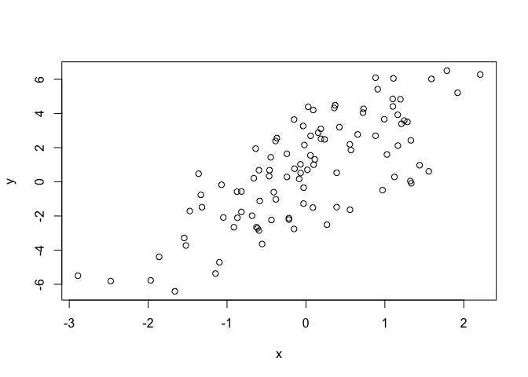
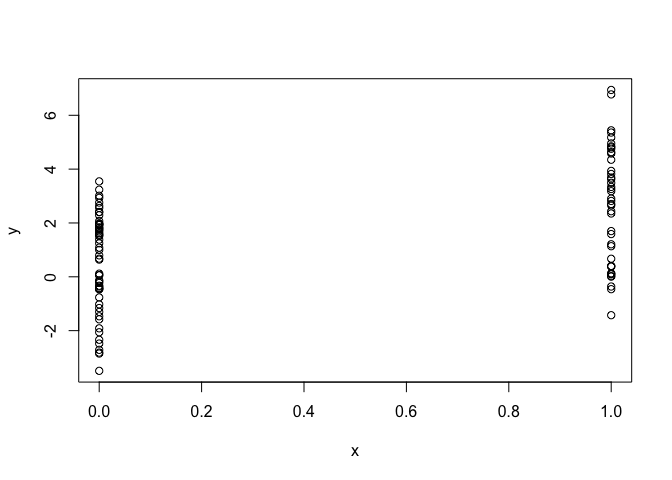
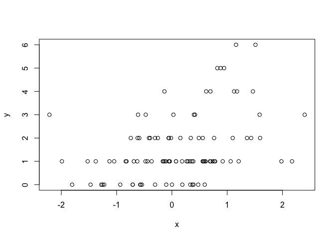

Simulación de modelos lineares
================
Carlos Guadián

-   [Modelo Linear](#modelo-linear)
-   [Modelo Binario](#modelo-binario)
-   [Modelo Poisson](#modelo-poisson)

## Modelo Linear

Simular números aleatorios es útil, pero a veces queremos simular
valores que provienen de un modelo específico. Para ello necesitamos
especificar el modelo y luego simular a partir de él utilizando las
funciones descritas anteriormente.

Supongamos que queremos simular a partir del siguiente modelo lineal
.

A continuación se explica cómo podríamos hacerlo en R.

``` r
set.seed(20)
x <- rnorm(100)
e <- rnorm(100, 0, 2)
y <- 0.5 + 2 *x + e
summary(y)
```

    ##    Min. 1st Qu.  Median    Mean 3rd Qu.    Max. 
    ## -6.4084 -1.5402  0.6789  0.6893  2.9303  6.5052

``` r
plot(x, y)
```

<!-- -->

## Modelo Binario

¿Qué pasa si queremos simular una variable predictora x que es binaria
en lugar de tener una distribución Normal? Podemos utilizar la función
rbinom() para simular variables aleatorias binarias.

``` r
set.seed(10)
x <- rbinom(100, 1, 0.5)
str(x) ## 'x' es ahora 0s y 1s
```

    ##  int [1:100] 1 0 0 1 0 0 0 0 1 0 ...

Entonces podemos proceder con el resto del modelo como antes.

``` r
e <- rnorm(100, 0, 2)
y <- 0.5 + 2 * x + e
plot(x, y)
```

<!-- -->

## Modelo Poisson

También podemos simular a partir de un modelo lineal generalizado en el
que los errores ya no provienen de una distribución Normal sino que
provienen de alguna otra distribución. Por ejemplo, supongamos que
queremos simular a partir de un log-lineal de Poisson.

``` r
set.seed(1)
x <- rnorm(100)
log.mu <- 0.5 + 0.3 * x
y <- rpois(100, exp(log.mu))
summary(y)
```

    ##    Min. 1st Qu.  Median    Mean 3rd Qu.    Max. 
    ##    0.00    1.00    1.00    1.55    2.00    6.00

``` r
plot(x, y)
```

<!-- -->
