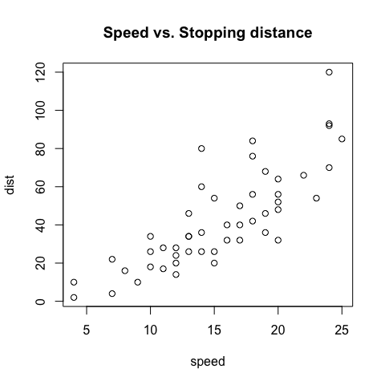
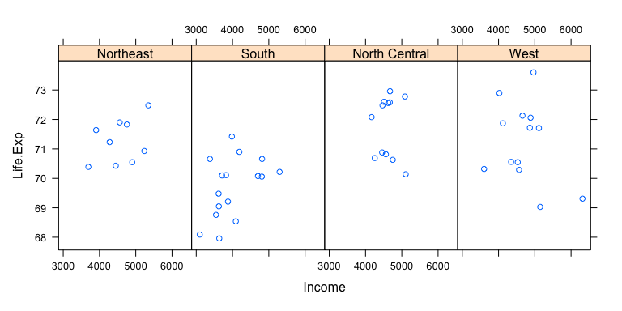
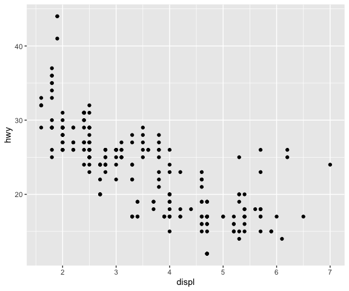

Sistemas de trazado en R
================

[Ver el vídeo de esta lección](https://youtu.be/a4mvbyNGdBA).

Hay tres diferentes sistemas de trazado en R y cada uno tiene diferentes
características y modos de operación. Los tres sistemas son: \* el
sistema de ploteo base, \* el sistema lattice y \* el sistema ggplot2.

## El sistema de trazado base

El sistema de trazado base es el sistema de trazado original de R. El
modelo básico se conoce a veces como el modelo de la “paleta del
artista”. La idea es que usted comienza con un lienzo en blanco y
construye a partir de ahí.

En términos más específicos de R, normalmente se empieza con la función
`plot` (o una función similar de creación de gráficos) para *iniciar* un
gráfico y luego *anotar* el gráfico con varias funciones de anotación
(`text`, `lines`, `points`, `axis`)

El sistema de trazado básico es a menudo el más conveniente para usar
porque refleja cómo pensamos a veces en la construcción de trazados y el
análisis de datos. Si no tenemos una idea bien formada de cómo queremos
ver algunos datos, a menudo empezaremos por “poner algunos datos en la
página” y luego poco a poco añadiremos más información a medida que
nuestro proceso de pensamiento evoluciona.

Por ejemplo, podemos ver un simple gráfico de dispersión y luego decidir
añadir una línea de regresión lineal o un suavizador para resaltar las
tendencias.

``` r
> data(airquality)
> with(airquality, {
+         plot(Temp, Ozone)
+         lines(loess.smooth(Temp, Ozone))
+ })
```


En el código anterior, la función `plot` crea el gráfico inicial y
dibuja los puntos (círculos) en el lienzo. La función `lines` se utiliza
para anotar o añadir al gráfico; en este caso añade un suavizador de
loess al gráfico de dispersión.

Aquí usamos la función `plot` para dibujar los puntos en el gráfico de
dispersión y luego usamos la función `title` para añadir un título
principal al gráfico.

Uno de los inconvenientes de la construcción de gráficos base es que no
se puede retroceder una vez que el gráfico ha comenzado. Así que es
posible que empiece a construir un gráfico y se dé cuenta más tarde
(cuando sea demasiado tarde) de que no tiene suficiente espacio para
añadir una etiqueta en el eje Y o algo así.

Si tienes un trazado específico en mente, es necesario planificar con
antelación para asegurarte, por ejemplo, de que has configurado los
márgenes con el tamaño adecuado para que quepan todas las anotaciones
que quieras incluir. Aunque el sistema de trazado base es bueno porque
te da la flexibilidad de especificar este tipo de detalles con una
precisión minuciosa, a veces sería bueno que el sistema lo resolviera
por ti.

Otra desventaja del sistema de trazado base es que es difícil describir
o traducir un trazado a otros porque no hay un lenguaje gráfico claro o
una gramática que pueda utilizarse para comunicar lo que has hecho. La
única forma real de describir lo que has hecho en un gráfico base es
simplemente enumerar la serie de comandos/funciones que has ejecutado,
lo cual no es una forma particularmente compacta de comunicar las cosas.
Este es un problema que el paquete `ggplot2` intenta resolver.

Otro gráfico base típico se construye con el siguiente código.

``` r
> data(cars)
> ## Create the plot / draw canvas
> with(cars, plot(speed, dist))
> ## Add annotation
> title("Speed vs. Stopping distance")
```



Entraremos en más detalle sobre lo que hacen estas funciones en
capítulos posteriores.

## El sistema `lattice`

El sistema de trazado `lattice` se implementa en el paquete de su propio
nombre que viene con cada instalación de R (aunque no se carga por
defecto). Para utilizar las funciones de trazado de `lattice` primero
debe cargar el paquete `lattice` con la función `library`.

``` r
> library(lattice)
```

Con el sistema lattice, los gráficos se crean con una sola llamada a una
función, como `xyplot` o `bwplot`. No hay una distinción real entre las
funciones que crean o inician los gráficos y las funciones que anotan
los gráficos porque todo sucede a la vez.

Los gráficos de `lattice` tienden a ser más útiles para los tipos de
gráficos condicionantes, es decir, mirando cómo y cambia con x a través
de los niveles de z. Estos tipos de gráficos son útiles para mirar los
datos multidimensionales y a menudo le permiten exprimir una gran
cantidad de información en una sola ventana o página.

Otro aspecto de la `lattice` que la hace diferente del trazado base es
que cosas como los márgenes y el espaciado se establecen
automáticamente. Esto es posible porque todo el trazado se especifica a
la vez a través de una sola llamada a la función, por lo que toda la
información disponible necesaria para averiguar el espaciado y los
márgenes ya está ahí.

Este es un ejemplo de un gráfico de `lattice` que analiza la relación
entre la esperanza de vida y los ingresos y cómo esa relación varía por
región en los Estados Unidos.

``` r
> state <- data.frame(state.x77, region = state.region)
> 
> xyplot(Life.Exp ~ Income | region, data = state, layout = c(4, 1))
```



Puede ver que todo el gráfico fue generado por la llamada a `xyplot` y
todos los datos para el gráfico fueron almacenados en el marco de datos
`state`. El gráfico contiene cuatro paneles, uno para cada región, y
dentro de cada panel hay un gráfico de dispersión de la esperanza de
vida y los ingresos. La noción de *paneles* surge a menudo con los
gráficos de `lattice` porque normalmente se tienen muchos paneles en un
gráfico de `lattice` (cada panel suele representar una *condición*, como
la “región”).

Uno de los inconvenientes del sistema de `lattice` es que a veces puede
resultar muy incómodo especificar un gráfico completo en una sola
llamada a una función (se acaba con funciones con muchos argumentos).
Además, la anotación en los paneles de los gráficos no es especialmente
intuitiva y puede ser difícil de explicar. En particular, el uso de
funciones de panel y subíndices personalizados puede ser difícil de
manejar y requiere una intensa preparación. Por último, una vez que se
ha creado un plot, no se puede “añadir” al mismo (pero, por supuesto, se
puede volver a hacer con modificaciones).

## El sistema `ggplot2`

El sistema ggplot2 de trazados intenta dividir la diferencia entre base
y lattice de varias maneras. Tomando pistas de lattice, el sistema
ggplot2 se ocupa automáticamente de los espaciados, el texto y los
títulos, pero también permite anotar “añadiendo” a un gráfico.

El sistema ggplot2 está implementado en el paquete `ggplot2`, que está
disponible en CRAN (no viene con R). Puedes instalarlo desde CRAN a
través de

``` r
> # install.packages("ggplot2")
```

y luego cargarlo en R a través de la función `library`.

``` r
> library(ggplot2)
```

Superficialmente, las funciones de ggplot2 son similares a las de
lattice, pero el sistema es generalmente más fácil y más intuitivo de
usar. Los valores por defecto utilizados en ggplot2 toman muchas
decisiones por ti, pero todavía puedes personalizar los gráficos a tu
gusto.

Un gráfico típico con el paquete `ggplot` tiene el siguiente aspecto.

``` r
> data(mpg)
> qplot(displ, hwy, data = mpg)
```



La función `qplot` en `ggplot2` es la que se utiliza para “obtener
rápidamente algunos datos en la pantalla”. Hay funciones adicionales en
`ggplot2` que te permiten hacer gráficos arbitrariamente sofisticados.

## Referencias

-   Paul Murrell (2011). *R Graphics*, CRC Press.
-   Hadley Wickham (2009). *ggplot2*, Springer.
-   Deepayan Sarkar (2008). *Lattice: Multivariate Data Visualization
    with R*, Springer. Traducido con la versión gratuita del Traductor
    de DeepL.
