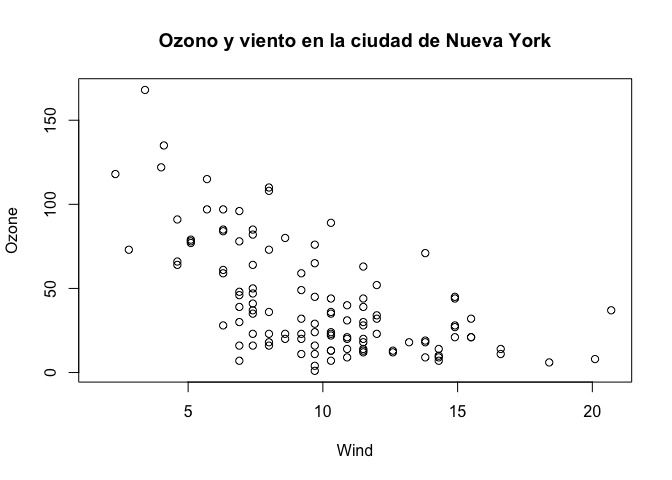
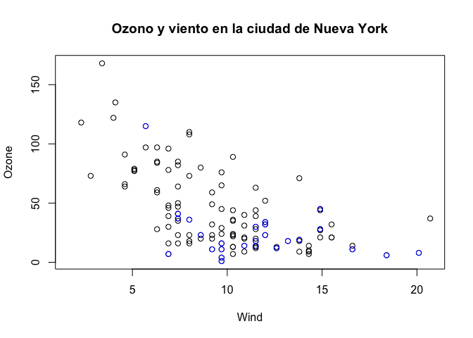

El sistema básico de trazado (ploteo)
================

-   [Gráficos base](#gráficos-base)
-   [Gráficos simples básicos](#gráficos-simples-básicos)
    -   [Histograma](#histograma)
    -   [Boxplot](#boxplot)
    -   [Gráfico de dispersión](#gráfico-de-dispersión)
-   [Algunos parámetros gráficos base
    importantes](#algunos-parámetros-gráficos-base-importantes)
-   [Funciones básicas de ploteo](#funciones-básicas-de-ploteo)
-   [Gráfico base con línea de
    regresión](#gráfico-base-con-línea-de-regresión)
-   [Gráficos de Base Múltiple](#gráficos-de-base-múltiple)
-   [Reset](#reset)
-   [Resumen](#resumen)

> Vídeos de esta lección: [Parte 1](https://youtu.be/AAXh0egb5WM) [Parte
> 2](https://youtu.be/bhyb1gCeAVk)

El núcleo del motor de trazado y gráficos en R está encapsulado en los
siguientes paquetes:

-   `graphics`: contiene funciones de trazado para los sistemas gráficos
    “base”, incluyendo `plot`, `hist`, `boxplot` y muchas otras.
-   `grDevices`: contiene todo el código que implementa los distintos
    dispositivos gráficos, incluyendo X11, PDF, PostScript, PNG, etc.

El paquete `grDevices` fue discutido en la lección anterior y contiene
la funcionalidad para enviar gráficos a varios dispositivos de salida.
El paquete `graphics` contiene el código para construir y anotar los
gráficos.

En este capítulo, nos centramos en el uso del **sistema de trazado
base** para crear gráficos en el **dispositivo de pantalla**.

## Gráficos base

Los gráficos base son los más utilizados y son un sistema muy potente
para crear gráficos de datos. Hay dos *fases* para crear un gráfico
base:

1.  Inicializar un nuevo gráfico
2.  Anotar (añadir) un gráfico existente

Al llamar a `plot(x, y)` o `hist(x)` se iniciará un dispositivo gráfico
(si no hay uno abierto) y se dibujará un nuevo gráfico en el
dispositivo. Si los argumentos de `plot` no son de alguna clase
especial, entonces se llama al método *default* para `plot`; esta
función tiene *muchos* argumentos, permitiéndole establecer el título,
la etiqueta del eje x, la etiqueta del eje y, etc.

El sistema gráfico base tiene *muchos* parámetros globales que se pueden
establecer y ajustar. Estos parámetros están documentados en `?par` y se
utilizan para controlar el comportamiento global de los gráficos, como
los márgenes, la orientación de los ejes y otros detalles. ¡No estaría
de más intentar memorizar al menos parte de esta página de ayuda!

## Gráficos simples básicos

### Histograma

Aquí hay un ejemplo de un histograma simple hecho usando la función
`hist()` del paquete `graphics`.

Si ejecuta este código y su ventana de gráficos no está ya abierta,
debería abrirse una vez que llame a la función `hist()`.

``` r
> library(datasets)
> ## Dibuja un nuevo gráfico en la pantalla del dispositivo
> hist(airquality$Ozone)  
```


### Boxplot

Los boxplots se pueden hacer en R utilizando la función `boxplot()`, que
toma como primer argumento una *fórmula*. La fórmula tiene forma de
`eje-y ~ eje-x`. Siempre que veas un `~` en R, es una fórmula. Aquí,
estamos trazando los niveles de ozono en Nueva York *por mes*, y la
parte derecha de la `~` indica la variable del mes. Sin embargo, primero
tenemos que transformar la variable mes en un factor antes de poder
pasarla a `boxplot()`, o de lo contrario `boxplot()` tratará la variable
mes como continua.

``` r
> airquality <- transform(airquality, Month = factor(Month))
> boxplot(Ozone ~ Month, airquality, xlab = "Month", ylab = "Ozone (ppb)")
```


Cada boxplot muestra la mediana, los percentiles 25 y 75 de los datos
(la “caja”), así como +/- 1,5 veces el rango intercuartil (IQR) de los
datos (los “bigotes”). Los puntos de datos que superan 1,5 veces el IQR
de los datos se indican por separado con círculos.

En este caso, los boxplots mensuales muestran algunas características
interesantes. En primer lugar, los niveles de ozono tienden a ser más
altos en julio y agosto. En segundo lugar, la *variabilidad* del ozono
también es mayor en julio y agosto. Este fenómeno es habitual en los
datos medioambientales, donde la media y la varianza suelen estar
relacionadas entre sí.

### Gráfico de dispersión

Aquí tenemos un sencillo gráfico de dispersión realizado con la función
`plot()`.

``` r
> with(airquality, plot(Wind, Ozone))
```


Generalmente, la función `plot()` toma dos vectores de números: uno para
las coordenadas del eje x y otro para las coordenadas del eje y. Sin
embargo, `plot()` es lo que se llama una *función genérica* en R, lo que
significa que su comportamiento puede cambiar dependiendo de qué tipo de
datos se pasan a la función. No entraremos en detalles sobre ese
comportamiento por ahora. El resto de este capítulo se centrará en el
comportamiento *por defecto* de la función `plot()`.

Una cosa a tener en cuenta aquí es que aunque no proporcionamos
etiquetas para los ejes x e y, las etiquetas se crearon automáticamente
a partir de los *nombres* de las variables (es decir, `Wind` y `Ozone`).
Esto puede ser útil cuando estás haciendo gráficos rápidamente, pero
exige que tengas nombres descriptivos útiles para tus variables y
objetos R.

## Algunos parámetros gráficos base importantes

Muchas funciones de trazado base comparten un conjunto de parámetros
globales. Aquí hay algunos clave:

-   `pch`: el símbolo de trazado (por defecto es un círculo abierto)
-   `lty`: el tipo de línea (por defecto es la línea sólida), puede ser
    discontinua, punteada, etc.
-   `lwd`: el ancho de la línea, especificado como un múltiplo entero
-   `col`: el color del trazado, especificado como un número, una cadena
    o un código hexadecimal. La función `colors()` proporciona un vector
    de colores por nombre.
-   `xlab`: cadena de caracteres para la etiqueta del eje x
-   `ylab`: cadena de caracteres para la etiqueta del eje y

La función `par()` se utiliza para especificar los parámetros gráficos
*globales* que afectan a todos los gráficos de una sesión de R. Estos
parámetros pueden ser sobre escritos cuando se especifican como
argumentos de funciones de trazado específicas.

-   `las`: la orientación de las etiquetas de los ejes en el gráfico
-   `bg`: el color de fondo
-   `mar`: el tamaño del margen
-   `oma`: el tamaño del margen exterior (por defecto es 0 para todos
    los lados)
-   `mfrow`: número de gráficos por fila, columna (los gráficos se
    rellenan por filas)
-   `mfcol`: número de gráficos por fila, columna (los gráficos se
    rellenan por columnas)

Puede ver los valores por defecto de los parámetros gráficos globales
llamando a la función `par()` y pasando el nombre del parámetro entre
comillas.

``` r
> par("lty")
[1] "solid"
> par("col")
[1] "black"
> par("pch")
[1] 1
```

Aquí hay más valores por defecto para los parámetros gráficos globales.

``` r
> par("bg")
[1] "white"
> par("mar")
[1] 5.1 4.1 4.1 2.1
> par("mfrow")
[1] 1 1
```

En su mayor parte, por lo general no tiene que modificar estos cuando se
hace parcelas rápidas. Sin embargo, es posible que tenga que ajustarlos
para finalizar los gráficos terminados.

## Funciones básicas de ploteo

La función básica de trazado es `plot()`. La función `plot()` hace un
gráfico de dispersión, u otro tipo de gráfico dependiendo de la clase
del objeto que se está trazando. Al llamar a `plot()` se dibujará un
gráfico en el dispositivo de pantalla (y se abrirá el dispositivo de
pantalla si no está ya abierto). Después de eso, las funciones de
anotación pueden ser llamadas para añadir a la trama ya hecha.

Algunas funciones de anotación clave son

-   `lines`: añade líneas a un gráfico, dado un vector de valores `x` y
    un y un vector correspondiente de valores `y` (o una matriz de 2
    columnas). función sólo conecta los puntos
-   `points`: añade puntos a un gráfico
-   `text`: añade etiquetas de texto a un gráfico utilizando las
    coordenadas x, y especificadas.
-   `title`: añade anotaciones a las etiquetas de los ejes x, y, título,
    subtítulo, margen exterior
-   `mtext`: añade texto arbitrario a los márgenes (interior o exterior)
    del gráfico
-   `axis`: añadir marcas/etiquetas en los ejes

A continuación se muestra un ejemplo de creación de un gráfico base y la
adición de algunas anotaciones. Primero creamos el gráfico con la
función `plot()` y luego añadimos un título en la parte superior del
gráfico con la función `title()`.

``` r
> library(datasets)
> ## Haz el gráfico inicial
> with(airquality, plot(Wind, Ozone))
> ## Añade un título
> title(main = "Ozono y viento en la ciudad de Nueva York")  
```



Aquí, empiezo con el mismo gráfico que antes (aunque añado el título
enseguida usando el argumento `main` a `plot()`) y luego lo anoto
coloreando de azul los puntos de datos correspondientes al mes de mayo.

``` r
> with(airquality, plot(Wind, Ozone, main = "Ozono y viento en la ciudad de Nueva York"))
> with(subset(airquality, Month == 5), points(Wind, Ozone, col = "blue"))
```



El siguiente gráfico colorea los puntos de datos del mes de mayo en azul
y colorea todos los demás puntos en rojo.

Observe que al construir el gráfico inicial, utilizamos la opción
`type = "n"` en la llamada a `plot`(). Este es un paradigma común, ya
que `plot()` dibujará todo en el gráfico excepto los puntos de datos
dentro de la ventana del gráfico. Entonces puedes usar funciones de
anotación como `points()` para añadir puntos de datos. Así que aquí,
creamos el gráfico sin dibujar los puntos de datos, luego añadimos los
puntos azules y luego añadimos los puntos rojos. Por último, añadimos
una leyenda con la función `legend()` explicando el significado de los
diferentes colores en el gráfico.

``` r
> with(airquality, plot(Wind, Ozone, main = "Ozono y viento en la ciudad de Nueva York", type = "n"))
> with(subset(airquality, Month == 5), points(Wind, Ozone, col = "blue"))
> with(subset(airquality, Month != 5), points(Wind, Ozone, col = "red"))
> legend("topright", pch = 1, col = c("blue", "red"), legend = c("May", "Other Months"))
```


## Gráfico base con línea de regresión

Es bastante común hacer un gráfico de dispersión y luego querer dibujar
una simple línea de regresión lineal a través de los datos. Esto se
puede hacer con la función `abline()`.

A continuación, primero hacemos el gráfico (como arriba). Luego
ajustamos un modelo de regresión lineal simple usando la función `lm()`.
Aquí, intentamos modelar el Ozono como una función del Viento. Luego
tomamos la salida de `lm()` y la pasamos a la función `abline()` que
automáticamente toma la información del objeto `model` y calcula la
línea de regresión correspondiente.

Tenga en cuenta que en la llamada a `plot()` a continuación, ponemos
`pch = 20` para cambiar el símbolo de trazado a un círculo relleno.

``` r
> with(airquality, plot(Wind, Ozone, main = "Ozono y viento en la ciudad de Nueva York", pch = 20))
> ## Ajustar un modelo de regresión lineal simple
> model <- lm(Ozone ~ Wind, airquality)
> ## Dibuja la línea de regresión en el gráfico
> abline(model, lwd = 2)
```


## Gráficos de Base Múltiple

Hacer múltiples gráficos uno al lado del otro es una forma útil de
visualizar muchas relaciones entre variables con gráficos estáticos de
2-D. A menudo, la repetición de los datos en una sola ventana de gráfico
puede ser una forma útil de identificar patrones en los datos. Para
ello, los parámetros `mfrow` y `mfcol` establecidos por la función
`par()` son fundamentales.

Los parámetros `mfrow` y `mfcol` toman dos números: el número de filas
de los gráficos seguido del número de columnas. Los gráficos múltiples
se organizarán en un patrón similar al de una matriz. La única
diferencia entre los dos parámetros es que si se establece `mfrow`, los
gráficos se dibujarán por filas; si se establece `mfcol`, los gráficos
se dibujarán por columnas.

En el ejemplo siguiente, hacemos dos gráficos: uno de Ozono y Viento y
otro con Ozono y Solar.R. Establecemos `par(mfrow = c(1, 2))`, lo que
indica que una fila de gráficos y dos columnas de gráficos.

``` r
> par(mfrow = c(1, 2))
> with(airquality, {
+   plot(Wind, Ozone, main = "Ozono y Viento")
+   plot(Solar.R, Ozone, main = "Ozono y radiación solar")
+ })
```


El siguiente ejemplo crea tres gráficos en una fila estableciendo
`par(mfrow = c(1, 3))`. Aquí también cambiamos los márgenes del gráfico
con el parámetro `mar`. Los distintos parámetros de margen, como `mar`,
se especifican estableciendo un valor para cada *lado* del gráfico. El
lado 1 es la parte inferior del gráfico, el lado 2 es la parte
izquierda, el lado 3 es la parte superior y el lado 4 es la parte
derecha. En el ejemplo siguiente también modificamos el margen exterior
mediante el parámetro `oma` para crear un poco más de espacio para los
gráficos y colocarlos más juntos.

``` r
> par(mfrow = c(1, 3), mar = c(4, 4, 2, 1), oma = c(0, 0, 2, 0))
> with(airquality, {
+   plot(Wind, Ozone, main = "Ozono y Viento")
+   plot(Solar.R, Ozone, main = "Ozono y radiación solar")
+   plot(Temp, Ozone, main = "Ozono y Temperatura")
+   mtext("Ozono y tiempo en la ciudad de Nueva York", outer = TRUE)
+ })
```


En el ejemplo anterior, la función `mtext()` se utilizó para crear un
título general para el panel de gráficos. Por lo tanto, cada parcela
individual tiene un título, mientras que el conjunto de parcelas también
tiene un título de resumen. La función `mtext()` es importante para
añadir anotaciones de texto que no son específicas de un solo gráfico.

## Reset

Para crear un gráfico nuevo y restablecer los parámetros por defecto
utilizamos `dev.off()` o `plot.new()`

``` r
> plot.new()
```

Comprobamos que hemos vuelto a los parámetros por defecto. Un gráfico
por fila y columna y los márgenes normales

``` r
> par(c("mfrow", "mar"))
$mfrow
[1] 1 1

$mar
[1] 5.1 4.1 4.1 2.1
```

## Resumen

-   Los gráficos en el sistema básico de trazado se crean llamando a
    sucesivas funciones de funciones de R para “construir” un gráfico

-   El trazado ocurre en dos etapas:

    -   Creación de un gráfico
    -   Anotación de un gráfico (añadiendo líneas, puntos, texto,
        leyendas)

-   El sistema de trazado básico es muy flexible y ofrece un alto grado
    de control sobre el trazado.
