Demostración de trazado base
================

## Gráfico por defecto

Vamos a empezar por un histograma sencillo. Generamos un vector de datos
con una distribución normal y pedimos que dibuje un histograma.

Fijaros que sin introducir ningún parámetro ha puesto título, decidido
el número de barras, relleno, nombre de los ejes, etc.

``` r
x <- rnorm(100)
hist(x)
```

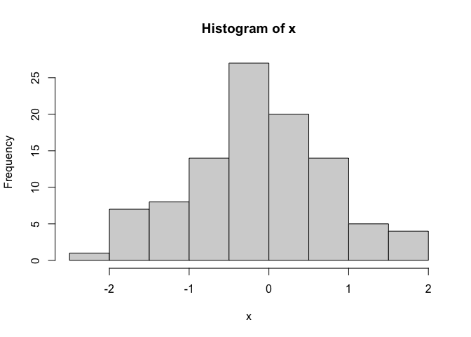<!-- -->
Lo mismo ocurre si pedimos un gráfico de dispersión.

``` r
y <- rnorm(100)
plot(y)
```

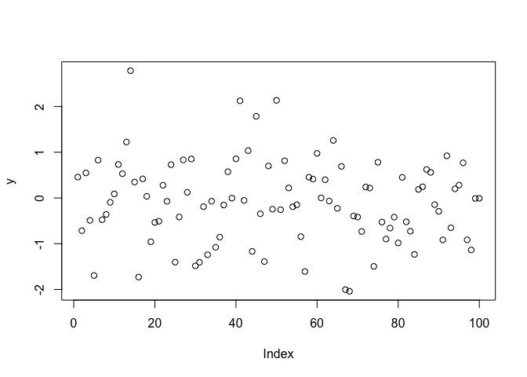<!-- -->

Y si pedimos que nos dibuje el gráfico de dispersión de `x` e `y` vemos
que cambia automáticamente los nombres de los ejes.

``` r
y <- rnorm(100)
plot(x, y)
```

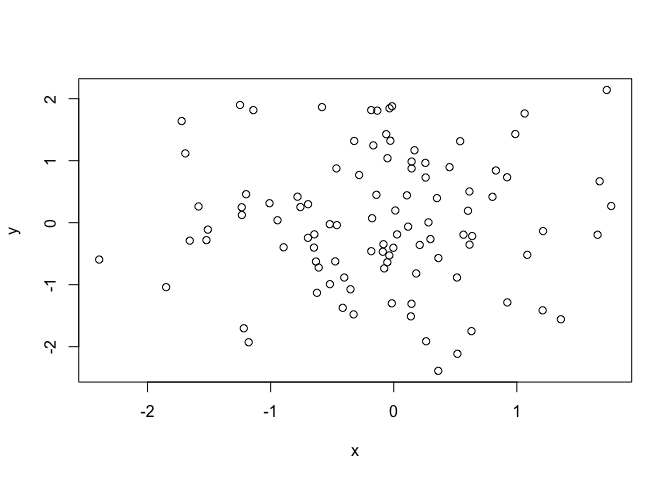<!-- -->

## Márgenes

A la hora de definir los márgenes de un gráfico debemos tener en cuenta
que:

-   1 es abajo (5 líneas de escritura)
-   2 es izquierda (4 líneas de escritura)
-   3 es arriba (4 líneas de escritura)
-   4 es derecha (2 líneas de escritura)

Estos valores por defecto los podemos cambiar pasando por `par()`. Con
los siguientes valores los márgenes se estrechan, por lo tanto, se
expande el gráfico. En este caso nos queda poco espacio para los títulos
de los ejes.

``` r
par(mar = c(2, 2, 2, 2))
plot(x, y)
```

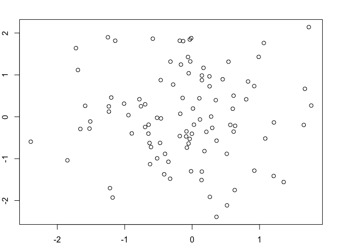<!-- -->

Vamos a darles un poco más de espacio.

``` r
par(mar = c(4, 4, 2, 2))
plot(x, y)
```

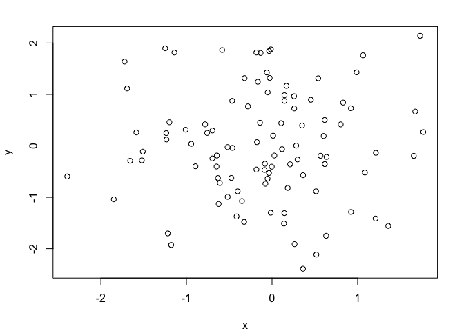<!-- -->

## Símbolo de los datos

Por defecto con `plot()`el símbolo es un círculo vacío, pero lo podemos
cambiar con el parámetro `pch`.

-   Con 20 le decimos que sea sólido.
-   Con 2 que sean triángulos
-   Con 3 que sean cruces

``` r
plot(x, y, pch = 20)
```

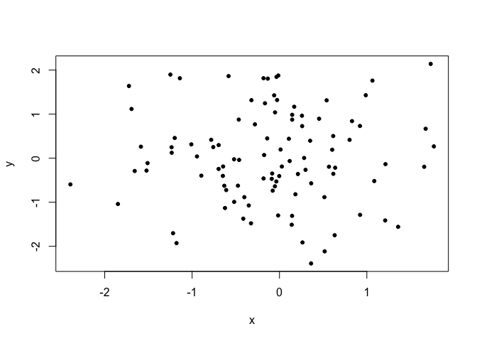<!-- -->

``` r
plot(x, y, pch = 2)
```

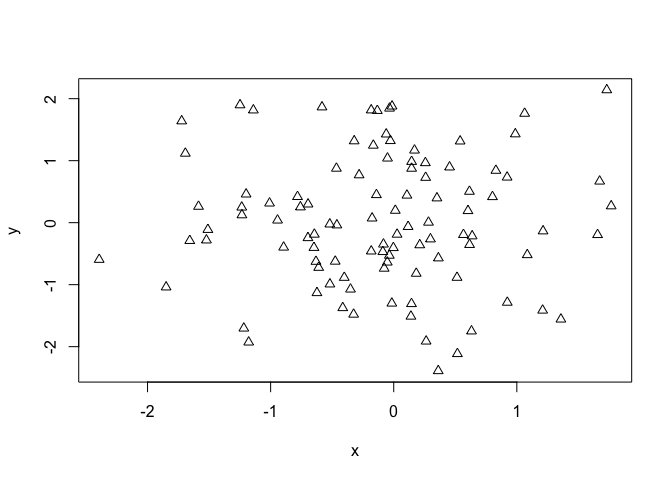<!-- -->

``` r
plot(x, y, pch = 3)
```

<!-- -->

La lista completa la tenemos con pchShow() que obtenemos consultando
`?pch`. Cambiando `cex`cambiamos el tamaño.

``` r
pchShow <-
  function(extras = c("*",".", "o","O","0","+","-","|","%","#"),
           cex = 3, ## good for both .Device=="postscript" and "x11"
           col = "red3", bg = "gold", coltext = "brown", cextext = 1.2,
           main = paste("plot symbols :  points (...  pch = *, cex =",
                        cex,")"))
  {
    nex <- length(extras)
    np  <- 26 + nex
    ipch <- 0:(np-1)
    k <- floor(sqrt(np))
    dd <- c(-1,1)/2
    rx <- dd + range(ix <- ipch %/% k)
    ry <- dd + range(iy <- 3 + (k-1)- ipch %% k)
    pch <- as.list(ipch) # list with integers & strings
    if(nex > 0) pch[26+ 1:nex] <- as.list(extras)
    plot(rx, ry, type = "n", axes  =  FALSE, xlab = "", ylab = "", main = main)
    abline(v = ix, h = iy, col = "lightgray", lty = "dotted")
    for(i in 1:np) {
      pc <- pch[[i]]
      ## 'col' symbols with a 'bg'-colored interior (where available) :
      points(ix[i], iy[i], pch = pc, col = col, bg = bg, cex = cex)
      if(cextext > 0)
          text(ix[i] - 0.3, iy[i], pc, col = coltext, cex = cextext)
    }
  }

pchShow()
```

<!-- -->

``` r
pchShow(c("o","O","0"), cex = 2.5)
```

<!-- -->

``` r
pchShow(NULL, cex = 4, cextext = 0, main = NULL)
```

<!-- -->

## Texto

Podemos añadir una anotación `tittle` al gráfico para sobre escribir la
que se genera por defecto.

``` r
plot(x, y, pch = 20)
title("Gráfico de dispersión")
```

<!-- -->

Así como otros elementos de texto con `text` indicando dónde lo
queremos.

``` r
plot(x, y, pch = 20)
title("Gráfico de dispersión")
text(-2, -2, "Label")
```

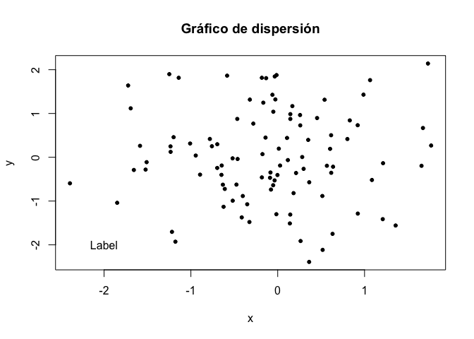<!-- -->

O añadir una legenda con `legend` en cuatro diferentes posiciones:

-   topleft
-   topright
-   bottomleft
-   bottomright

``` r
plot(x, y, pch = 20)
title("Gráfico de dispersión")
legend("topleft", legend = "Data", pch = 20)
```

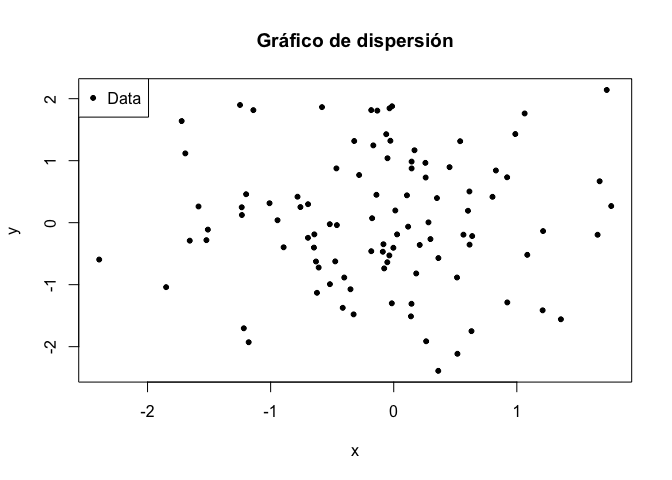<!-- -->

## Líneas

Otro elemento que se puede añadir son líneas, por ejemplo una línea de
tendencia. Para ello ajustamos la línea con un modelo linear y la
añadimos con `abline`.

Para la línea podemos controlar algunos parámetros como el grosor con
`lwd`, el color con `col`

``` r
plot(x, y, pch = 20)
title("Gráfico de dispersión")
legend("topleft", legend = "Data", pch = 20)
fit <- lm(x ~ y)
abline(fit, lwd = 3, col = "blue")
```

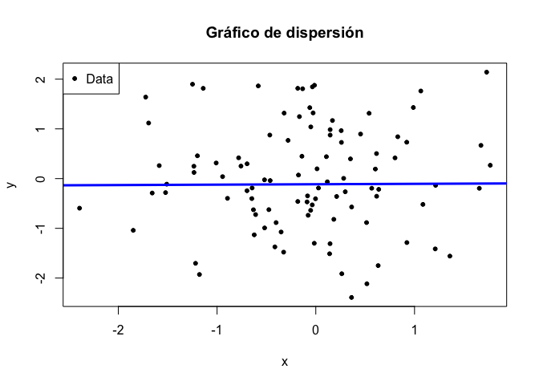<!-- -->

## Parámetros en `plot()`

Otro elemento de texto que podemos añadir son los títulos de los ejes.
Para ello utilizamos cuando pasamos `plot()`:

-   xlab
-   ylab

Y para definir el título, usamos `main`

``` r
plot(x, y, pch = 20, xlab = "Peso", ylab = "Altura", main = "Gráfico de dispersión")
```

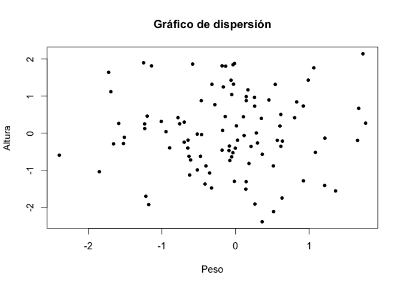<!-- -->

## Más de un gráfico a la vez

Controlamos si queremos dibujar más de un gráfico con: \* `mfrow`
definimos el número de filas y columnas que queremos para distribuir los
gráficos \* mfcow

La siguiente distribución `mfrow(2, 1)` son dos filas y una columna.

``` r
z <- rpois(100, 2)
par(mfrow = c(2, 1))
plot(x, y, pch = 20)
plot(x, z, pch = 19)
```

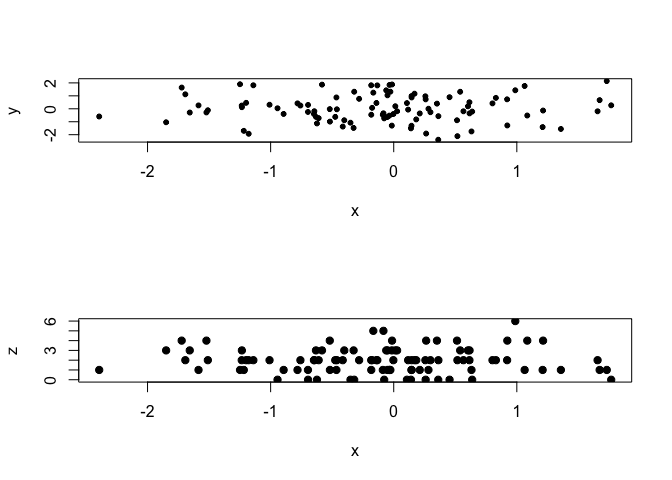<!-- -->

Fijaros que salen muy estrechos, para expandirlos tendremos que
modificar los márgenes un poco. Primero comprobamos los valores que
tienen los márgenes y después modificamos para agrandarlos.

``` r
par("mar")
```

    ## [1] 5.1 4.1 4.1 2.1

``` r
par(mar = c(1, 10, 1, 10))
par(mfrow = c(2, 1))
plot(x, y, pch = 20)
plot(x, z, pch = 19)
```

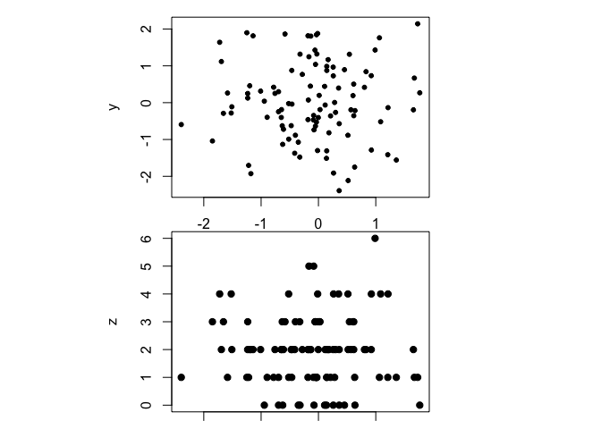<!-- -->

Si lo que queremos es poner más de un gráfico en una fila, por ejemplo,
un par lo hacemos de la siguiente manera

``` r
par(mfrow = c(1, 2))
plot(x, y, pch = 20)
plot(x, z, pch = 19)
```

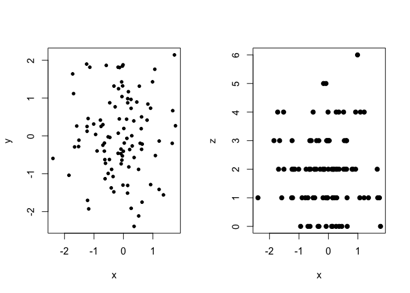<!-- -->

O por ejemplo poner un 2x2

``` r
par("mar")
```

    ## [1] 5.1 4.1 4.1 2.1

``` r
par(mar = c(4, 4, 2, 1))
par(mfrow = c(2, 2))
plot(x, y, pch = 20)
plot(x, z, pch = 19)
plot(y, z, pch = 19)
plot(y, x, pch = 20)
```

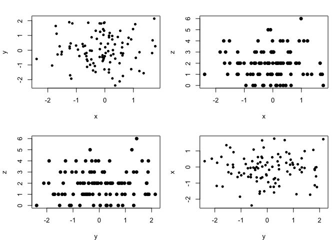<!-- -->

Si utilizamos `mfcol` los gráficos van por columnas en lugar de por
filas.

``` r
par(mfcol = c(2, 2))
plot(x, y, pch = 20)
plot(x, z, pch = 19)
plot(y, z, pch = 19)
plot(y, x, pch = 20)
```

<!-- -->

## Visualizar más de una categoría de datos

Para reinicializar la disposición de los gráficos debemos volver a
asignar los valores por defecto.

``` r
par(mfcol = c(1, 1))
```

Vamos a ver como podemos asignar colores por factor a un gráfico de
dispersión. Generamos primero algunos datos que asignaremos a `hombres`
y `mujeres`.

-   Primero dibujamos el gráfico
-   Segundo asignamos a la `mujeres` el color azul con un punto relleno
-   Tercero asignamos a los `hombres` el color verde

``` r
x <- rnorm(100)
y <- x + rnorm(100)
g <- gl(2, 50, labels = c("Male", "Female"))
plot(x, y, type = "n") #dibuja el gráfico per vacío para ir añadiendo lo que nos interesa
points(x[g == "Female"], y[g == "Female"], col = "blue", pch = 19)
points(x[g == "Male"], y[g == "Male"], col = "green")
title("Hombres vs. Mujeres")
```

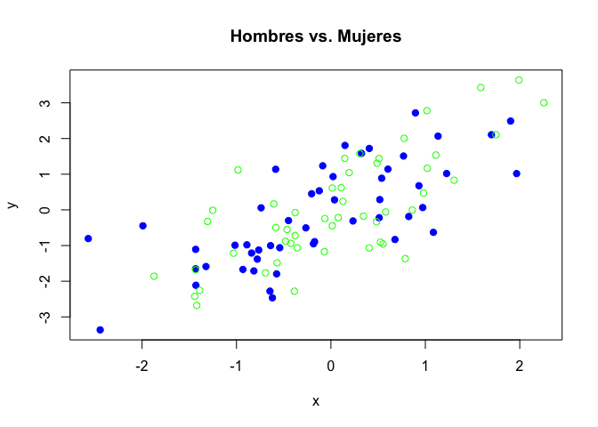<!-- -->
