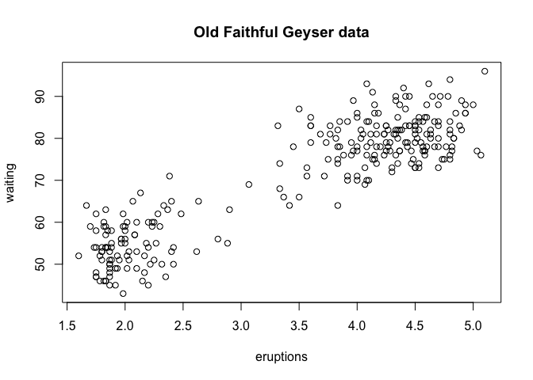

Dispositivos gráficos
================

Vídeo de esta lección: [Parte 1](https://youtu.be/ftc6_hqRYuY) [Parte
2](https://youtu.be/ci6ogllxVxg)

Un dispositivo gráfico es algo donde se puede hacer aparecer un gráfico.
Algunos ejemplos son:

-   Una ventana en su ordenador (dispositivo de pantalla)
-   Un archivo PDF (dispositivo de archivo
-   Un archivo PNG o JPEG (dispositivo de archivo)
-   Un archivo de gráficos vectoriales escalables (SVG) (dispositivo de
    archivo)

Cuando se hace un trazado en R, tiene que ser “enviado” a un dispositivo
gráfico específico. El lugar más común para que un gráfico sea “enviado”
es el *dispositivo de pantalla*. En un Mac el dispositivo de pantalla se
lanza con la función `quartz()`, en Windows el dispositivo de pantalla
se lanza con la función `windows()`, y en Unix/Linux el dispositivo de
pantalla se lanza con la función `x11()`.

Cuando se hace un trazado, hay que tener en cuenta cómo se va a utilizar
el trazado para determinar a qué dispositivo se debe enviar el trazado.
La lista de dispositivos soportados por su instalación de R se encuentra
en `?Devices`. También hay dispositivos gráficos que han sido creados
por los usuarios y que están disponibles a través de paquetes en CRAN.

Para las visualizaciones rápidas y el análisis exploratorio, por lo
general se desea utilizar el dispositivo de pantalla. Funciones como
`plot` en `base`, `xyplot` en `lattice`, o `qplot` en `ggplot2` enviarán
por defecto un gráfico al dispositivo de pantalla. En una plataforma
determinada, como Mac, Windows o Unix/Linux, sólo hay un dispositivo de
pantalla.

Para los gráficos que pueden ser impresos o incorporados en un
documento, tales como documentos, informes o presentaciones de
diapositivas, por lo general un *dispositivo de archivo* es más
apropiado, hay muchos dispositivos de archivo diferentes para elegir y
exactamente cuál utilizar en una situación dada es algo que discutimos
más adelante.

Tenga en cuenta que normalmente, no todos los dispositivos gráficos
están disponibles en todas las plataformas. Por ejemplo, no se puede
lanzar el dispositivo `windows()` en un Mac o el dispositivo `quartz()`
en Windows. El código para mst de los dispositivos gráficos clave se
implementa en el paquete `grDevices`, que viene con una instalación
estándar de R y normalmente se carga por defecto.

## El proceso de hacer un gráfico

Al hacer un gráfico uno debe primero hacer algunas consideraciones (no
necesariamente en este orden):

-   ¿Dónde se hará el gráfico? ¿En la pantalla? ¿En un archivo?
-   ¿Cómo se utilizará el gráfico?
    -   ¿El gráfico es para verlo temporalmente en la pantalla?  
    -   ¿Se presentará en un navegador web?
    -   ¿Acabará en un documento que podría imprimirse?
    -   ¿Se utilizará en una presentación?
-   ¿Hay una gran cantidad de datos en el gráfico? ¿O son sólo unos
    pocos puntos?
-   ¿Necesitas poder cambiar el tamaño del gráfico de forma dinámica?
-   ¿Qué sistema de gráficos va a utilizar: base, lattice o ggplot2?
    Estos generalmente no se pueden mezclar.

Los `gráficos de base` suelen construirse por partes, con cada aspecto
del gráfico manejado por separado a través de una serie de llamadas a
funciones; esto es a veces conceptualmente más simple y permite que el
trazado refleje el proceso de pensamiento.

Los `gráficos lattice` suelen crearse en una sola llamada a la función,
por lo que todos los parámetros de los gráficos tienen que especificarse
a la vez; especificar todo a la vez permite a R calcular automáticamente
los espaciados y tamaños de fuente necesarios.

El `sistema ggplot2` combina conceptos de los gráficos de base y de
lattice, pero utiliza una implementación independiente.

## ¿Cómo se crea un gráfico?

Hay **dos enfoques básicos** para el trazado.

El **primero** es el más común. Esto implica

1.  Llamar a una función de *trazado* como `plot`, `xyplot`, o `qplot`
2.  El gráfico aparece en la pantalla del dispositivo
3.  Anote en el gráfico si es necesario

Aquí hay un ejemplo de este proceso al hacer un gráfico con la función
`plot()`.

``` r
## Make plot appear on screen device
with(faithful, plot(eruptions, waiting)) 
## Annotate with a title
title(main = "Old Faithful Geyser data")  
```

<!-- -->

El **segundo** enfoque básico para el trazado se utiliza más comúnmente
para los `dispositivos de archivo`:

1.  Lanzar explícitamente un dispositivo gráfico
2.  Llamar a una función de ploteo para hacer un ploteo (Nota: si está
    usando un dispositivo de archivo, no aparecerá ningún trazado en la
    pantalla)
3.  Anotar el trazado si es necesario
4.  Cierre explícitamente el dispositivo gráfico con `dev.off()`
    (**¡esto es muy importante!**)

Aquí hay un ejemplo de cómo hacer un gráfico usando este segundo
enfoque. En este caso hacemos un gráfico que se guarda en un archivo
PDF.

``` r
## Open PDF device; create 'myplot.pdf' in my working directory
pdf(file = "myplot.pdf")  
## Create plot and send to a file (no plot appears on screen)
with(faithful, plot(eruptions, waiting))  
## Annotate plot; still nothing on screen
title(main = "Old Faithful Geyser data")  
## Close the PDF file device
dev.off()  
```

    ## quartz_off_screen 
    ##                 2

``` r
## Now you can view the file 'myplot.pdf' on your computer
```

## Dispositivos de archivos gráficos

Hay dos tipos básicos de dispositivos de archivo a considerar: *vector*
y *bitmap*. Algunos de los principales formatos vectoriales son útiles
para gráficos de tipo lineal, redimensiona bien, normalmente portátil,
no es eficiente si un gráfico tiene muchos objetos/puntos.

-   `svg`: Gráficos vectoriales escalables basados en XML; admite
    animación e interactividad, potencialmente útil para gráficos
    basados en la web
-   `win.metafile`: Formato metafile de Windows (sólo en Windows)
-   `postscript`: formato más antiguo, también se redimensiona bien,
    suele ser portátil, puede utilizarse para crear archivos postscript
    encapsulados; los sistemas Windows a menudo no tienen un visor de
    postscript.

Algunos ejemplos de formatos de mapa de bits son:

-   `png`: formato de mapa de bits, bueno para dibujos lineales o
    imágenes con colores sólidos, utiliza una compresión sin pérdidas
    (como el antiguo formato GIF), la mayoría de navegadores web pueden
    leer este formato de forma nativa, es bueno para trazar muchos
    puntos, no cambia bien el tamaño.
-   `jpeg`: bueno para fotografías o escenas naturales, utiliza
    compresión con pérdidas, bueno para trazar muchos puntos, no cambia
    de tamaño, puede ser leído por casi cualquier ordenador y cualquier
    navegador web,no es bueno para dibujos lineales.
-   `tiff`: Crea archivos de mapa de bits en formato TIFF; admite la
    compresión sin pérdidas compresión sin pérdidas
-   `bmp`: un formato de mapa de bits nativo de Windows

## Múltiples dispositivos gráficos abiertos

Es posible abrir múltiples dispositivos gráficos (pantalla, archivo, o
ambos), por ejemplo cuando se visualizan varios gráficos a la vez. Sin
embargo, el trazado sólo puede ocurrir en un dispositivo gráfico a la
vez.

El dispositivo gráfico **actualmente activo** puede encontrarse llamando
a `dev.cur()` A cada dispositivo gráfico abierto se le asigna un número
entero que empieza por 2 (no existe el dispositivo gráfico 1). Puedes
cambiar el dispositivo gráfico activo con `dev.set(<integer>)` donde
`<integer>` es el número asociado al dispositivo gráfico al que quieres
cambiar.

## Copiar gráficos

Copiar un gráfico a otro dispositivo puede ser útil porque algunos
gráficos requieren una gran cantidad de código y puede ser un dolor de
escribir todo eso de nuevo para un dispositivo diferente. Por supuesto,
siempre es bueno guardar el código que crea sus gráficos, especialmente
para cualquier gráfico que pueda publicar o dar a otras personas.

La función `dev.copy()` puede utilizarse para copiar un gráfico de un
dispositivo a otro. Por ejemplo, puede copiar un gráfico del dispositivo
de pantalla a un dispositivo de archivo. La función `dev.copy2pdf()` se
utiliza específicamente para copiar un gráfico del dispositivo actual
(normalmente el dispositivo de pantalla) a un archivo PDF.

Tenga en cuenta que copiar un gráfico no es una operación exacta, por lo
que el resultado puede no ser ser idéntico al original. En particular,
al copiar desde el dispositivo de pantalla a un archivo, dependiendo del
tamaño del dispositivo de archivo, muchas anotaciones como las etiquetas
de los ejes pueden no verse bien.

``` r
library(datasets)
## Create plot on screen device
with(faithful, plot(eruptions, waiting))  
## Add a main title
title(main = "Old Faithful Geyser data")  
```

<!-- -->

``` r
## Copy my plot to a PNG file
dev.copy(png, file = "geyserplot.png")  
```

    ## quartz_off_screen 
    ##                 3

``` r
## Don't forget to close the PNG device!
dev.off()  
```

    ## quartz_off_screen 
    ##                 2

## Resumen

Los gráficos deben ser creados en un dispositivo gráfico. El dispositivo
gráfico por defecto es casi siempre el dispositivo de pantalla, que es
más útil para el análisis exploratorio. Los dispositivos de archivo son
útiles para crear gráficos que pueden ser incluidos en otros documentos
o enviados a otras personas.

Para los dispositivos de archivo, hay formatos vectoriales y de mapa de
bits:

-   Los `formatos vectoriales` son buenos para los dibujos lineales y
    los trazados con colores sólidos con un número modesto de puntos
-   Los `formatos de mapa de bits` son buenos para trazados con un gran
    número de puntos,escenas naturales o gráficos basados en la web.
