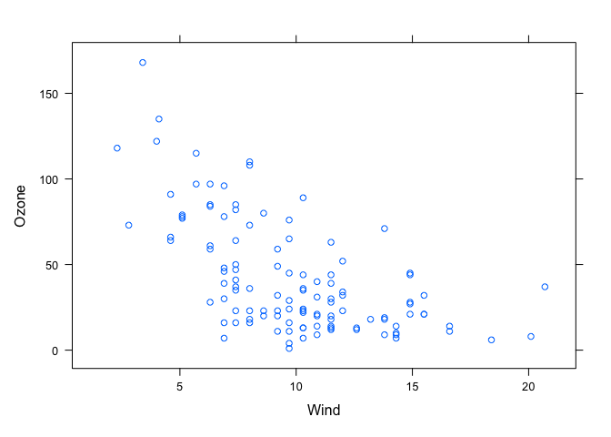
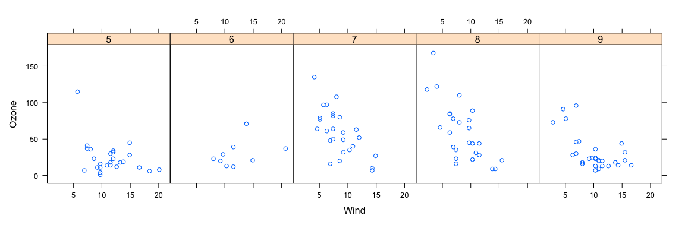
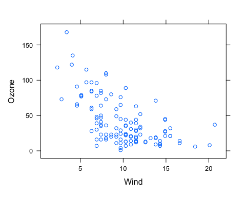
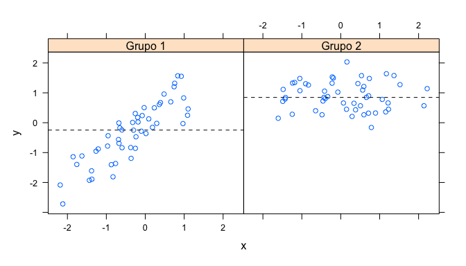
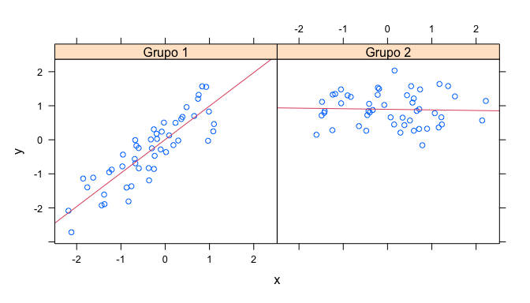
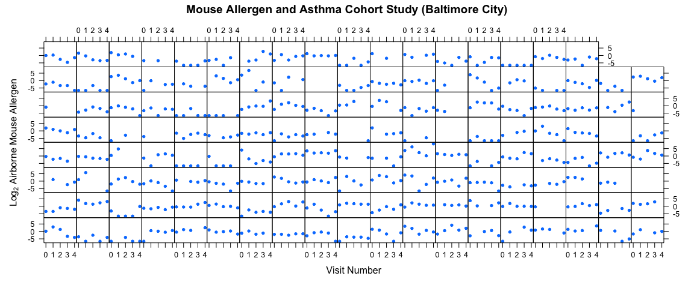

El sistema Lattice
================

-   [Funciones de Lattice](#funciones-de-lattice)
-   [Funciones Lattice](#funciones-lattice)
-   [Gráfico LATTICE simple](#gráfico-lattice-simple)
-   [Comportamiento lattice](#comportamiento-lattice)
-   [Funciones de panel lattice](#funciones-de-panel-lattice)
-   [Funciones de panel Lattice: Línea de
    regresión](#funciones-de-panel-lattice-línea-de-regresión)
-   [Varios gráficos lattice: Ejemplo de
    MAACS](#varios-gráficos-lattice-ejemplo-de-maacs)
-   [Resumen](#resumen)

El sistema `lattice` de trazado se implementa utilizando los siguientes
paquetes:

-   *lattice*: contiene código para producir gráficos Trellis, que son
    independientes del sistema gráfico “base”; incluye funciones como
    `xyplot`, `bwplot`, `levelplot`.
-   *grid*: implementa un sistema de gráficos diferente e independiente
    del sistema “base”; el paquete *lattice* se basa en *grid*. Rara vez
    llamamos a funciones del paquete *grid* directamente
-   El sistema lattice no tiene un aspecto “bifásico” con con trazado y
    anotación separados como en el trazado básico
-   Todo el trazado/anotación se hace de una vez con una sola llamada a
    la función

## Funciones de Lattice

-   `xyplot`: es la función principal para crear gráficos de dispersión
-   `bwplot`: gráficos de caja y bigotes (“boxplots”)
-   `histogram`: histogramas
-   `stripplot`: como un boxplot pero con puntos reales
-   `dotplot`: traza puntos en “cuerdas de violín”
-   `splom`: matriz de dispersión; como `pairs` en el sistema de trazado
    base
-   `levelplot`, `contourplot`: para trazar datos de “imagen”.

## Funciones Lattice

Las funciones lattice generalmente toman una fórmula como primer
argumento, normalmente de la siguiente forma:

``` r
xyplot(y ~ x | f * g, data)
```

-   Aquí utilizamos la *notación de fórmula*, de ahí el `~`.
-   A la izquierda del \~ está la variable del eje y, a la derecha está
    la variable del eje x
-   f y g son *variables condicionantes* - son opcionales
    -   el \* indica una interacción entre dos variables
-   El segundo argumento es el marco de datos o la lista de la que deben
    buscarse las variables de la fórmula.
    -   Si no se pasa ningún marco de datos o lista, se utiliza el marco
        principal.
-   Si no se pasa ningún otro argumento, hay valores por defecto que se
    pueden utilizar.

## Gráfico LATTICE simple

Aquí hay una llamada básica a un gráfico de dispersión en el que
representamos las variables Ozono y Viento del dataset `airquality`.

``` r
library(lattice)
library(datasets)
## Diagrama de dispersión simple
xyplot(Ozone ~ Wind, data = airquality)
```

<!-- -->

Lattice permite, en la misma llamada complicarlo un poco. Por ejemplo,
seguimos representando las variables Ozono y Viento de `airquality`,
pero le pedimos que lo haga por mes. Para ello primero transformamos
Month en factor y le indicamos con el argumento `layout` que nos dibuje
5 gráficos en una fila.

``` r
library(datasets)
library(lattice)
## Convertir 'Mes' en una variable de factor
airquality <- transform(airquality, Month = factor(Month)) 
xyplot(Ozone ~ Wind | Month, data = airquality, layout = c(5, 1))
```

<!-- -->

## Comportamiento lattice

Las funciones de celosía se comportan de forma diferente a las funciones
gráficas básicas en una manera crítica.

-   Las funciones gráficas básicas trazan los datos directamente en el
    dispositivo gráfico (pantalla, archivo PDF, etc.)
-   Las funciones gráficas de celosía devuelven un objeto de la clase
    **trellis**.
-   Los métodos de impresión de las funciones de celosía realmente hacen
    el trabajo de trazar los datos en el dispositivo gráfico.
-   Las funciones de celosía devuelven “objetos de trazado” que pueden,
    en principio, ser almacenar (pero normalmente es mejor guardar el
    código + los datos).
-   En la línea de comandos, los objetos lattice son *auto-impresos*
    para que para que parezca que la función está trazando los datos

En este caso generamos `p` que es el objeto `trellis` con el resultado
del gráfico. Para imprimirlo hay que ponerlo como argumento a `p`.

``` r
p <- xyplot(Ozone ~ Wind, data = airquality)  ## Nothing happens!
class(p)
```

    ## [1] "trellis"

``` r
print(p)  ## Plot appears
```

<!-- -->

Si no lo guardamos en una variable, el gráfico se autoimprime.

``` r
xyplot(Ozone ~ Wind, data = airquality)  ## Auto-printing
```

<!-- -->

## Funciones de panel lattice

-   Las funciones Lattice tienen una función **panel** que controla lo
    que ocurre dentro de cada panel del gráfico.
-   El paquete *lattice* viene con funciones de panel por defecto, pero
    usted puede suministrar las suyas propias si desea personalizar lo
    que sucede en cada panel
-   Las funciones de panel reciben las coordenadas x/y de los puntos de
    datos en su panel (junto con cualquier argumento opcional)

Creamos algunos datos y dos grupos para representar, como hemos hecho
antes dos gráficos, representando, en este caso, la variable `y` y la
`x` para cada uno de los grupos de `f`.

``` r
set.seed(10)
x <- rnorm(100)
f <- rep(0:1, each = 50)
y <- x + f - f * x+ rnorm(100, sd = 0.5)
f <- factor(f, labels = c("Grupo 1", "Grupo 2"))
xyplot(y ~ x | f, layout = c(2, 1))  ## Gráfico con 2 paneles
```

<!-- -->

Si queremos introducir una línea, lo haremos mediante la función `panel`
en la que primero llamamos por defecto a `xyplot` y después añadimos con
`panel.abline` una línea en la mediana de cada gráfico.

``` r
## Función de panel personalizada
xyplot(y ~ x | f, panel = function(x, y, ...) {
       panel.xyplot(x, y, ...) ## Primero llama a la función de panel por defecto para 'xyplot'
       panel.abline(h = median(y), lty = 2) ## Añade una línea horizontal en la mediana
})
```

<!-- -->

## Funciones de panel Lattice: Línea de regresión

En el caso de querer agregar una línea de tendencia, lo hacemos
exactamente igual, primero llamamos al panel por defecto, y después la
línea de regresión.

``` r
## Función de panel personalizada
xyplot(y ~ x | f, panel = function(x, y, ...) {
               panel.xyplot(x, y, ...) ## Primero llama a la función por defecto del panel
               panel.lmline(x, y, col = 2) ## Superponer una línea de regresión lineal simple
       })
```

<!-- -->

## Varios gráficos lattice: Ejemplo de MAACS

-   Estudio: Estudio de cohorte de alérgenos y asma en ratones (MAACS)
-   Sujetos del estudio: Niños con asma que viven en la ciudad de
    Baltimore, muchos alérgicos al alérgeno del ratón
-   Diseño: Estudio observacional, visita domiciliaria inicial + cada 3
    meses durante un año.
-   Pregunta: ¿Cómo varía el alérgeno del ratón en el aire interior con
    el tiempo y entre los sujetos?

[Ahluwalia et al., *Journal of Allergy and Clinical Immunology*,
2013](http://www.ncbi.nlm.nih.gov/pubmed/23810154)

Vemos que al hacer los gráficos, si los pedimos hacer para cada nivel de
un factor, podemos generar muchos simultáneamente como en este caso.

``` r
env <- readRDS("maacs_env.rds")
env <- transform(env, MxNum = factor(MxNum))
xyplot(log2(airmus) ~ VisitNum | MxNum, data = env, strip = FALSE, pch = 20, xlab = "Visit Number", 
       ylab = expression(Log[2] * " Airborne Mouse Allergen"), 
       main = "Mouse Allergen and Asthma Cohort Study (Baltimore City)")
```

<!-- -->

## Resumen

-   Los gráficos lattice se construyen con una sola llamada a una
    función lattice (por ejemplo, `xyplot`)
-   Aspectos como los márgenes y el espaciado se manejan automáticamente
    y los valores por defecto suelen ser suficientes
-   El sistema lattice es ideal para crear gráficos condicionados en los
    que se examina el mismo tipo de gráfico bajo muchas condiciones
    diferentes.
-   Las funciones de los paneles se pueden especificar/personalizar para
    modificar lo que se traza en cada uno de los paneles.
