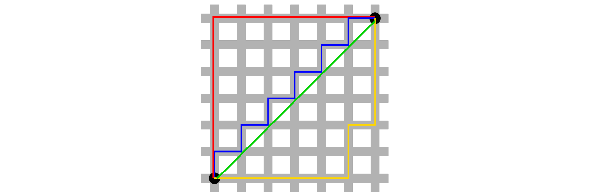

Agrupación Jerárquica
================

**Ver un vídeo de esta lección**:

-   [Parte 1](https://youtu.be/BKoChxguelA)
-   [Parte 2](https://youtu.be/ZQYLGS7ptWM)
-   [Parte 3](https://youtu.be/lmSMEZAjE-4)

El clustering o análisis de conglomerados es una técnica muy utilizada
para visualizar datos multidimensionales. Es muy sencilla de utilizar,
las ideas son bastante intuitivas y puede servir como una forma
realmente rápida de hacerse una idea de lo que ocurre en un conjunto de
datos de muy alta dimensión.

El análisis de conglomerados es una técnica muy importante y ampliamente
utilizada. Si se escribe “análisis de conglomerados” en Google, aparecen
millones de resultados.


Y es un método ampliamente aplicado en muchas áreas diferentes de la
ciencia, los negocios y otras aplicaciones. Por eso es útil saber cómo
funcionan estas técnicas.

El objetivo de la agrupación es organizar cosas u observaciones que
están **cercanas** entre sí y separarlas en grupos. Por supuesto, esta
sencilla definición plantea algunas preguntas inmediatas:

-   ¿Cómo definimos lo que está cerca?
-   ¿Cómo agrupamos las cosas?
-   ¿Cómo visualizamos la agrupación?
-   ¿Cómo interpretamos la agrupación?

Todas las técnicas de agrupación se enfrentan a una cuestión básica:
¿cómo definimos cuándo las cosas están cerca y cuándo están lejos?
Básicamente, la gran variedad de técnicas de agrupación que existen y
que se pueden aplicar a los datos difieren en la forma en que responden
a estas preguntas.

## Clustering jerárquico

La agrupación jerárquica, como su nombre indica, implica la organización
de los datos en una especie de jerarquía. El enfoque común es lo que se
llama un enfoque aglomerativo. Se trata de una especie de enfoque
ascendente, en el que se empieza a pensar en los datos como puntos de
datos individuales. Luego se empiezan a agrupar en clusters poco a poco
hasta que finalmente todo el conjunto de datos es un gran cluster.

Imagina que hay todas estas pequeñas partículas flotando (tus puntos de
datos), y empiezas a agruparlas en pequeñas bolas. Y luego las bolas se
agrupan en bolas más grandes, y las bolas más grandes se agrupan en un
gran clúster masivo. Ese es el enfoque aglomerativo.

El algoritmo es recursivo y va como sigue:

1.  Encuentra los dos puntos más cercanos en tu conjunto de datos
2.  Júntalos y llámalos “punto”
3.  Usa tu nuevo “conjunto de datos” con este nuevo punto y repite

Esta metodología requiere que tenga una forma de medir la *distancia*
entre dos puntos y que tenga un enfoque para *unir* dos puntos para
crear un nuevo “punto”. Una ventaja de esta metodología de agrupación es
que se puede producir un árbol que muestre lo cerca que están las cosas
entre sí, que es simplemente un producto derivado de la ejecución del
algoritmo.

## ¿Cómo definimos la cercanía?

Definir la cercanía es un aspecto clave a la hora de definir un método
de clustering. En última instancia, se aplica la vieja regla de “basura
que entra, basura que sale”. Si no utiliza una métrica de distancia que
tenga sentido para sus datos, no obtendrá ninguna información útil de la
agrupación.

Existen varias métricas de uso común para caracterizar la distancia o su
inversa, la similitud:

-   **Distancia euclidiana**: Una métrica continua que puede
    considerarse en términos geométricos como la distancia “en línea
    recta” entre dos puntos.
-   **Similitud de correlación**: De naturaleza similar a la distancia
    euclidiana.
-   **Distancia “Manhattan”**: en una cuadrícula o entramado, ¿cuántas
    “manzanas” habría que recorrer para llegar del punto A al punto B?

Lo importante es elegir siempre una métrica de distancia o similitud que
tenga sentido para su problema.

## Ejemplo: Distancia euclidiana


[source](https://github.com/carlosguadian/datasciencecoursera/blob/master/03_Exploratory_Data_Analysis/Week_3/resources/lecture5-clustering.pdf)

Por ejemplo, toma dos ciudades, digamos Baltimore y Washington D.C., y
ponlas en un mapa. Si imaginas que el centro de cada ciudad tiene una
coordenada X y una coordenada Y (digamos, longitud y latitud), y quieres
trazar la distancia entre los centros de las dos ciudades, entonces
puedes dibujar una línea diagonal recta entre las dos ciudades. La
distancia se puede calcular de la manera habitual, que va a ser una
función de la diferencia de las coordenadas x y la diferencia de las
coordenadas y. En el plano bidimensional, se toma la distancia en las
coordenadas x, se eleva al cuadrado, se toma la diferencia en las
coordenadas y, se eleva al cuadrado, y luego se suman los dos cuadrados
y se saca la raíz cuadrada del conjunto. En otras palabras,

*D**i**s**t**a**n**c**i**a* = \[(*X*<sub>1</sub> − *X*<sub>2</sub>)<sup>2</sup> + (*Y*<sub>1</sub> − *Y*<sub>2</sub>)<sup>2</sup>\]<sup>1/2</sup>

Esa es la definición clásica de distancia euclidiana. Puedes imaginar
que si un pájaro volara de Washington, D.C. a Baltimore, simplemente
volaría en línea recta de una ciudad a otra. Esto es posible porque un
pájaro no se ve impedido por cosas como carreteras o montañas, o lo que
sea. Que eso tenga sentido para ti depende, entre otras cosas, de si
eres un pájaro o no. Así que tienes que pensar en las propiedades de
esta métrica de distancia en el contexto de tu problema.

Una buena característica de la distancia euclidiana es que es fácilmente
generalizable a dimensiones mayores. Si en lugar de dos dimensiones
tienes 100 dimensiones, puedes tomar fácilmente las diferencias entre
cada una de las 100 dimensiones, elevarlas al cuadrado, sumarlas y luego
sacar la raíz cuadrada. Así que la métrica de la distancia euclidiana se
extiende de forma muy natural a problemas de dimensiones muy elevadas.

En general, la fórmula de la distancia euclidiana entre puntos

*A* = (*A*<sub>1</sub>, *A*<sub>2</sub>, …, *A*<sub>*n*</sub>)

y

*B* = (*B*<sub>1</sub>, *B*<sub>2</sub>, …, *B*<sub>*n*</sub>)

es

*D**i**s**t**a**n**c**i**a* = ((*A*<sub>1</sub> − *B*<sub>1</sub>)<sup>2</sup> + (*A*<sub>2</sub> − *B*<sub>2</sub>)<sup>2</sup> + ⋯ + (*A*<sub>*n*</sub> − *B*<sub>*n*</sub>)<sup>2</sup>)<sup>(1/2)</sup>

## Ejemplo: La distancia de Manhattan

La distancia de Manhattan recibe su nombre de la idea de que se pueden
considerar los puntos como si estuvieran en una cuadrícula o entramado,
no muy diferente de la cuadrícula que forma las calles de Manhattan en
la ciudad de Nueva York.



En una ciudad, si quieres ir del punto A al punto B, normalmente no
puedes tomar la ruta directa porque habrá edificios en el camino. Así
que hay que seguir las calles, o la disposición en cuadrícula, de la
ciudad para desplazarse. Esa es la idea de la distancia de Manhattan

En la figura anterior, las líneas rojas, azules y amarillas muestran
varias formas de llegar entre los dos círculos negros utilizando la
cuadrícula, mientras que la línea verde muestra la distancia euclidiana.
La distancia Manhattan entre los puntos es simplemente la suma de los
movimientos derecha-izquierda más la suma de todos los movimientos
arriba-abajo en la cuadrícula.

En general:

*D**i**s**t**a**n**c**i**a* = \|*A*<sub>1</sub> − *B*<sub>1</sub>\| + \|*A*<sub>2</sub> − *B*<sub>2</sub>\| + ⋯ + \|*A*<sub>*n*</sub> − *B*<sub>*n*</sub>\|

Consulta la página de Wikipedia sobre [geometría de
taxis](http://en.wikipedia.org/wiki/Taxicab_geometry) para divertirte.

## Ejemplo: Clustering jerárquico

He aquí un ejemplo sencillo que demuestra cómo funciona la agrupación
jerárquica. Primero simularemos algunos datos en tres clusters
separados.

``` r
set.seed(1234)
x <- rnorm(12, rep(1:3,each=4), 0.2)
y <- rnorm(12, rep(c(1,2,1),each=4), 0.2)
plot(x,y, col = rgb(red = 1, green = 0, blue = 0, alpha = 0.5),
     pch = 16, cex = 2)
text(x+0.05,y+0.05,labels=as.character(1:12))
```


El primer paso en el enfoque básico de clustering es calcular la
distancia entre cada punto con cada otro punto. El resultado es una
*matriz de distancia*, que se puede calcular con la función `dist()` de
R.

Aquí está un trozo de la matriz de distancia asociada a la figura
anterior.

``` r
library(tibble)
dataFrame <- data.frame(x=x, y=y)
dist(dataFrame)
```

    ##             1          2          3          4          5          6          7
    ## 2  0.34120511                                                                  
    ## 3  0.57493739 0.24102750                                                       
    ## 4  0.26381786 0.52578819 0.71861759                                            
    ## 5  1.69424700 1.35818182 1.11952883 1.80666768                                 
    ## 6  1.65812902 1.31960442 1.08338841 1.78081321 0.08150268                      
    ## 7  1.49823399 1.16620981 0.92568723 1.60131659 0.21110433 0.21666557           
    ## 8  1.99149025 1.69093111 1.45648906 2.02849490 0.61704200 0.69791931 0.65062566
    ## 9  2.13629539 1.83167669 1.67835968 2.35675598 1.18349654 1.11500116 1.28582631
    ## 10 2.06419586 1.76999236 1.63109790 2.29239480 1.23847877 1.16550201 1.32063059
    ## 11 2.14702468 1.85183204 1.71074417 2.37461984 1.28153948 1.21077373 1.37369662
    ## 12 2.05664233 1.74662555 1.58658782 2.27232243 1.07700974 1.00777231 1.17740375
    ##             8          9         10         11
    ## 2                                             
    ## 3                                             
    ## 4                                             
    ## 5                                             
    ## 6                                             
    ## 7                                             
    ## 8                                             
    ## 9  1.76460709                                 
    ## 10 1.83517785 0.14090406                      
    ## 11 1.86999431 0.11624471 0.08317570           
    ## 12 1.66223814 0.10848966 0.19128645 0.20802789

La métrica de distancia por defecto utilizada por la función `dist()` es
la distancia euclidiana.

Tenga en cuenta que normalmente no tendrá que calcular explícitamente la
matriz de distancia (a menos que esté inventando su propio método de
agrupación). Aquí sólo la imprimo para mostrar lo que sucede
internamente.

En primer lugar, un enfoque de clustering aglomerativo intenta encontrar
los dos puntos más cercanos entre sí. En otras palabras, queremos
encontrar la menor entrada distinta de cero en la matriz de distancia.

``` r
rdistxy <- as.matrix(dist(dataFrame))
## Eliminar la diagonal de la consideración
diag(rdistxy) <- diag(rdistxy) + 1e5
# Encuentra el índice de los puntos con mínima distancia
ind <- which(rdistxy == min(rdistxy),arr.ind=TRUE)
ind
```

    ##   row col
    ## 6   6   5
    ## 5   5   6

Ahora podemos graficar los puntos y mostrar cuáles son los dos puntos
más cercanos entre sí según nuestra métrica de distancia.

``` r
plot(x,y,col=rgb(red = 0, green = 0, blue = 1, alpha = 0.5),pch=19,cex=2)
text(x+0.05,y+0.05,labels=as.character(1:12))
points(x[ind[1,]],y[ind[1,]],col=rgb(red = 1, green = 0, blue = 0, alpha = 0.5),pch=19,cex=2)
```


El siguiente paso del algoritmo es empezar a dibujar el árbol, cuyo
primer paso sería “fusionar” estos dos puntos.

``` r
par(mfrow = c(1, 2))
plot(x,y,col=rgb(red = 0, green = 0, blue = 1, alpha = 0.5),pch=19,cex=2, main = "Data")
text(x+0.05,y+0.05,labels=as.character(1:12))
points(x[ind[1,]],y[ind[1,]],col=rgb(red = 1, green = 0, blue = 0, alpha = 0.5),pch=19,cex=2)
# Make a cluster and cut it at the right height
library(dplyr)
hcluster <- dist(dataFrame) %>% hclust
dendro <- as.dendrogram(hcluster)
cutDendro <- cut(dendro,h=(hcluster$height[1]+0.00001) )
plot(cutDendro$lower[[11]],yaxt="n",main="Begin building tree")
```


Ahora que hemos fusionado las dos primeras “hojas” de este árbol,
podemos girar la manivela del algoritmo y seguir construyendo el árbol.
Ahora, los dos puntos que identificamos en la iteración anterior se
“fusionarán” en un solo punto, como se muestra a continuación.


Tenemos que buscar en la matriz de distancias los *siguientes* dos
puntos más cercanos, ignorando los dos primeros que ya hemos fusionado.

``` r
nextmin <- rdistxy[order(rdistxy)][3]
ind <- which(rdistxy == nextmin,arr.ind=TRUE)
ind
```

    ##    row col
    ## 11  11  10
    ## 10  10  11

Ahora podemos graficar los datos con este siguiente par de puntos y las
hojas del árbol fusionado.


Y así sucesivamente. Si continuáramos de esta manera -identificando los
dos puntos más cercanos y fusionándolos- terminaríamos con un
*dendrograma* que se parece a éste. Aquí, llamamos a `hclust()` para
ejecutar el algoritmo de clustering.

``` r
hClustering <- data.frame(x=x,y=y) %>% dist %>% hclust
plot(hClustering)
```


Del árbol/dendrograma se desprende que hay tres clusters con cuatro
puntos cada uno.

## Dendrogramas más bonitos

Es posible hacer dendrogramas ligeramente más bonitos con alguna
modificación del método habitual de trazado para la salida de
`hclust()`. Esta es una función que toma la salida de `hclust()` y
codifica por colores cada uno de los miembros del cluster según su
pertenencia al mismo.

``` r
myplclust <- function( hclust, lab=hclust$labels, lab.col=rep(1,length(hclust$labels)), hang=0.1,...){
  ## modifiction of plclust for plotting hclust objects *in colour*!
  ## Copyright Eva KF Chan 2009
  ## Arguments:
  ##    hclust:    hclust object
  ##    lab:        a character vector of labels of the leaves of the tree
  ##    lab.col:    colour for the labels; NA=default device foreground colour
  ##    hang:     as in hclust & plclust
  ## Side effect:
  ##    A display of hierarchical cluster with coloured leaf labels.
  y <- rep(hclust$height,2); x <- as.numeric(hclust$merge)
  y <- y[which(x<0)]; x <- x[which(x<0)]; x <- abs(x)
  y <- y[order(x)]; x <- x[order(x)]
  plot( hclust, labels=FALSE, hang=hang, ... )
  text( x=x, y=y[hclust$order]-(max(hclust$height)*hang),
        labels=lab[hclust$order], col=lab.col[hclust$order], 
        srt=90, adj=c(1,0.5), xpd=NA, ... )
}
```

Y aquí está la salida de la función produce.

``` r
hClustering <- data.frame(x=x,y=y) %>% dist %>% hclust 
myplclust(hClustering,lab=rep(1:3,each=4),
          lab.col=rep(1:3,each=4))
```


## Fusión de puntos: Completa

Una cuestión que aún no hemos discutido es cómo funciona exactamente la
fusión de clusters. Recordemos que una vez que encontramos los dos
puntos más cercanos, los “fusionamos” y consideramos el par fusionado
como un único “punto”. Cuando comparamos este “punto” fusionado con
otros puntos, ¿cómo debemos medir la distancia de un punto a este grupo
de puntos fusionados?

Un método, llamado “completo”, consiste en medir la distancia entre dos
grupos de puntos por la distancia máxima entre ambos grupos. Es decir,
tomar todos los puntos del grupo 1 y todos los puntos del grupo 2 y
encontrar los dos puntos que están *más alejados*, esa es la distancia
entre los grupos.

Esto es lo que se vería con nuestros datos simulados.


La fusión completa es el método por defecto de la función `hclust()`.

## Fusión de puntos: Promedio

Otro enfoque es la fusión promedio, que toma el promedio de los valores
de las coordenadas en cada grupo y mide la distancia entre estos dos
promedios. Este enfoque se muestra a continuación.


Aunque no hay necesariamente un enfoque de fusión correcto para
cualquier aplicación dada, es importante tener en cuenta que el
árbol/jerarquía resultante que se obtiene puede ser sensible al enfoque
de fusión que se utiliza.

## Uso de la función `heatmap()`.

La función `heatmap()` es una forma práctica de visualizar los datos de
la matriz. La idea básica es que `heatmap()` ordena las filas y columnas
de una matriz de acuerdo con la agrupación determinada por una llamada a
`hclust()`. Conceptualmente, `heatmap()` trata primero las filas de una
matriz como observaciones y llama a `hclust()` sobre ellas, luego trata
las columnas de una matriz como observaciones y llama a `hclust()` sobre
esos valores. El resultado final es que se obtiene un dendrograma
asociado tanto a las filas como a las columnas de una matriz, que puede
ayudar a detectar patrones obvios en los datos.

``` r
dataMatrix <- data.frame(x=x,y=y) %>% data.matrix 
heatmap(dataMatrix)
```


## Notas y recursos adicionales

La agrupación jerárquica es una herramienta realmente útil porque le da
rápidamente una idea de las relaciones entre las
variables/observaciones. Pero hay que tener cuidado con la agrupación,
ya que a menudo la imagen que produce puede ser inestable. En
particular, puede ser sensible a

-   Cambiar algunos puntos del conjunto de datos
-   Tener diferentes valores perdidos en algunas de las observaciones
-   La elección de una métrica de distancia diferente (por ejemplo,
    Euclidean vs. Manhattan)
-   Cambiar la estrategia de fusión (por ejemplo, completa o media)
-   Cambiar la escala de los puntos de una variable

Otro problema es que la elección de dónde “cortar” el árbol para
determinar el número de clusters no siempre es obvia. A la luz de
algunas de estas limitaciones, la agrupación jerárquica debería
utilizarse principalmente para la exploración de datos. Una vez que se
han identificado los patrones principales, a menudo es mejor profundizar
con otras herramientas y la modelización formal.

Algunos otros recursos que se pueden consultar:

-   [Vídeo sobre distancias y clustering de
    Rafa](http://www.youtube.com/watch?v=wQhVWUcXM0A)
-   [Elementos de aprendizaje
    estadístico](http://www-stat.stanford.edu/~tibs/ElemStatLearn/)
