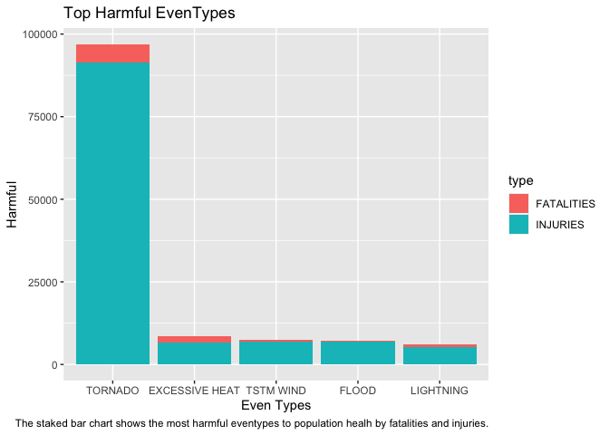
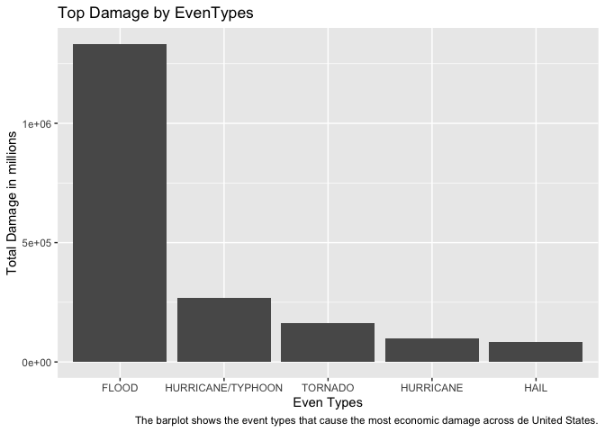

Exploring NOAA Storm Database
================

## “The most harmful eventypes in health and economics”

## Synopsis

This analysis want to ask two questions, the first one is which types of
event are the most harmful with respect to population health. The second
one is see which types of events have the greatest economic
consequences.

We explore the U.S. National Oceanic and Atmospheric Administration’s
(NOAA) storm database. This database tracks characteristics of major
storms and weather events in the United States, including when and where
they occur, as well as estimates of any fatalities, injuries, and
property damage.

**More info about the data:**

-   National Weather Service [Storm Data
    Documentation](https://d396qusza40orc.cloudfront.net/repdata%2Fpeer2_doc%2Fpd01016005curr.pdf)
-   National Climatic Data Center Storm Events
    [FAQ](https://d396qusza40orc.cloudfront.net/repdata%2Fpeer2_doc%2FNCDC%20Storm%20Events-FAQ%20Page.pdf)

Know which events are the most harmful in heath and economics can
support public policies.

## Data Processing

Load needed libraries

``` r
library(dplyr)
```

    ## 
    ## Attaching package: 'dplyr'

    ## The following objects are masked from 'package:stats':
    ## 
    ##     filter, lag

    ## The following objects are masked from 'package:base':
    ## 
    ##     intersect, setdiff, setequal, union

``` r
library(tidyr)
library(ggplot2)
library(lubridate)
```

    ## 
    ## Attaching package: 'lubridate'

    ## The following objects are masked from 'package:base':
    ## 
    ##     date, intersect, setdiff, union

Download and unzip data

``` r
# Downloading data
file <- "repdata_data_StormData.csv.bz2"
fileURL <- "https://d396qusza40orc.cloudfront.net/repdata%2Fdata%2FStormData.csv.bz2"

# Check if the file exists
if(!file.exists(file)){
  download.file(fileURL,file, method="curl") 
}

# Check if you unzip the data previously
if(!file.exists(file)){
  unzip(file)
}
```

Reading data

``` r
if(!exists("StormData")){
    StormData <- read.csv("~/datasciencecoursera/04_Reproducible_Research/course_project_2/repdata_data_StormData.csv", strip.white=TRUE)
}
```

Check structure and variable classes

``` r
str(StormData)
```

    ## 'data.frame':    902297 obs. of  37 variables:
    ##  $ STATE__   : num  1 1 1 1 1 1 1 1 1 1 ...
    ##  $ BGN_DATE  : chr  "4/18/1950 0:00:00" "4/18/1950 0:00:00" "2/20/1951 0:00:00" "6/8/1951 0:00:00" ...
    ##  $ BGN_TIME  : chr  "0130" "0145" "1600" "0900" ...
    ##  $ TIME_ZONE : chr  "CST" "CST" "CST" "CST" ...
    ##  $ COUNTY    : num  97 3 57 89 43 77 9 123 125 57 ...
    ##  $ COUNTYNAME: chr  "MOBILE" "BALDWIN" "FAYETTE" "MADISON" ...
    ##  $ STATE     : chr  "AL" "AL" "AL" "AL" ...
    ##  $ EVTYPE    : chr  "TORNADO" "TORNADO" "TORNADO" "TORNADO" ...
    ##  $ BGN_RANGE : num  0 0 0 0 0 0 0 0 0 0 ...
    ##  $ BGN_AZI   : chr  "" "" "" "" ...
    ##  $ BGN_LOCATI: chr  "" "" "" "" ...
    ##  $ END_DATE  : chr  "" "" "" "" ...
    ##  $ END_TIME  : chr  "" "" "" "" ...
    ##  $ COUNTY_END: num  0 0 0 0 0 0 0 0 0 0 ...
    ##  $ COUNTYENDN: logi  NA NA NA NA NA NA ...
    ##  $ END_RANGE : num  0 0 0 0 0 0 0 0 0 0 ...
    ##  $ END_AZI   : chr  "" "" "" "" ...
    ##  $ END_LOCATI: chr  "" "" "" "" ...
    ##  $ LENGTH    : num  14 2 0.1 0 0 1.5 1.5 0 3.3 2.3 ...
    ##  $ WIDTH     : num  100 150 123 100 150 177 33 33 100 100 ...
    ##  $ F         : int  3 2 2 2 2 2 2 1 3 3 ...
    ##  $ MAG       : num  0 0 0 0 0 0 0 0 0 0 ...
    ##  $ FATALITIES: num  0 0 0 0 0 0 0 0 1 0 ...
    ##  $ INJURIES  : num  15 0 2 2 2 6 1 0 14 0 ...
    ##  $ PROPDMG   : num  25 2.5 25 2.5 2.5 2.5 2.5 2.5 25 25 ...
    ##  $ PROPDMGEXP: chr  "K" "K" "K" "K" ...
    ##  $ CROPDMG   : num  0 0 0 0 0 0 0 0 0 0 ...
    ##  $ CROPDMGEXP: chr  "" "" "" "" ...
    ##  $ WFO       : chr  "" "" "" "" ...
    ##  $ STATEOFFIC: chr  "" "" "" "" ...
    ##  $ ZONENAMES : chr  "" "" "" "" ...
    ##  $ LATITUDE  : num  3040 3042 3340 3458 3412 ...
    ##  $ LONGITUDE : num  8812 8755 8742 8626 8642 ...
    ##  $ LATITUDE_E: num  3051 0 0 0 0 ...
    ##  $ LONGITUDE_: num  8806 0 0 0 0 ...
    ##  $ REMARKS   : chr  "" "" "" "" ...
    ##  $ REFNUM    : num  1 2 3 4 5 6 7 8 9 10 ...

Change some variables to correct class

``` r
# BGN_DATE to date
StormData$BGN_DATE <- mdy_hms(StormData$BGN_DATE)

# Some variables to factor
StormData$COUNTYNAME <- as.factor(StormData$COUNTYNAME)
StormData$STATE <- as.factor(StormData$STATE)
StormData$EVTYPE <- as.factor(StormData$EVTYPE)
StormData$PROPDMGEXP <- as.factor(StormData$PROPDMGEXP)
StormData$CROPDMGEXP <- as.factor(StormData$CROPDMGEXP)
```

We need also standardize `EVTYPE` and `damage exp` in capital letters to
deduplicate data.

``` r
StormData <- StormData %>%
  mutate(EVTYPE=toupper(EVTYPE)) %>%
  mutate(PROPDMGEXP = toupper(PROPDMGEXP))  %>%
  mutate(CROPDMGEXP = toupper(CROPDMGEXP))
```

In order to calculate question 2, we need to change the damage
exponential for numerical values. First we see how many elements we have
is these variables.

``` r
unique(StormData$PROPDMGEXP)
```

    ##  [1] "K" "M" ""  "B" "+" "0" "5" "6" "?" "4" "2" "3" "H" "7" "-" "1" "8"

``` r
unique(StormData$CROPDMGEXP)
```

    ## [1] ""  "M" "K" "B" "?" "0" "2"

Change H, M, K, B for corresponding valor

``` r
StormData$PROPDMGEXP <- gsub("B","1000000000",StormData$PROPDMGEXP)
StormData$PROPDMGEXP <- gsub("K","1000",StormData$PROPDMGEXP)
StormData$PROPDMGEXP <- gsub("M","1000000",StormData$PROPDMGEXP)
StormData$PROPDMGEXP <- gsub("H","100",StormData$PROPDMGEXP)
StormData$PROPDMGEXP <- gsub("+","0",StormData$PROPDMGEXP, fixed = TRUE)
StormData$PROPDMGEXP <- gsub("?","0",StormData$PROPDMGEXP, fixed = TRUE)
StormData$PROPDMGEXP <- gsub("-","0",StormData$PROPDMGEXP, fixed = TRUE)
StormData$PROPDMGEXP <- gsub("^$","0",StormData$PROPDMGEXP)
StormData$PROPDMGEXP <- gsub("5","100000",StormData$PROPDMGEXP)
StormData$PROPDMGEXP <- gsub("6","1000000",StormData$PROPDMGEXP)
StormData$PROPDMGEXP <- gsub("4","10000",StormData$PROPDMGEXP)
StormData$PROPDMGEXP <- gsub("2","100",StormData$PROPDMGEXP)
StormData$PROPDMGEXP <- gsub("3","10000000",StormData$PROPDMGEXP)
StormData$PROPDMGEXP <- gsub("1","10",StormData$PROPDMGEXP)
StormData$PROPDMGEXP <- gsub("8","100000000",StormData$PROPDMGEXP)

StormData$CROPDMGEXP <- gsub("B","1000000000",StormData$CROPDMGEXP)
StormData$CROPDMGEXP <- gsub("K","1000",StormData$CROPDMGEXP)
StormData$CROPDMGEXP <- gsub("M","1000000",StormData$CROPDMGEXP)
StormData$CROPDMGEXP <- gsub("H","100",StormData$CROPDMGEXP)
StormData$CROPDMGEXP <- gsub("+","0",StormData$CROPDMGEXP, fixed = TRUE)
StormData$CROPDMGEXP <- gsub("?","0",StormData$CROPDMGEXP, fixed = TRUE)
StormData$CROPDMGEXP <- gsub("-","0",StormData$CROPDMGEXP, fixed = TRUE)
StormData$CROPDMGEXP <- gsub("^$","0",StormData$CROPDMGEXP)
StormData$CROPDMGEXP <- gsub("2","100",StormData$CROPDMGEXP)
```

Check againg

``` r
unique(StormData$PROPDMGEXP)
```

    ##  [1] "10000"       "10000000"    "0"           "10000000000" "1000000"    
    ##  [6] "100000"      "1000"        "100000000"   "7"           "10"

``` r
unique(StormData$CROPDMGEXP)
```

    ## [1] "0"          "1000000"    "1000"       "1000000000" "100"

## Results

### Question 1

**Across the United States, which types of events (as indicated in the
EVTYPE variable) are most harmful with respect to population health?**

We need to calculate the total **injuries** and **fatalities** by each
type of event to determine the most harmful.

We group the dataset by event type and sum the total of injuries and
fatalities.

``` r
HarmfulData <- StormData %>%
  group_by(EVTYPE) %>%
  summarise(FATALITIES = sum(FATALITIES),
            INJURIES = sum(INJURIES)) %>%
  mutate(total_harmful = FATALITIES + INJURIES) %>% 
  arrange(desc(total_harmful)) %>% 
  slice(1:5)
HarmfulData
```

    ## # A tibble: 5 × 4
    ##   EVTYPE         FATALITIES INJURIES total_harmful
    ##   <chr>               <dbl>    <dbl>         <dbl>
    ## 1 TORNADO              5633    91346         96979
    ## 2 EXCESSIVE HEAT       1903     6525          8428
    ## 3 TSTM WIND             504     6957          7461
    ## 4 FLOOD                 470     6789          7259
    ## 5 LIGHTNING             816     5230          6046

Plotting to visualize the most eventype harmful

``` r
# Making copy to reorganize data
total_harmful <- HarmfulData
total_harmful$total_harmful <- NULL

# Reorganize data
final_harm <- gather(total_harmful, type, count, -EVTYPE)
# Dropping empty levels
final_harm$EVTYPE <- as.factor(final_harm$EVTYPE)
final_harm$EVTYPE <- droplevels(final_harm$EVTYPE)

# Plotting barplot
ggplot(final_harm, aes(x = reorder(EVTYPE, -count), y = count, fill = type)) + 
  geom_bar(stat = "identity") +
    labs(title = "Top Harmful EvenTypes",
       caption = "The staked bar chart shows the most harmful eventypes to population healh by fatalities and injuries.") +
  xlab("Even Types") + ylab("Harmful")
```

<!-- -->

> From the above data the most harmful event to population health across
> United States is `TORNADO` with `96979` deaths or injuries.

### Question 2

**Across the United States, which types of events have the greatest
economic consequences?**

First we select only the values on EXP more than 0

``` r
total_damage <- StormData %>%
  select(EVTYPE, PROPDMG, PROPDMGEXP, CROPDMG, CROPDMGEXP) %>%
  filter(PROPDMGEXP > 0) %>%
  filter(CROPDMGEXP > 0)
```

Calculate total damage per PROP and CROP and calculate total damage in
millions.

``` r
total_damage$EVTYPE <- as.factor(total_damage$EVTYPE)
total_damage <- total_damage %>%
  mutate(prop_damage = PROPDMG * as.numeric(PROPDMGEXP)) %>%
  mutate(crop_damage = CROPDMG * as.numeric(CROPDMGEXP)) %>%
  mutate(prop_crop = (prop_damage + crop_damage)/1000000)
```

Group by event type and calculate total damage by event type, sorting
and getting top 5.

``` r
total_damage <- total_damage %>%  
  group_by(EVTYPE) %>%
  summarise(total = sum(prop_crop)) %>%
  arrange(desc(total)) %>% 
  slice(1:5)
```

Plotting total damage by event type

``` r
# Dropping empty levels
total_damage$EVTYPE <- droplevels(total_damage$EVTYPE)
# Plotting barplot
ggplot(total_damage, aes(x = reorder(EVTYPE, -total), y = total)) + 
  geom_bar(stat = "identity") +
  labs(title = "Top Damage by EvenTypes",
       caption = "The barplot shows the event types that cause the most economic damage across de United States.") +
  xlab("Even Types") + ylab("Total Damage in millions")
```

<!-- -->

``` r
total_damage
```

    ## # A tibble: 5 × 2
    ##   EVTYPE               total
    ##   <fct>                <dbl>
    ## 1 FLOOD             1333536.
    ## 2 HURRICANE/TYPHOON  270011.
    ## 3 TORNADO            162021.
    ## 4 HURRICANE           99852.
    ## 5 HAIL                82002.

> From the above data the events that have the greatest economic
> consequences across United States are `FLOOD`, `HURRICANE/TYPHOON` and
> `TORNADO`.
