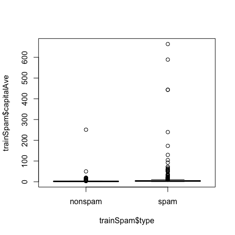
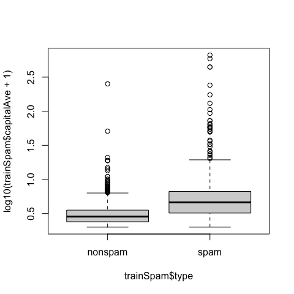
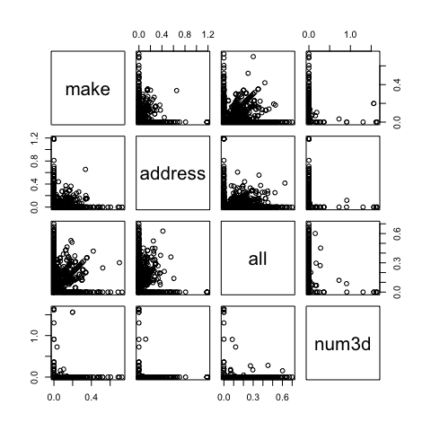
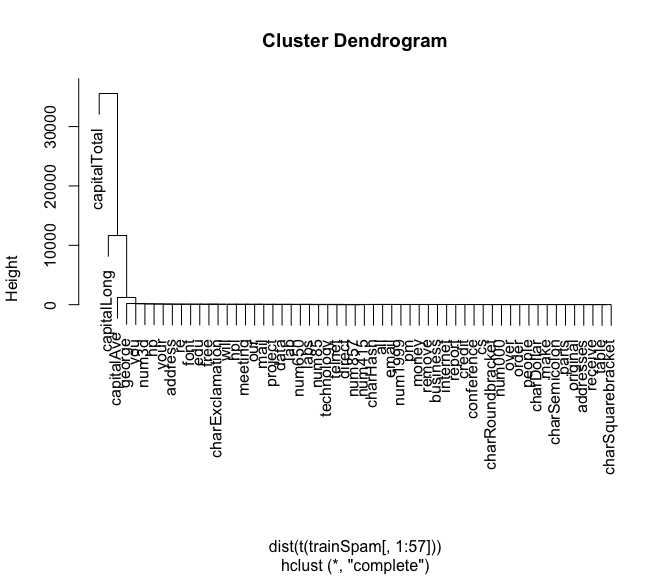
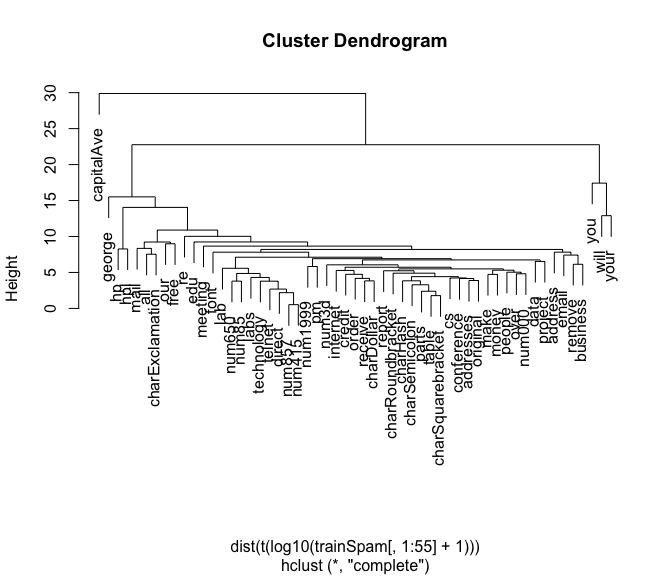

Structure of a Data Analysis 2
================

-   [Steps in a data analysis](#steps-in-a-data-analysis)
-   [An example](#an-example)
-   [Our data set](#our-data-set)
-   [Subsampling our data set](#subsampling-our-data-set)
-   [Exploratory data analysis](#exploratory-data-analysis)
-   [Names](#names)
-   [Head](#head)
-   [Summaries](#summaries)
-   [Plots](#plots)
-   [Plots](#plots-1)
-   [Relationships between
    predictors](#relationships-between-predictors)
-   [Clustering](#clustering)
-   [New clustering](#new-clustering)
-   [Statistical prediction/modeling](#statistical-predictionmodeling)
-   [Statistical prediction/modeling](#statistical-predictionmodeling-1)
-   [Get a measure of uncertainty](#get-a-measure-of-uncertainty)
-   [Get a measure of uncertainty](#get-a-measure-of-uncertainty-1)
-   [Interpret results](#interpret-results)
-   [Our example](#our-example)
-   [Challenge results](#challenge-results)
-   [Synthesize/write-up results](#synthesizewrite-up-results)
-   [In our example](#in-our-example)
-   [Create reproducible code](#create-reproducible-code)

> Source:
> <https://github.com/DataScienceSpecialization/courses/blob/master/05_ReproducibleResearch/structureOfADataAnalysis2/index.Rmd>

## Steps in a data analysis

-   Define the question
-   Define the ideal data set
-   Determine what data you can access
-   Obtain the data
-   Clean the data
-   **Exploratory data analysis**
-   **Statistical prediction/modeling**
-   **Interpret results**
-   **Challenge results**
-   **Synthesize/write up results**
-   **Create reproducible code**

## An example

**Start with a general question**

Can I automatically detect emails that are SPAM or not?

**Make it concrete**

Can I use quantitative characteristics of the emails to classify them as
SPAM/HAM?

## Our data set


<http://search.r-project.org/library/kernlab/html/spam.html>

## Subsampling our data set

We need to generate a test and training set (prediction)

``` r
# If it isn't installed, install the kernlab package
library(kernlab)
data(spam)
# Perform the subsampling
set.seed(3435)
trainIndicator = rbinom(4601,size=1,prob=0.5)
table(trainIndicator)
```

    ## trainIndicator
    ##    0    1 
    ## 2314 2287

``` r
trainSpam = spam[trainIndicator==1,]
testSpam = spam[trainIndicator==0,]
```

## Exploratory data analysis

-   Look at summaries of the data
-   Check for missing data
-   Create exploratory plots
-   Perform exploratory analyses (e.g. clustering)

## Names

``` r
names(trainSpam)
```

    ##  [1] "make"              "address"           "all"              
    ##  [4] "num3d"             "our"               "over"             
    ##  [7] "remove"            "internet"          "order"            
    ## [10] "mail"              "receive"           "will"             
    ## [13] "people"            "report"            "addresses"        
    ## [16] "free"              "business"          "email"            
    ## [19] "you"               "credit"            "your"             
    ## [22] "font"              "num000"            "money"            
    ## [25] "hp"                "hpl"               "george"           
    ## [28] "num650"            "lab"               "labs"             
    ## [31] "telnet"            "num857"            "data"             
    ## [34] "num415"            "num85"             "technology"       
    ## [37] "num1999"           "parts"             "pm"               
    ## [40] "direct"            "cs"                "meeting"          
    ## [43] "original"          "project"           "re"               
    ## [46] "edu"               "table"             "conference"       
    ## [49] "charSemicolon"     "charRoundbracket"  "charSquarebracket"
    ## [52] "charExclamation"   "charDollar"        "charHash"         
    ## [55] "capitalAve"        "capitalLong"       "capitalTotal"     
    ## [58] "type"

## Head

``` r
head(trainSpam)
```

    ##    make address  all num3d  our over remove internet order mail receive will
    ## 1  0.00    0.64 0.64     0 0.32 0.00   0.00        0  0.00 0.00    0.00 0.64
    ## 7  0.00    0.00 0.00     0 1.92 0.00   0.00        0  0.00 0.64    0.96 1.28
    ## 9  0.15    0.00 0.46     0 0.61 0.00   0.30        0  0.92 0.76    0.76 0.92
    ## 12 0.00    0.00 0.25     0 0.38 0.25   0.25        0  0.00 0.00    0.12 0.12
    ## 14 0.00    0.00 0.00     0 0.90 0.00   0.90        0  0.00 0.90    0.90 0.00
    ## 16 0.00    0.42 0.42     0 1.27 0.00   0.42        0  0.00 1.27    0.00 0.00
    ##    people report addresses free business email  you credit your font num000
    ## 1    0.00      0         0 0.32        0  1.29 1.93   0.00 0.96    0      0
    ## 7    0.00      0         0 0.96        0  0.32 3.85   0.00 0.64    0      0
    ## 9    0.00      0         0 0.00        0  0.15 1.23   3.53 2.00    0      0
    ## 12   0.12      0         0 0.00        0  0.00 1.16   0.00 0.77    0      0
    ## 14   0.90      0         0 0.00        0  0.00 2.72   0.00 0.90    0      0
    ## 16   0.00      0         0 1.27        0  0.00 1.70   0.42 1.27    0      0
    ##    money hp hpl george num650 lab labs telnet num857 data num415 num85
    ## 1   0.00  0   0      0      0   0    0      0      0 0.00      0     0
    ## 7   0.00  0   0      0      0   0    0      0      0 0.00      0     0
    ## 9   0.15  0   0      0      0   0    0      0      0 0.15      0     0
    ## 12  0.00  0   0      0      0   0    0      0      0 0.00      0     0
    ## 14  0.00  0   0      0      0   0    0      0      0 0.00      0     0
    ## 16  0.42  0   0      0      0   0    0      0      0 0.00      0     0
    ##    technology num1999 parts pm direct cs meeting original project re edu table
    ## 1           0    0.00     0  0   0.00  0       0      0.0       0  0   0     0
    ## 7           0    0.00     0  0   0.00  0       0      0.0       0  0   0     0
    ## 9           0    0.00     0  0   0.00  0       0      0.3       0  0   0     0
    ## 12          0    0.00     0  0   0.00  0       0      0.0       0  0   0     0
    ## 14          0    0.00     0  0   0.00  0       0      0.0       0  0   0     0
    ## 16          0    1.27     0  0   0.42  0       0      0.0       0  0   0     0
    ##    conference charSemicolon charRoundbracket charSquarebracket charExclamation
    ## 1           0         0.000            0.000                 0           0.778
    ## 7           0         0.000            0.054                 0           0.164
    ## 9           0         0.000            0.271                 0           0.181
    ## 12          0         0.022            0.044                 0           0.663
    ## 14          0         0.000            0.000                 0           0.000
    ## 16          0         0.000            0.063                 0           0.572
    ##    charDollar charHash capitalAve capitalLong capitalTotal type
    ## 1       0.000    0.000      3.756          61          278 spam
    ## 7       0.054    0.000      1.671           4          112 spam
    ## 9       0.203    0.022      9.744         445         1257 spam
    ## 12      0.000    0.000      1.243          11          184 spam
    ## 14      0.000    0.000      2.083           7           25 spam
    ## 16      0.063    0.000      5.659          55          249 spam

## Summaries

``` r
table(trainSpam$type)
```

    ## 
    ## nonspam    spam 
    ##    1381     906

## Plots

``` r
plot(trainSpam$capitalAve ~ trainSpam$type)
```

<!-- -->

## Plots

``` r
plot(log10(trainSpam$capitalAve + 1) ~ trainSpam$type)
```

<!-- -->

## Relationships between predictors

``` r
plot(log10(trainSpam[,1:4]+1))
```

<!-- -->

## Clustering

``` r
hCluster = hclust(dist(t(trainSpam[,1:57])))
plot(hCluster)
```

<!-- -->

## New clustering

``` r
hClusterUpdated = hclust(dist(t(log10(trainSpam[,1:55]+1))))
plot(hClusterUpdated)
```

<!-- -->

## Statistical prediction/modeling

-   Should be informed by the results of your exploratory analysis
-   Exact methods depend on the question of interest
-   Transformations/processing should be accounted for when necessary
-   Measures of uncertainty should be reported

## Statistical prediction/modeling

``` r
trainSpam$numType = as.numeric(trainSpam$type)-1
costFunction = function(x,y) sum(x!=(y > 0.5)) 
cvError = rep(NA,55)
library(boot)
for(i in 1:55){
  lmFormula = reformulate(names(trainSpam)[i], response = "numType")
  glmFit = glm(lmFormula,family="binomial",data=trainSpam)
  cvError[i] = cv.glm(trainSpam,glmFit,costFunction,2)$delta[2]
}
## Which predictor has minimum cross-validated error?
names(trainSpam)[which.min(cvError)]
```

    ## [1] "charDollar"

## Get a measure of uncertainty

``` r
## Use the best model from the group
predictionModel = glm(numType ~ charDollar,family="binomial",data=trainSpam)
## Get predictions on the test set
predictionTest = predict(predictionModel,testSpam)
predictedSpam = rep("nonspam",dim(testSpam)[1])
## Classify as `spam' for those with prob > 0.5
predictedSpam[predictionModel$fitted > 0.5] = "spam"
```

## Get a measure of uncertainty

``` r
## Classification table
table(predictedSpam,testSpam$type)
```

    ##              
    ## predictedSpam nonspam spam
    ##       nonspam    1346  458
    ##       spam         61  449

``` r
## Error rate
(61+458)/(1346+458 + 61 + 449)
```

    ## [1] 0.2242869

## Interpret results

-   Use the appropriate language
    -   describes
    -   correlates with/associated with
    -   leads to/causes
    -   predicts
-   Give an explanation
-   Interpret coefficients
-   Interpret measures of uncertainty

## Our example

-   The fraction of characters that are dollar signs can be used to
    predict if an email is Spam
-   Anything with more than 6.6% dollar signs is classified as Spam
-   More dollar signs always means more Spam under our prediction
-   Our test set error rate was 22.4%

## Challenge results

-   Challenge all steps:
    -   Question
    -   Data source
    -   Processing
    -   Analysis
    -   Conclusions
-   Challenge measures of uncertainty
-   Challenge choices of terms to include in models
-   Think of potential alternative analyses

## Synthesize/write-up results

-   Lead with the question
-   Summarize the analyses into the story
-   Don’t include every analysis, include it
    -   If it is needed for the story
    -   If it is needed to address a challenge
-   Order analyses according to the story, rather than chronologically
-   Include “pretty” figures that contribute to the story

## In our example

-   Lead with the question
    -   Can I use quantitative characteristics of the emails to classify
        them as SPAM/HAM?
-   Describe the approach
    -   Collected data from UCI -&gt; created training/test sets
    -   Explored relationships
    -   Choose logistic model on training set by cross validation
    -   Applied to test, 78% test set accuracy
-   Interpret results
    -   Number of dollar signs seems reasonable, e.g. “Make money with
        Viagra \\$ \\$ \\$ \\$!”
-   Challenge results
    -   78% isn’t that great
    -   I could use more variables
    -   Why logistic regression?

## Create reproducible code


