```{r setup, include=FALSE}
knitr::opts_chunk$set(echo = TRUE)
```

> [Slides from this lesson](https://github.com/DataScienceSpecialization/courses/raw/master/05_ReproducibleResearch/knitr/knitr.pdf)

## Problems,	Problems

- Authors	must	undertake	considerable	effort	to	put	data/results	on	the	web	
- Readers	must	download	data/results	individually	and	piece	together	which	data	go	with	which	code sections, etc.	
- Authors/readers	must	manually	interact	with	websites	
- There	is	no	single	document	to	integrate	data	analysis with	textual	representations;	i.e.	data,	code,	and	text are not linked.

## Literate	Statistical	Programming

- Original	idea	comes	from	Don	Knuth	
- An	article	is	a	stream	of	text	and	code
- Analysis	code	is	divided	into	text	and	code	“chunks”	
- Presentation	code	formats	results	(tables,	figures,	etc.)	
- Article	text	explains	what	is	going	on	
- Literate	programs	are	weaved	to	produce	human readable	documents	and	tangled	to	produce	machine readable	documents
- Literate	programming	is	a	general	concept. We need	
  – A	documentation	language	
  – A	programming	language	
- The	original Sweave	system	developed	by Friedrich	Leisch	used	LaTeX	and	R	
- knitr	supports	a	variety	of	documentation languages	

## How	Do	I	Make	My	Work	Reproducible?

- Decide	to	do	it	(ideally	from	the	start)	
- Keep	track	of	things,	perhaps	with	a	version	 control	system	to	track	snapshots/changes	
- Use	software	whose	operation	can	be	coded	
- Don’t	save	output	
- Save	data	in	non-proprietary	formats

## Literate	Programming:	Pros

- Text	and	code	all	in	one	place,	logical	order	
- Data,	results	automatically	updated	to	reflect	external	changes	
- Code	is	live--automatic	“regression	test”	when building	a	document

## Literate	Programming:	Cons

- Text	and	code	all	in	one	place;	can	make documents	difficult	to	read,	especially	if	there	is	a	lot	of	code	
- Can	substantially	slow	down	processing	of documents	(although	there	are	tools	to	help)

## What	is	knitr?

- An	R	package	written	by	Yihui Xie	(while	he	was	a	grad	student	at	Iowa	State)
  – Available	on	CRAN	
- Supports	RMarkdown,	LaTeX,	and	HTML	as	documentation	languages	
- Can	export	to	PDF,	HTML	
- Built	right	into	RStudio	for	your	convenience	

## Requirements

- A	recent	version	of	R	
- A	text	editor	(the	one	that	comes	with	RStudio	is okay)	
- Some	support	packages	also	available	on	CRAN	
- Some	knowledge	of	Markdown,	LaTeX,	or	HTML	
- We	will	use	Markdown	here

## What	is	Markdown?

- A	simplified	version	of	“markup”	languages	
- No	special	editor	required	
- Simple,	intuitive	formatting	elements	
- Complete	information	available	at [Daring Fireball](https://daringfireball.net/projects/markdown/basics)

## What	is	knitr	Good	For?

- Manuals	
- Short/medium-length	technical	documents	
- Tutorials	
- Reports	(esp.	if	generated	periodically)	
- Data	preprocessing	documents/summaries

## What	is	knitr	NOT	Good	For?

- Very	long	research	articles	
- Complex	time-consuming	computations	
- Documents	that	require	precise	formatting

## My	First	knitr	Document
First create a new document, and then choose an R Markdown document
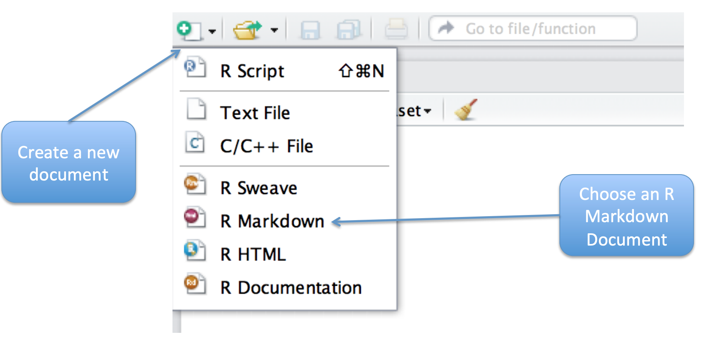

Use markdown for the text, and for code chunks use ``` like separator
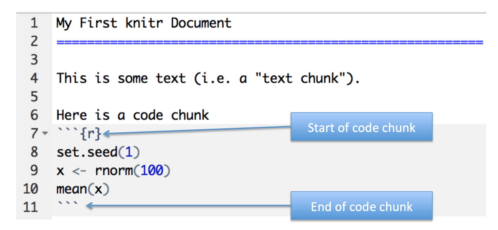

To process the document clic ```knitr HTML``` button.
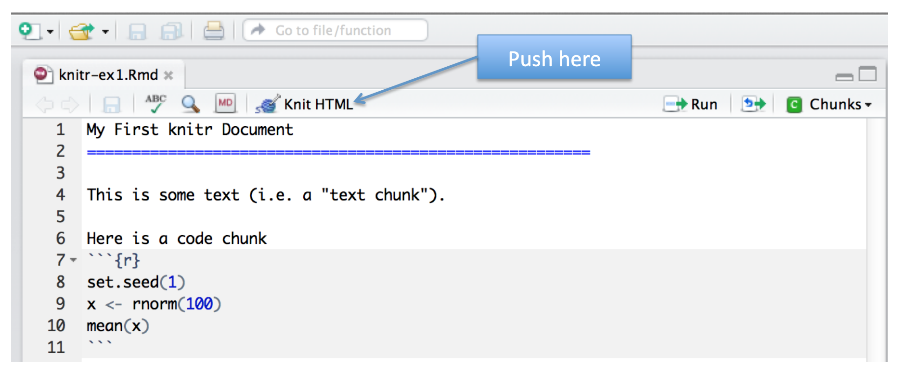

## More	Complicated	Way	
```
library(knitr)
setwd(<working directory>)
knit2html(“document.Rmd”)
browseURL(“document.html”)
```

## Output
Can be in HTML or others like this document that get a github markdown document.
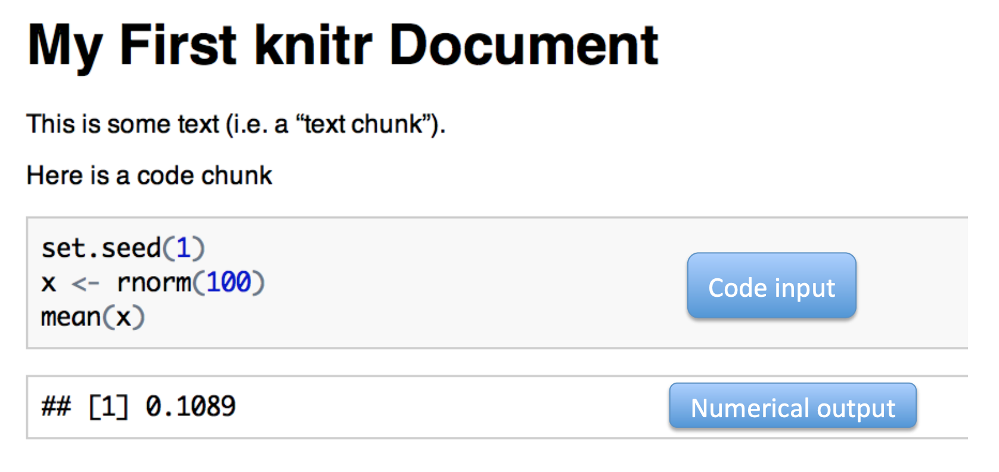

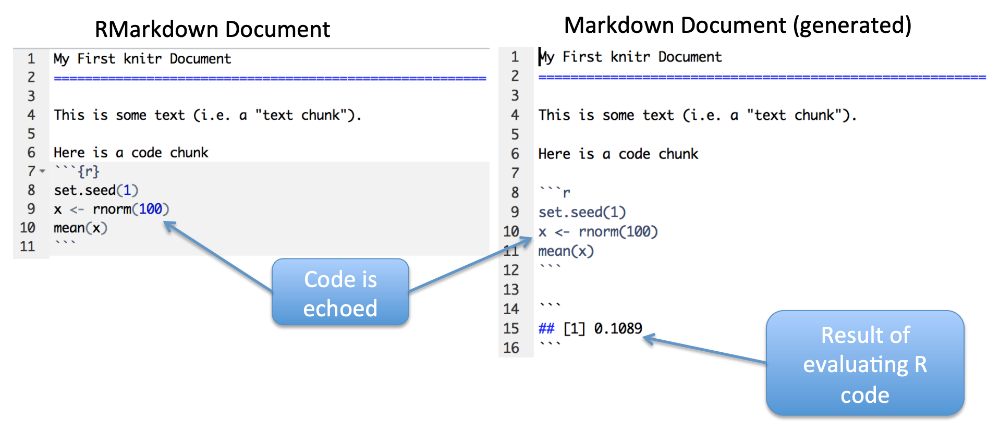

## A	Few	Notes	

- knitr	will	fill	a	new	document	with	filler	text;	delete	it	
- Code	chunks	begin	with	```{r}	and	end	with	```
- All	R	code	goes	in	between	these	markers	
- Code	chunks	can	have	names,	which	is	useful	when	we start	making	graphics	
```{r firstchunk}
## R code goes here
```
- By	default,	code	in	a	code	chunk	is	echoed,	as	will	the	results	of	the	computation	(if	there	are	results	to	print)

## Processing	of	knitr	Documents	(what	happens	under	the	hood)

- You	write	the	RMarkdown	document	(.Rmd)	
- knitr	produces	a	Markdown	document	(.md)	
- knitr	converts	the	Markdown	document	into HTML	(by	default)	
- .Rmd	->	.md	->	.html	
- You	should	NOT	edit	(or	save)	the	.md	or	.html	documents	until	you	are	finished

## Another	Example
For this code in knitr document
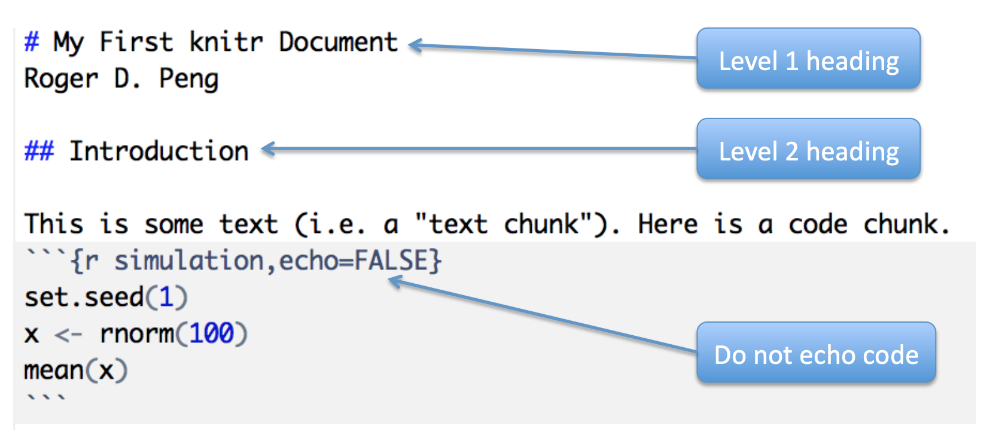

We get this output. The code is not show, not echoed.
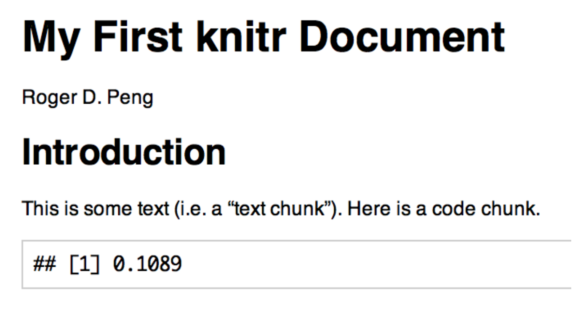

## Hiding	Results
To hide results you have to indicate in chunk like this
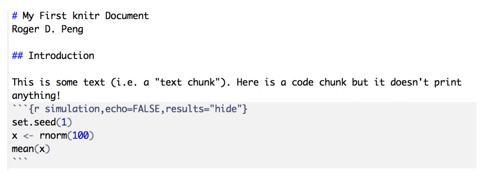

Then you get this
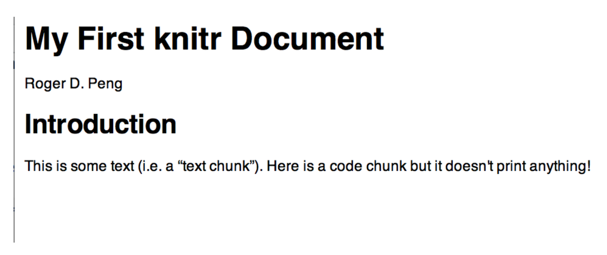

## Inline	Text	Computations
You can make computations in a chunk defining variables to use inline. Don't forget to make ```echo = FALSE``` if you don't want to show your code.
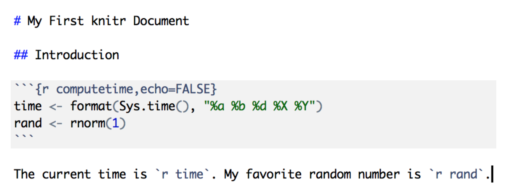

You get this
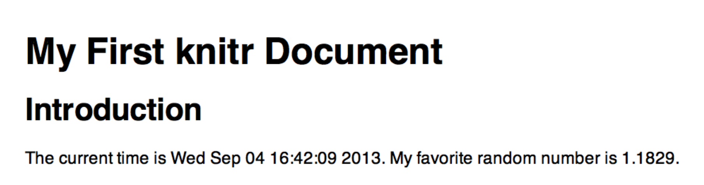

## Incorporating	Graphics
You can insert graphics, and define in chunk properties like height.
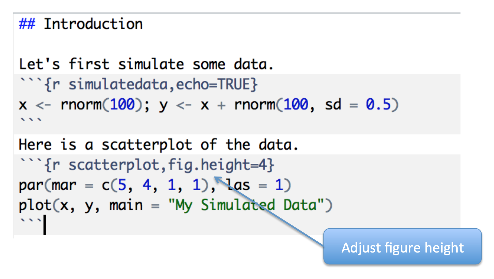
You get the graphic inline at document
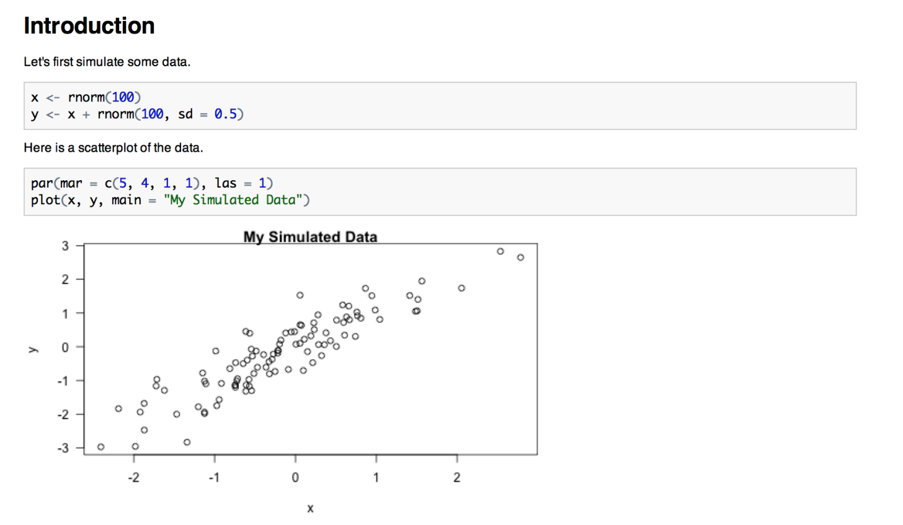

In behind the scenes, knitr produces this in HTML to insert image
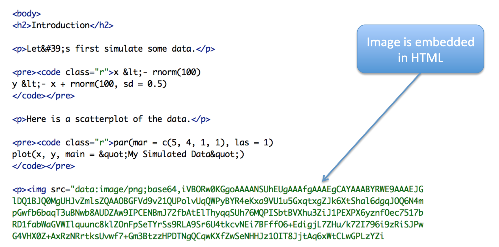

## Making	Tables	with	xtable
With ```xtable``` you can insert tables in document

First some data
```{r fitmodel}
library(datasets)
data("airquality")
fit <- lm(Ozone ~ Wind + Temp + Solar.R, data = airquality)
```

Second make table and insert inline at document
```{r showtable, results="asis"}
library(xtable)
xt <- xtable(summary(fit))
print(xt, type = "html")
```

## Setting Global Options

- Sometimes	we	want	to	set	options	for	every code	chunk	that	are	different	from	the	 defaults	
- For	example,	we	may	want	to	suppress	all	code	echoing	and	results	output	
- We	have	to	write	some	code	to	set	these	global	options	

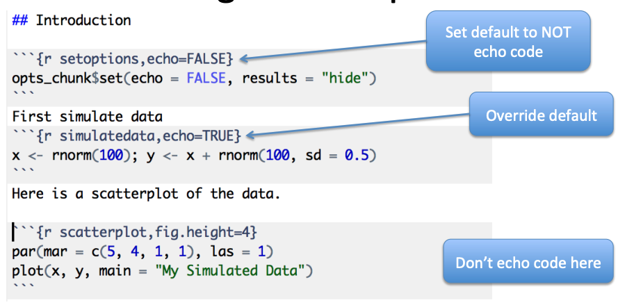

Then the output is
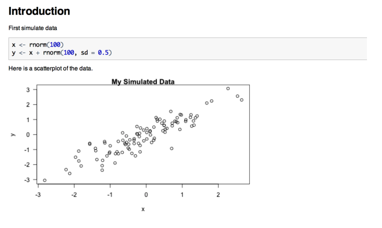

## Some common options

- Output	
  – results:	“asis”,	“hide”	
  – echo:	TRUE,	FALSE	
- Figures	
  – fig.height:	numeric	
  – fig.width:	numeric	
  
## Caching computations

- What	if	one	chunk	takes	a	long	time	to	run?	
- All	chunks	have	to	be	re-computed	every	time you	re-knit	the	file	
- The	cache=TRUE op)on	can	be	set	on	a	chunk-bychunk	basis	to	store	results	of	computation	
- After	the	first	run,	results	are	loaded	from	cache	

## Caching	Caveats

- If	the	data	or	code	(or	anything	external)	changes,	you	need	to	re-run	the	cached	code	chunks	
- Dependencies	are	not	checked	explicitly	
- Chunks	with	significant	side	effects	may	not	be	cacheable	

## Summary

- Literate	statistical	programming	can	be	a	useful	way	to	put	text,	code,	data,	output	all	in	one	document	
- knitr	is	a	powerful	tool	for	integrating	code	and	text	in	a	simple	document	format