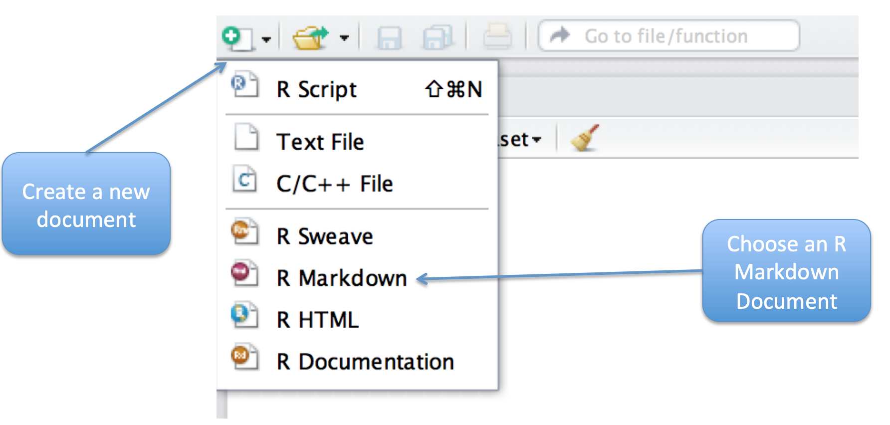
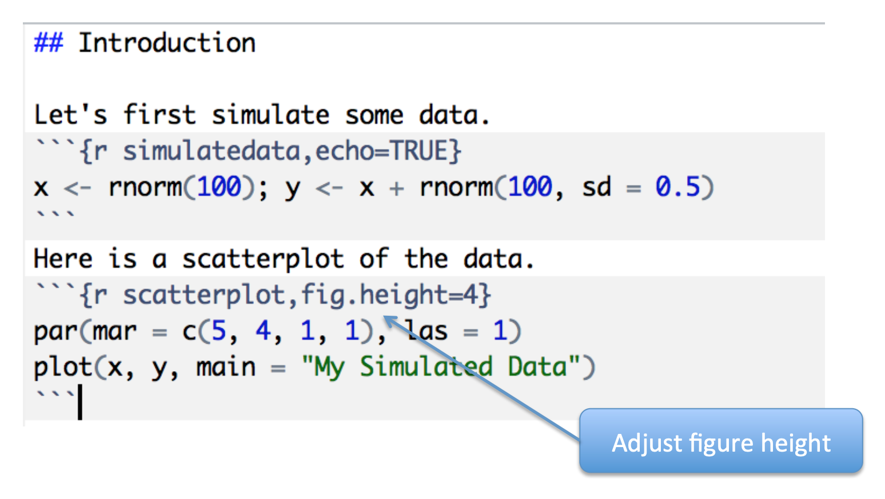
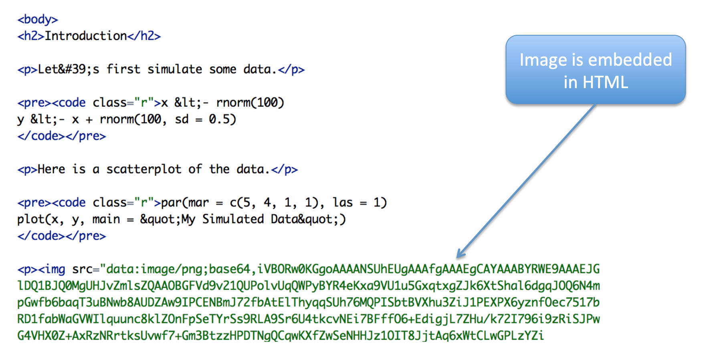

knitr
================

## Problems, Problems

-   Authors must undertake considerable effort to put data/results on
    the web
-   Readers must download data/results individually and piece together
    which data go with which code sections, etc.
-   Authors/readers must manually interact with websites  
-   There is no single document to integrate data analysis with textual
    representations; i.e. data, code, and text are not linked.

## Literate Statistical Programming

-   Original idea comes from Don Knuth  
-   An article is a stream of text and code
-   Analysis code is divided into text and code “chunks”  
-   Presentation code formats results (tables, figures, etc.)  
-   Article text explains what is going on  
-   Literate programs are weaved to produce human readable documents and
    tangled to produce machine readable documents
-   Literate programming is a general concept. We need  
    – A documentation language  
    – A programming language  
-   The original Sweave system developed by Friedrich Leisch used LaTeX
    and R  
-   knitr supports a variety of documentation languages

## How Do I Make My Work Reproducible?

-   Decide to do it (ideally from the start)  
-   Keep track of things, perhaps with a version control system to track
    snapshots/changes  
-   Use software whose operation can be coded  
-   Don’t save output  
-   Save data in non-proprietary formats

## Literate Programming: Pros

-   Text and code all in one place, logical order  
-   Data, results automatically updated to reflect external changes
-   Code is live–automatic “regression test” when building a document

## Literate Programming: Cons

-   Text and code all in one place; can make documents difficult to
    read, especially if there is a lot of code  
-   Can substantially slow down processing of documents (although there
    are tools to help)

## What is knitr?

-   An R package written by Yihui Xie (while he was a grad student at
    Iowa State) – Available on CRAN  
-   Supports RMarkdown, LaTeX, and HTML as documentation languages  
-   Can export to PDF, HTML  
-   Built right into RStudio for your convenience

## Requirements

-   A recent version of R  
-   A text editor (the one that comes with RStudio is okay)  
-   Some support packages also available on CRAN  
-   Some knowledge of Markdown, LaTeX, or HTML  
-   We will use Markdown here

## What is Markdown?

-   A simplified version of “markup” languages  
-   No special editor required  
-   Simple, intuitive formatting elements  
-   Complete information available at [Daring
    Fireball](https://daringfireball.net/projects/markdown/basics)

## What is knitr Good For?

-   Manuals  
-   Short/medium-length technical documents  
-   Tutorials
-   Reports (esp. if generated periodically)  
-   Data preprocessing documents/summaries

## What is knitr NOT Good For?

-   Very long research articles  
-   Complex time-consuming computations  
-   Documents that require precise formatting

## My First knitr Document

First create a new document, and then choose an R Markdown document


Use markdown for the text, and for code chunks use \`\`\` like separator


To process the document clic `knitr HTML` button. 

## More Complicated Way

    library(knitr)
    setwd(<working directory>)
    knit2html(“document.Rmd”)
    browseURL(“document.html”)

## Output

Can be in HTML or others like this document that get a github markdown
document. 


## A Few Notes

-   knitr will fill a new document with filler text; delete it  
-   Code chunks begin with `{r}  and end with`
-   All R code goes in between these markers
-   Code chunks can have names, which is useful when we start making
    graphics

``` r
## R code goes here
```

-   By default, code in a code chunk is echoed, as will the results of
    the computation (if there are results to print)

## Processing of knitr Documents (what happens under the hood)

-   You write the RMarkdown document (.Rmd)  
-   knitr produces a Markdown document (.md)  
-   knitr converts the Markdown document into HTML (by default)  
-   .Rmd -&gt; .md -&gt; .html  
-   You should NOT edit (or save) the .md or .html documents until you
    are finished

## Another Example

For this code in knitr document 

We get this output. The code is not show, not echoed. 

## Hiding Results

To hide results you have to indicate in chunk like this 

Then you get this 

## Inline Text Computations

You can make computations in a chunk defining variables to use inline.
Don’t forget to make `echo = FALSE` if you don’t want to show your code.


You get this 

## Incorporating Graphics

You can insert graphics, and define in chunk properties like height.
 You get the graphic
inline at document 

In behind the scenes, knitr produces this in HTML to insert image

