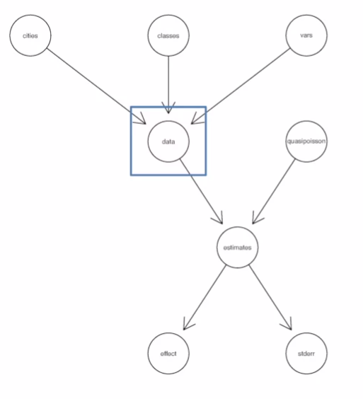
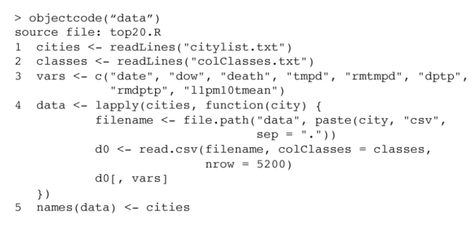
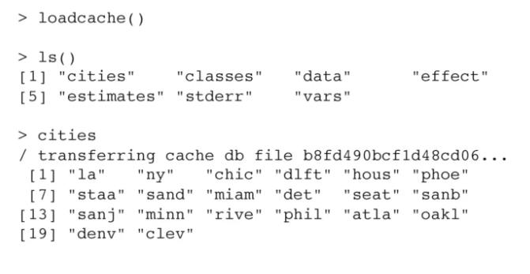

Caching Computations
================

-   [Referencias](#referencias)
-   [Literate (Statistical)
    Programming](#literate-statistical-programming)
-   [Research Pipeline](#research-pipeline)
-   [Caching Computations](#caching-computations)
-   [The `cacher()` package for R](#the-cacher-package-for-r)
-   [Conceptual Model](#conceptual-model)
-   [Using cacher as an Author](#using-cacher-as-an-author)
-   [Example: Simple Analysis](#example-simple-analysis)
-   [Using cacher as a Reader](#using-cacher-as-a-reader)
-   [Cloning an Analysis](#cloning-an-analysis)
-   [Examining Code](#examining-code)
-   [Analysis Code Graphs](#analysis-code-graphs)
-   [Tracing Code Backwards](#tracing-code-backwards)
-   [Running Code](#running-code)
-   [Checking Code and Objects](#checking-code-and-objects)
-   [Inspecting Data Objects](#inspecting-data-objects)
-   [Cacher Summary](#cacher-summary)

## Referencias

-   <https://rstudio-pubs-static.s3.amazonaws.com/157089_504d61c69ada43e8b9f67a0979d43c48.html>
-   <https://sux13.github.io/DataScienceSpCourseNotes/5_REPDATA/Reproducible_Research_Course_Notes.pdf>

## Literate (Statistical) Programming

-   An article is a stream of text and code
-   Analysis code is divided into text and code `chunks`
-   Each code chunk loads data and computes result
-   Presentation code formats results (tables, figures, etc.)
-   Article text explains what is going on
-   Literate programs can be weaved to produce human-readable documents
    and tangled to produce machine-readable documents.
-   Literate programming is a general concept that requires
    -   A documentation language
    -   A programming language (machine readable)
-   Sweave uses `LATEX` and `R` as the documentation and programming
    languages Sweave was developed by Friedrich Leisch (member of the R
    Core) and is maintained by R core.
-   [Main web
    site](https://web.archive.org/web/20101129175301/http://www.stat.uni-muenchen.de/~leisch/Sweave/)

## Research Pipeline


## Caching Computations


## The `cacher()` package for R

-   Add-on package for R
-   Evaluates code written in files and stores intermediate results in a
    key-value database
-   R expressions ar given SHA-1 hash values so that changes can be
    tracked and code reevaluated if necessary
-   “Cacher Packages” can be built for distribution
-   Other can “clone” an analysis and evaluate subsets of code or
    inspect data objects

> `cacher ()` package is outdated and was removed drom the CRAN
> repository. [More
> info](https://cran.r-project.org/web/packages/cacher/index.html)

> Other options:
> [R.cache](https://cran.r-project.org/web/packages/R.cache/index.html)

## Conceptual Model


## Using cacher as an Author

-   Parse de R source file; Create the necessary cache directories and
    sub directories
-   Cycle through each expression in the source file:
    -   If an expressions has never been evaluated, evaluate it and
        store any resulting R objects in the cache database
    -   If a cached result exists, lazy-load the results from the cache
        database and move to the next expression
    -   If an expressions does not create any R objects (i.e. there is
        nothing to cache), add the expression to the list of expressions
        where evaluation needs to be forced
    -   Write out metadata for this expression to the metadata file
-   The cachepackage function creates a cacher package storing
    -   Source file
    -   Cached data objects
    -   Metadata
-   Package file is zipped and can be distributed
-   Readers can unzip the file and inmmediately investigate its contents
    via cacher package

## Example: Simple Analysis


## Using cacher as a Reader

A journal article says…

> “… the code and data for this analysis can be found in the cacher
> package 092dcc7dda4b93e42f23e03a60e1d44dbec7b3f.”

``` r
> library(cacher)
> clonechache(id = "092dcc7dda4b93e42f23e03a60e1d44dbec7b3f")
> clonecache (id = "092d") ## same as above
created cache directory '.cache'

> showfiles()
[1] "top20.R"
> sourcefile("top20.R")
```

## Cloning an Analysis

-   Local directories created
-   Source code files and metadata are downloaded
-   Data objects are not downloaded by default
-   References to data objects are loaded and corresponding data can be
    lazy-loaded on demand.

## Examining Code

``` r
> code()
sourcefile: top20.R
1 cities <- readLines("citylist.txt")
2 classes <- readLines("colClasses.txt")
3 vars <- c("date", "dow", "death",)
4 data <- lapply(cities, )
5 names(data) <- citites
6 estimates <- sapply(data, function(city))
7 effect <- weighted.mean(estimates1, )
8 stderr <- sqrt(1/estimates[2, ])

> graphcode()
```

## Analysis Code Graphs



## Tracing Code Backwards



## Running Code

-   The `runcode()` function executes code in the source file
-   by default, expressions that results in an object being creatd are
    not run and the resulting objects is lazy-loaded into the workspace.
-   Expressions not resulting in objects are evaluated

## Checking Code and Objects

-   The `checkcode()` function evaluates all expressions from scratch
    (no lazy-loading)
-   Results of evaluation are checked against stored results to see if
    the results are the same as what the author calculated
    -   Setting `RNG` seeds is critical for this to work
-   The integrity of data objects can be verified with the
    `checkobjects()` function to check for possible corruption of data
    (i.e. in transit)

## Inspecting Data Objects



## Cacher Summary

-   The `cacher` package can be used by authors to create cache packages
    from data analysis for distribution
-   Readers can user the `cacher` package to inspect other’s data
    analysis by examining cached computations.
-   `cacher` is mindful of reader’s resources and efficiently loads only
    those data objects that are needed.
