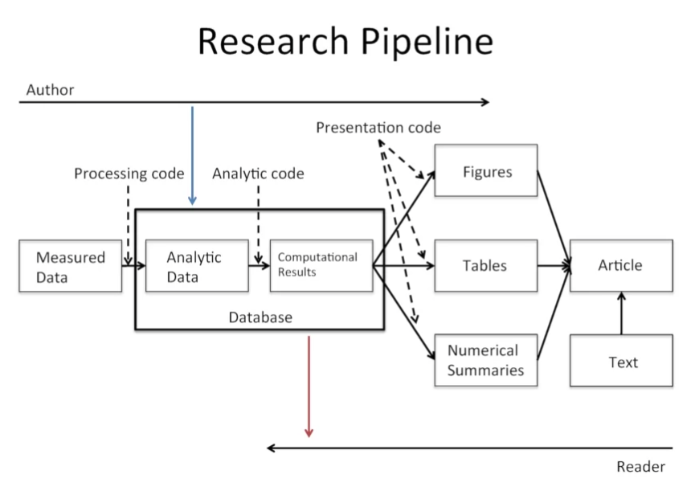
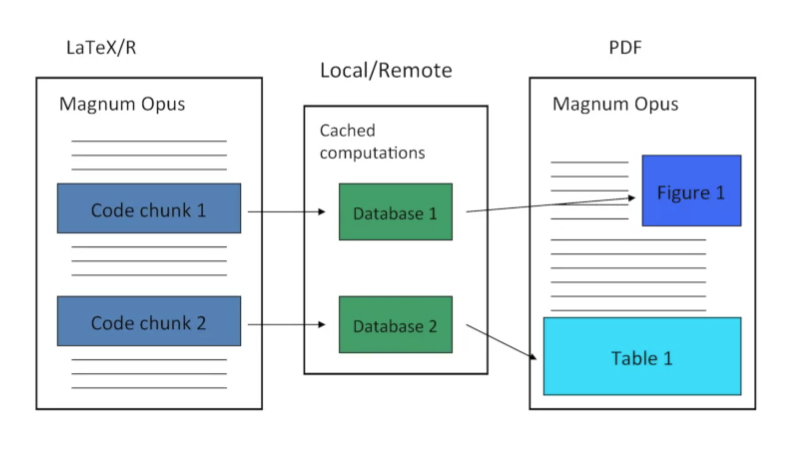
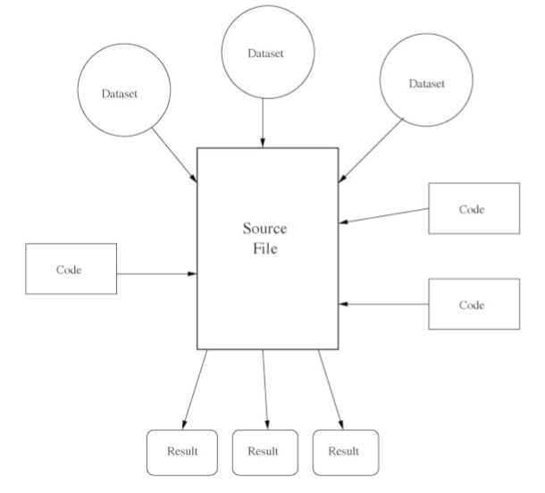
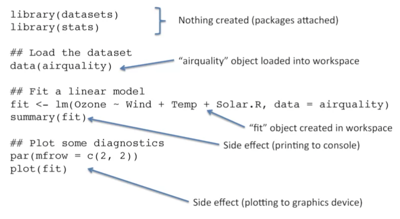

Caching Computations
================

-   [Referencias](#referencias)
-   [Literate (Statistical)
    Programming](#literate-statistical-programming)
-   [Research Pipeline](#research-pipeline)
-   [Caching Computations](#caching-computations)
-   [The `cacher()` package for R](#the-cacher-package-for-r)
-   [Conceptual Model](#conceptual-model)
-   [Using cacher as an Author](#using-cacher-as-an-author)
-   [Example: Simple Analysis](#example-simple-analysis)

## Referencias

-   <https://rstudio-pubs-static.s3.amazonaws.com/157089_504d61c69ada43e8b9f67a0979d43c48.html>
-   <https://sux13.github.io/DataScienceSpCourseNotes/5_REPDATA/Reproducible_Research_Course_Notes.pdf>

## Literate (Statistical) Programming

-   An article is a stream of text and code
-   Analysis code is divided into text and code `chunks`
-   Each code chunk loads data and computes result
-   Presentation code formats results (tables, figures, etc.)
-   Article text explains what is going on
-   Literate programs can be weaved to produce human-readable documents
    and tangled to produce machine-readable documents.
-   Literate programming is a general concept that requires
    -   A documentation language
    -   A programming language (machine readable)
-   Sweave uses `LATEX` and `R` as the documentation and programming
    languages Sweave was developed by Friedrich Leisch (member of the R
    Core) and is maintained by R core.
-   [Main web
    site](https://web.archive.org/web/20101129175301/http://www.stat.uni-muenchen.de/~leisch/Sweave/)

## Research Pipeline

## Caching Computations

## The `cacher()` package for R

-   Add-on package for R
-   Evaluates code written in files and stores intermediate results in a
    key-value database
-   R expressions ar given SHA-1 hash values so that changes can be
    tracked and code reevaluated if necessary
-   “Cacher Packages” can be built for distribution
-   Other can “clone” an analysis and evaluate subsets of code or
    inspect data objects

## Conceptual Model

## Using cacher as an Author

-   Parse de R source file; Create the necessary cache directories and
    sub directories
-   Cycle through each expression in the source file:
    -   If an expressions has never been evaluated, evaluate it and
        store any resulting R objects in the cache database
    -   If a cached result exists, lazy-load the results from the cache
        database and move to the next expression
    -   If an expressions does not create any R objects (i.e. there is
        nothing to cache), add the expression to the list of expressions
        where evaluation needs to be forced
    -   Write out metadata for this expression to the metadata file
-   The cachepackage function creates a cacher package storing
    -   Source file
    -   Cached data objects
    -   Metadata
-   Package file is zipped and can be distributed
-   Readers can unzip the file and inmmediately investigate its contents
    via cacher package

## Example: Simple Analysis

