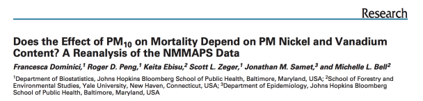
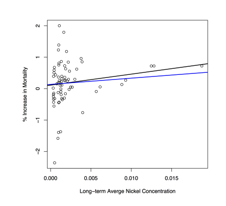
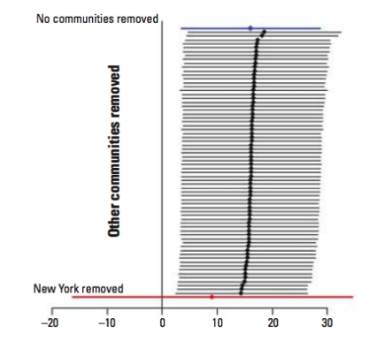

```{r setup, include=FALSE}
knitr::opts_chunk$set(echo = TRUE)
```

## Case Study: Air Pollution

Reanalysis of data from MMAPS and link with PM chemical constituent data

- Lippmann et al. found strong evidence that Ni modified the short-term effect of PM10 across 60 US communities
- National Morbidity, Mortality, and Air Pollution Study (NMMAPS) = national study of the short-term health effects of ambient air pollution
 - focused primarily on particulate matter (PM10) and ozone (O3)
 - health outcomes included mortality from all causes and hospitalizations for cardiovascular and respiratory diseases
 - Data made available at the Internet-based Health and Air Pollution Surveillance System (iHAPSS)
 


## Analysis: Does Nickel Make PM Toxic?

- Long-term average nickel concentrations appear correlated with PM risk (p < 0.01 → statistically significant)
- there appear to be some outliers on the right-hand side (New York City)
  - adjusting the data by removing the New York counties altered the regression line (shown in blue)
  - though the relationship is still positive, regression line no longer statistically significant (p < 0.31)



Sensitivity analysis shows that the regression line is particularly sensitive to the New York data



## Conclusions and Lessons Learnt
- New York havs very high levels of nickel and vanadium, much higher than any other US community
- there is evidence of a positive relationship between Ni concentrations and PM10 risk
- strength of this relationship is highly sensitive to the observations from New York City
- most of the information in the data is derived from just 3 observations
- reproducibility of NMMAPS allowed for a secondary analysis (and linking with PM chemical constituent data) investigating a novel hypothesis (Lippmann et al.), as well as a critique of that analysis and new findings (Dominici et al.)
- original hypothesis not necessarily invalidated, but evidence not as strong as originally suggested (more work should be done)