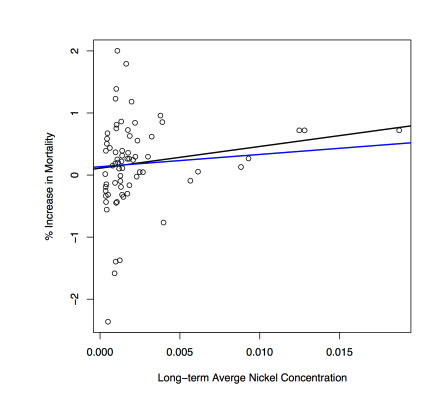
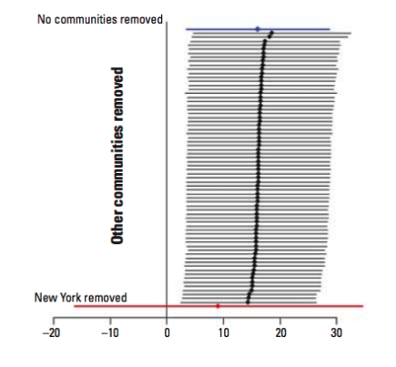

Case Study: Air Pollution
================

## Case Study: Air Pollution

Reanalysis of data from MMAPS and link with PM chemical constituent data

-   Lippmann et al. found strong evidence that Ni modified the
    short-term effect of PM10 across 60 US communities
-   National Morbidity, Mortality, and Air Pollution Study (NMMAPS) =
    national study of the short-term health effects of ambient air
    pollution
-   focused primarily on particulate matter (PM10) and ozone (O3)
-   health outcomes included mortality from all causes and
    hospitalizations for cardiovascular and respiratory diseases
-   Data made available at the Internet-based Health and Air Pollution
    Surveillance System (iHAPSS)

## Analysis: Does Nickel Make PM Toxic?

-   Long-term average nickel concentrations appear correlated with PM
    risk (p &lt; 0.01 → statistically significant)
-   there appear to be some outliers on the right-hand side (New York
    City)
    -   adjusting the data by removing the New York counties altered the
        regression line (shown in blue)
    -   though the relationship is still positive, regression line no
        longer statistically significant (p &lt; 0.31)

Sensitivity analysis shows that the regression line is particularly
sensitive to the New York data

## Conclusions and Lessons Learnt

-   New York havs very high levels of nickel and vanadium, much higher
    than any other US community
-   there is evidence of a positive relationship between Ni
    concentrations and PM10 risk
-   strength of this relationship is highly sensitive to the
    observations from New York City
-   most of the information in the data is derived from just 3
    observations
-   reproducibility of NMMAPS allowed for a secondary analysis (and
    linking with PM chemical constituent data) investigating a novel
    hypothesis (Lippmann et al.), as well as a critique of that analysis
    and new findings (Dominici et al.)
-   original hypothesis not necessarily invalidated, but evidence not as
    strong as originally suggested (more work should be done)
