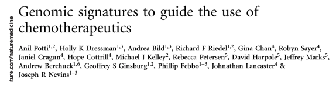

Case Study: High Throughput Biology
================

-   Potti et al. published in 2006 that microarray data from cell lines
    (the NCI60) can be used to define drug response “signatures”, which
    can be used to predict whether patients will respond
-   however, analysis performed were fundamentally flawed as there exist
    much misclassification and mishandling of data and were
    unreproducible
-   the results of their study, even after being corrected twice, still
    contained many errors and were unfortunately used as guidelines for
    clinical trials
-   the fiasco with this paper and associated research, though
    spectacular in its own light, was by no means an unique occurrence

## Conclusions and lessons learnt

-   most common mistakes are simple
    -   confounding in the experimental design
    -   mixing up the sample labels
    -   mixing up the gene labels
    -   mixing up the group labels
-   most mixups involve simple switches or offsets
    -   this simplicity is often hidden due to incomplete documentation
-   research papers should include the following (particularly those
    that would potentially lead to clinical trials)
    -   data (with column names)
    -   provenance (who owns what data/which sample is which)
    -   code
    -   descriptions of non-scriptable steps
    -   descriptions of planned design (if used)
-   reproducible research is the key to minimize these errors
    -   literate programming
    -   reusing templates
    -   report structure
    -   executive summaries
    -   appendices (sessionInfo, saves, file location)
