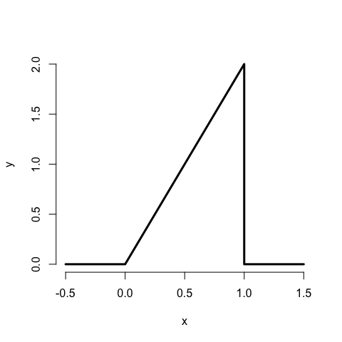
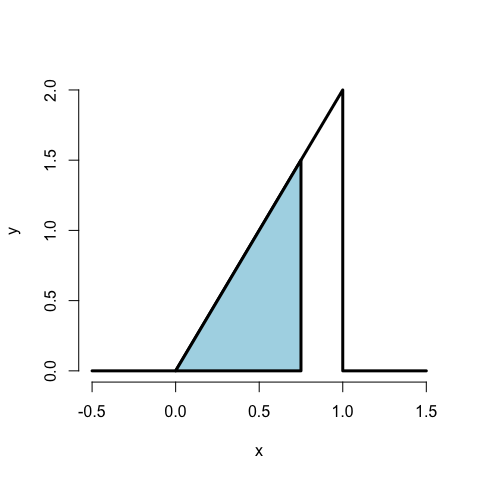

Probabilidad
================

## Notación

-   El **espacio muestral**, *Ω*, es la colección de posibles resultados
    de un experimento
    -   Ejemplo: tirada de un dado *Ω* = {1, 2, 3, 4, 5, 6}
-   Un **evento**, digamos *E*, es un subconjunto de *Ω*
    -   Ejemplo: la tirada del dado es par *E* = {2, 4, 6}
-   Un **suceso elemental** o **simple** es un resultado particular de
    un experimento
    -   Ejemplo: la tirada es un cuatro, *ω* = 4
-   ∅ se llama el **suceso nulo** o el **conjunto vacío**

## Interpretación de las operaciones con conjuntos

Las operaciones de conjunto normales tienen interpretaciones
particulares en este entorno

1.  $\\omega \\Nen E$ implica que *E* ocurre cuando *ω* ocurre
2.  $\\omega \\Nno en E$ implica que *E* no ocurre cuando *ω* ocurre
3.  $E \\Nsubconjunto F$ implica que la ocurrencia de *E* implica la
    ocurrencia de *F*
4.  $E \\Ncap F$ implica el suceso de que ocurran tanto *E* como *F*
5.  $E \\c F$ implica el suceso de que se produzca al menos una de las
    *E* o *F*
6.  $E \\cap F=\\\\\\\\\\\\\\\\c vacía$ significa que *E* y
    *F***mutuamente excluyentes**, o que no pueden ocurrir las dos cosas
7.  *E*<sup>*c*</sup> o *Ē* es el caso de que *E* no ocurra

## Probabilidad

Una **medida de probabilidad**, *P*, es una función de la colección de
sucesos posibles de forma que se cumpla lo siguiente

1.  Para un suceso $E\\\\Nsubconjunto \\Nmega$, $P(E)\\Nsubconjunto 1$
2.  *P*(*Ω*) = 1
3.  Si *E*<sub>1</sub> y *E*<sub>2</sub> son sucesos mutuamente
    excluyentes
    *P*(*E*<sub>1</sub> ∪ *E*<sub>2</sub>) = *P*(*E*<sub>1</sub>) + *P*(*E*<sub>2</sub>).

La parte 3 de la definición implica **aditividad finita**

$$
P(\\cup\_{i=1}^n A\_i) = \\sum\_{i=1}^n P(A\_i)
$$
donde los ${A\_i\\}$ son mutuamente excluyentes. (Obsérvese que en las
clases avanzadas se utiliza una versión más general de aditividad se
utiliza en las clases avanzadas).

## Ejemplo consecuencias

-   $P(\\Nconjunto vacío) = 0$
-   *P*(*E*) = 1 − *P*(*E*<sup>*c*</sup>)
-   $P(A \\c B) = P(A) + P(B) - P(A \\c B)$
-   si $A \\cubo B$ entonces *P*(*A*) ≤ *P*(*B*)
-   $P(A \\cup B\\right) = 1 - P(A^c \\cap B^c)$
-   *P*(*A* ∩ *B*<sup>*c*</sup>) = *P*(*A*) − *P*(*A* ∩ *B*)
-   $P(\\cup\_{i=1}^n E\_i) \\leq \\sum\_{i=1}^n P(E\_i)$
-   $P(\\cup\_{i=1}^n E\_i) \\geq \\max\_i P(E\_i)$

## Ejemplo

La Fundación Nacional del Sueño
([www.sleepfoundation.org](http://www.sleepfoundation.org/)) informa de
que alrededor del 3% de la población estadounidense padece apnea del
sueño. También informan de que alrededor del 10% de la población
norteamericana y europea padece el síndrome de las piernas inquietas.
¿Implica esto que el 13% de las personas tendrán al menos un problema de
sueño de este tipo?

## Ejemplo continuado

Respuesta: No, los eventos no son mutuamente excluyentes. Para
elaborarlo dejemos:

$$
\\begin{eqnarray\*}
    A\_1 & = & \\{\\mbox{Person has sleep apnea}\\} \\\\
    A\_2 & = & \\{\\mbox{Person has RLS}\\} 
  \\end{eqnarray\*}
$$

Entonces

$$
\\begin{eqnarray\*}
    P(A\_1 \\cup A\_2 ) & = & P(A\_1) + P(A\_2) - P(A\_1 \\cap A\_2) \\\\
   & = & 0.13 - \\mbox{Probability of having both}
  \\end{eqnarray\*}
$$
Es probable que alguna fracción de la población tenga ambos.

## Variables aleatorias

-   Una **variable aleatoria** es un resultado numérico de un
    experimento.
-   Las variables aleatorias que estudiamos vienen en dos variedades,
    **discretas** o **continuas**.
-   Las variables aleatorias discretas son variables aleatorias que
    adoptan sólo un número contable de posibilidades.
    -   *P*(*X* = *k*)
-   Las variables aleatorias continuas pueden tomar cualquier valor en
    la recta real o en algún subconjunto de la recta real.
    -   *P*(*X* ∈ *A*)

## Ejemplos de variables que pueden ser consideradas como variables aleatorias

-   El resultado (0 − 1) del lanzamiento de una moneda
-   El resultado de la tirada de un dado
-   El IMC de un sujeto cuatro años después de una medición de
    referencia
-   El estado de hipertensión de un sujeto extraído al azar de una
    población

## PMF

Una función de masa de probabilidad evaluada en un valor corresponde a
la probabilidad de que una variable aleatoria tome ese valor. Para que
sea una pmf una función, *p*, debe satisfacer

1.  *p*(*x*) ≥ 0 para todo *x*
2.  ∑<sub>*x*</sub>*p*(*x*) = 1.

La suma se realiza sobre todos los valores posibles de *x*.

## Ejemplo

Sea *X* el resultado de un lanzamiento de moneda donde *X* = 0
representa cola y *X* = 1 representa la cara.
*p*(*x*) = (1/2)<sup>*x*</sup>(1/2)<sup>1 − *x*</sup>   para  *x* = 0, 1
Supongamos que no sabemos si la moneda es justa o no. *θ* es la
probabilidad de que salga cara expresada como una proporción (entre 0 y
1).
*p*(*x*) = *θ*<sup>*x*</sup>(1 − *θ*)<sup>1 − *x*</sup>   para  *x* = 0, 1

## PDF

Una función de densidad de probabilidad (pdf), es una función asociada a
una variable aleatoria continua

*Las áreas bajo las pdf corresponden a las probabilidades de esa
variable aleatoria*

Para ser una pdf válida, una función *f* debe satisfacer

1.  *f*(*x*) ≥ 0 para todo *x*

2.  El área bajo *f*(*x*) es uno.

|                                                                                                                               |
|-------------------------------------------------------------------------------------------------------------------------------|
| \#\# Ejemplo                                                                                                                  |
| Supongamos que la proporción de llamadas de ayuda que son atendidas en un día aleatorio por una línea de ayuda viene dada por 
 $$                                                                                                                             
 f(x) = \\left\\{\\begin{array}{ll}                                                                                             
 2 x & \\mbox{ for } 1 &gt; x &gt; 0 \\\\                                                                                       
 0                 & \\mbox{ otherwise}                                                                                         
 \\end{array} \\right.                                                                                                          
 $$                                                                                                                             |
| ¿Es esta una densidad matemáticamente válida?                                                                                 |
| `r x <- c(-0.5, 0, 1, 1, 1.5); y <- c( 0, 0, 2, 0, 0) plot(x, y, lwd = 3, frame = FALSE, type = "l")`                         |
|                     |

## Ejemplo continuado

¿Cuál es la probabilidad de que el 75% o menos de las llamadas sean
atendidas?



``` r
1.5 * .75 / 2
```

    ## [1] 0.5625

``` r
pbeta(.75, 2, 1)
```

    ## [1] 0.5625

## CDF y función de supervivencia

-   La **función de distribución acumulativa** (CDF) de una variable
    aleatoria *X* se define como la función
    *F*(*x*) = *P*(*X* ≤ *x*)
-   Esta definición se aplica independientemente de que *X* sea discreta
    o continua.
-   La **función de supervivencia** de una variable aleatoria *X* se
    define como
    *S*(*x*) = *P*(*X* &gt; *x*)
-   Obsérvese que *S*(*x*) = 1 − *F*(*x*)
-   Para las variables aleatorias continuas, la FDP es la derivada de la
    FCD

## Ejemplo

¿Cuáles son la función de supervivencia y la FDA de la densidad
considerada anteriormente?

Para 1 ≥ *x* ≥ 0
$$
F(x) = P(X \\leq x) = \\frac{1}{2} Base \\times Altura = \\frac{1}{2} (x) \\times (2 x) = x^2
$$

*S*(*x*) = 1 − *x*<sup>2</sup>

``` r
pbeta(c(0.4, 0.5, 0.6), 2, 1)
```

    ## [1] 0.16 0.25 0.36

------------------------------------------------------------------------

## Cuantiles

-   El **cuantil** de una distribución con función de distribución *F*
    es el punto *x*<sub>*α*</sub> de forma que
    *F*(*x*<sub>*a*</sub>*l**p**h**a*) = *α*
-   Un **percentil** es simplemente un cuantil con
    <sub>*a*</sub>*l**f**a* expresado en porcentaje
-   La **mediana** es el percentil 50<sup>*t**h*</sup>

## Ejemplo

-   Queremos resolver 0, 5 = *F*(*x*) = *x*<sup>2</sup>
-   Resultando la solución

``` r
sqrt(0.5)
```

    ## [1] 0.7071068

-   Por lo tanto, alrededor de 0.7071068 de las llamadas que se
    responden en un día al azar es la mediana.
-   R puede aproximar los cuantiles para distribuciones comunes

``` r
qbeta(0.5, 2, 1)
```

    ## [1] 0.7071068

## Resumen

-   Llegados a este punto, te preguntarás: “Ya he oído hablar de la
    mediana, no requiere integración. ¿Dónde están los datos?”
-   Nos referimos a que son **cantidades de población**. Por lo tanto,
    la mediana que se busca es la **mediana de la población**.
-   Un modelo probabilístico conecta los datos con la población mediante
    supuestos.
-   Por lo tanto, la mediana que estamos discutiendo es la
    **estimación**, la mediana de la muestra será el **estimador**
