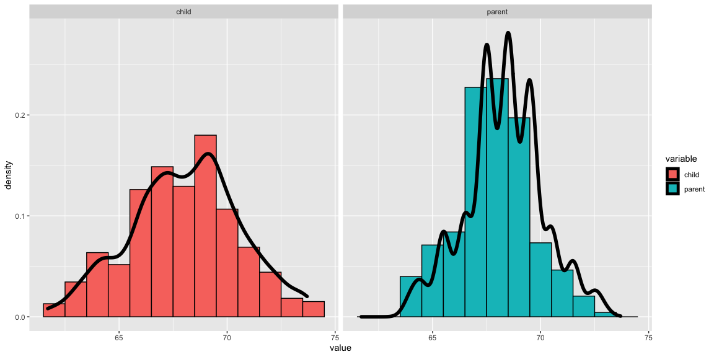
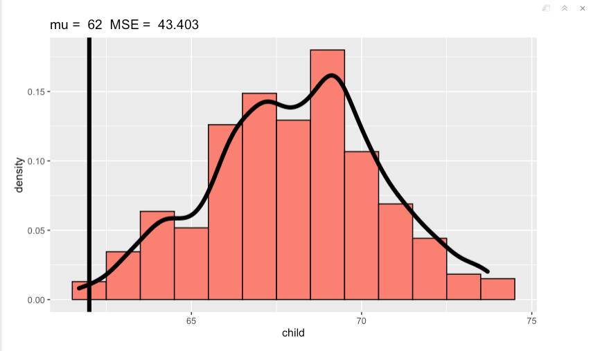
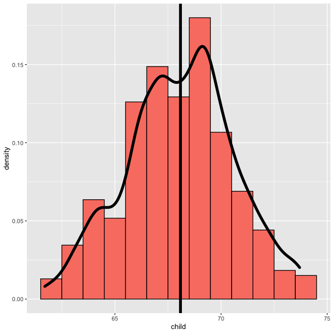
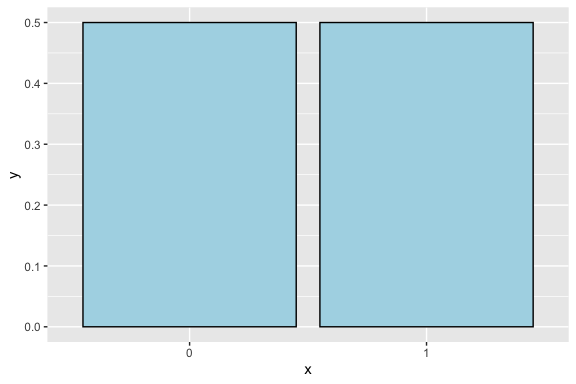
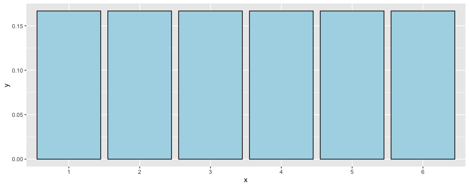
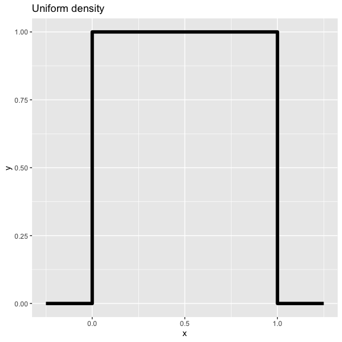
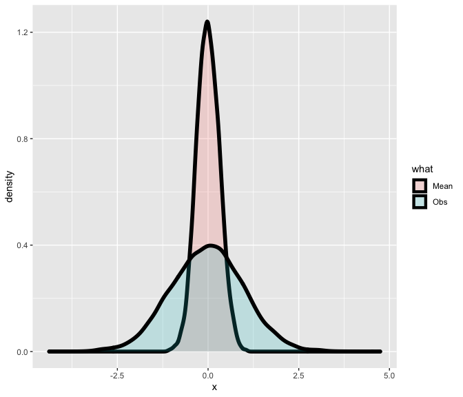
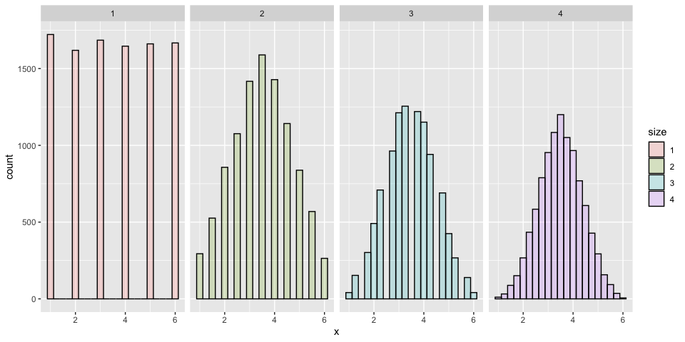
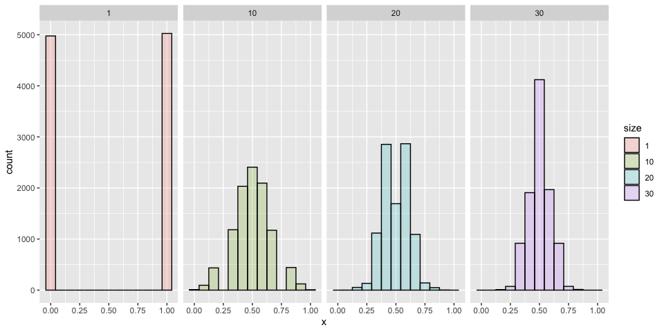

Expected values
================

## Expected values

-   Expected values are useful cor characterizing a distribution
-   The mean is a characterization of its center
-   The variance and standard deviation are characterizations of how
    spread out it is
-   Our sample expected values (the sample mean and variance) will
    estimate the population versions

## The population mean

-   The **expected value** or **mean** of a random variable is the
    center of its distribution
-   For discrete random variable *X* with PMF *p*(*x*), it is defined as
    follows
    *E*\[*X*\] = ∑<sub>*x*</sub>*x**p*(*x*).
    where the sum is taken over the possible values of *x*
-   *E*\[*X*\] represents the center of mass of a collection of
    locations and weights, {*x*, *p*(*x*)}

## The sample mean

-   The sample mean estimates this population mean
-   The center of mass of the data is the empirical mean
    $$
    \\bar X = \\sum\_{i=1}^n x\_i p(x\_i)
    $$
    where *p*(*x*<sub>*i*</sub>) = 1/*n*

## Example

### Find the center of mass of the bars

``` r
library(UsingR); data(galton); library(ggplot2)
library(reshape2)
longGalton <- melt(galton, measure.vars = c("child", "parent"))
g <- ggplot(longGalton, aes(x = value)) + geom_histogram(aes(y = ..density..,  fill = variable), binwidth=1, colour = "black") + geom_density(size = 2)
g <- g + facet_grid(. ~ variable)
g
```



## Using manipulate

``` r
library(manipulate)
myHist <- function(mu){
    g <- ggplot(galton, aes(x = child))
    g <- g + geom_histogram(fill = "salmon", 
      binwidth=1, aes(y = ..density..), colour = "black")
    g <- g + geom_density(size = 2)
    g <- g + geom_vline(xintercept = mu, size = 2)
    mse <- round(mean((galton$child - mu)^2), 3)  
    g <- g + labs(title = paste('mu = ', mu, ' MSE = ', mse))
    g
}
# manipulate(myHist(mu), mu = slider(62, 74, step = 0.5))
```



## The center of mass is the empirical mean

``` r
    g <- ggplot(galton, aes(x = child))
    g <- g + geom_histogram(fill = "salmon", 
      binwidth=1, aes(y = ..density..), colour = "black")
    g <- g + geom_density(size = 2)
    g <- g + geom_vline(xintercept = mean(galton$child), size = 2)
    g
```



## Example of a population mean

-   Suppose a coin is flipped and *X* is declared 0 or 1 corresponding
    to a head or a tail, respectively
-   What is the expected value of *X*?
    *E*\[*X*\] = .5 × 0 + .5 × 1 = .5
-   Note, if thought about geometrically, this answer is obvious; if two
    equal weights are spaced at 0 and 1, the center of mass will be .5

``` r
ggplot(data.frame(x = factor(0 : 1), y = c(.5, .5)), aes(x = x, y = y)) + geom_bar(stat = "identity", colour = 'black', fill = "lightblue")
```



## What about a biased coin?

-   Suppose that a random variable, *X*, is so that *P*(*X* = 1) = *p*
    and *P*(*X* = 0) = (1 − *p*)
-   (This is a biased coin when *p* ≠ 0.5)
-   What is its expected value?
    *E*\[*X*\] = 0 \* (1 − *p*) + 1 \* *p* = *p*

## Example

-   Suppose that a die is rolled and *X* is the number face up
-   What is the expected value of *X*?
    $$
      E\[X\] = 1 \\times \\frac{1}{6} + 2 \\times \\frac{1}{6} +
      3 \\times \\frac{1}{6} + 4 \\times \\frac{1}{6} +
      5 \\times \\frac{1}{6} + 6 \\times \\frac{1}{6} = 3.5
      $$
-   Again, the geometric argument makes this answer obvious without
    calculation.

``` r
ggplot(data.frame(x = factor(1 : 6), y = rep(1/6, 6)), aes(x = x, y = y)) + geom_bar(stat = "identity", colour = 'black', fill = "lightblue")
```



## Continuous random variables

-   For a continuous random variable, *X*, with density, *f*, the
    expected value is again exactly the center of mass of the density

## Example

-   Consider a density where *f*(*x*) = 1 for *x* between zero and one
-   (Is this a valid density?)
-   Suppose that *X* follows this density; what is its expected value?

``` r
g <- ggplot(data.frame(x = c(-0.25, 0, 0, 1, 1, 1.25),
                  y = c(0, 0, 1, 1, 0, 0)),
       aes(x = x, y = y))
g <- g + geom_line(size = 2, colour = "black")
g <- g + labs(title = "Uniform density")
g  
```



## Facts about expected values

-   Recall that expected values are properties of distributions
-   Note the average of random variables is itself a random variable and
    its associated distribution has an expected value
-   The center of this distribution is the same as that of the original
    distribution
-   Therefore, the expected value of the **sample mean** is the
    population mean that it’s trying to estimate
-   When the expected value of an estimator is what its trying to
    estimate, we say that the estimator is **unbiased**
-   Let’s try a simulation experiment

## Simulation experiment

Simulating normals with mean 0 and variance 1 versus averages of 10
normals from the same population

``` r
library(ggplot2)
nosim <- 10000; n <- 10
dat <- data.frame(
    x = c(rnorm(nosim), apply(matrix(rnorm(nosim * n), nosim), 1, mean)),
    what = factor(rep(c("Obs", "Mean"), c(nosim, nosim))) 
    )
ggplot(dat, aes(x = x, fill = what)) + geom_density(size = 2, alpha = .2); 
```



## Averages of x die rolls

``` r
dat <- data.frame(
  x = c(sample(1 : 6, nosim, replace = TRUE),
        apply(matrix(sample(1 : 6, nosim * 2, replace = TRUE), 
                     nosim), 1, mean),
        apply(matrix(sample(1 : 6, nosim * 3, replace = TRUE), 
                     nosim), 1, mean),
        apply(matrix(sample(1 : 6, nosim * 4, replace = TRUE), 
                     nosim), 1, mean)
        ),
  size = factor(rep(1 : 4, rep(nosim, 4))))
g <- ggplot(dat, aes(x = x, fill = size)) + geom_histogram(alpha = .20, binwidth=.25, colour = "black") 
g + facet_grid(. ~ size)
```



## Averages of x coin flips

``` r
dat <- data.frame(
  x = c(sample(0 : 1, nosim, replace = TRUE),
        apply(matrix(sample(0 : 1, nosim * 10, replace = TRUE), 
                     nosim), 1, mean),
        apply(matrix(sample(0 : 1, nosim * 20, replace = TRUE), 
                     nosim), 1, mean),
        apply(matrix(sample(0 : 1, nosim * 30, replace = TRUE), 
                     nosim), 1, mean)
        ),
  size = factor(rep(c(1, 10, 20, 30), rep(nosim, 4))))
g <- ggplot(dat, aes(x = x, fill = size)) + geom_histogram(alpha = .20, binwidth = 1 / 12, colour = "black"); 
g + facet_grid(. ~ size)
```



## Sumarizing what we know

-   Expected values are properties of distributions
-   The population mean is the center of mass of population
-   The sample mean is the center of mass of the observed data
-   The sample mean is an estimate of the population mean
-   The sample mean is unbiased
    -   The population mean of its distribution is the mean that it’s
        trying to estimate
-   The more data that goes into the sample mean, the more concentrated
    its density / mass function is around the population mean
