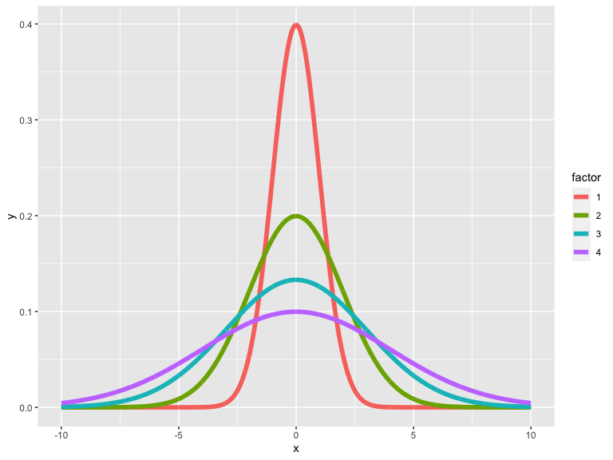
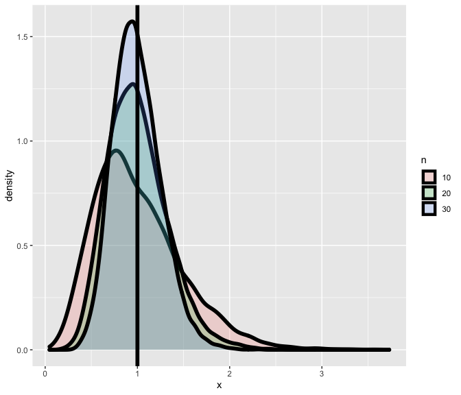
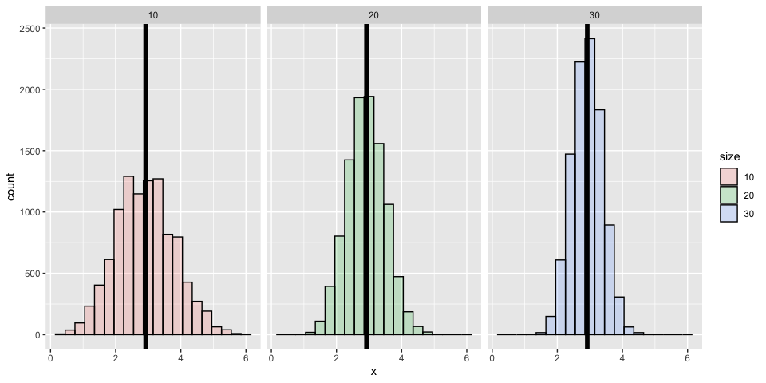
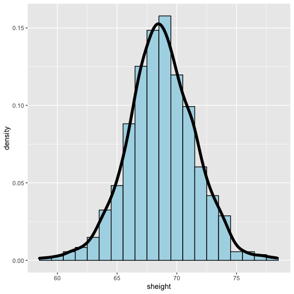
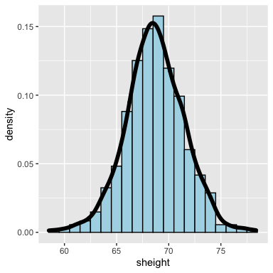

The variance; Statistical Inference
================

## The variance

-   The variance of a random variable is a measure of *spread*
-   If *X* is a random variable with mean *μ*, the variance of *X* is
    defined as

*V**a**r*(*X*) = *E*\[(*X* − *μ*)<sup>2</sup>\] = *E*\[*X*<sup>2</sup>\] − *E*\[*X*\]<sup>2</sup>

-   The expected (squared) distance from the mean
-   Densities with a higher variance are more spread out than densities
    with a lower variance
-   The square root of the variance is called the **standard deviation**
-   The standard deviation has the same units as *X*

## Example

-   What’s the variance from the result of a toss of a die?

    -   *E*\[*X*\] = 3.5
    -   $E\[X^2\] = 1 ^ 2 \\times \\frac{1}{6} + 2 ^ 2 \\times \\frac{1}{6} + 3 ^ 2 \\times \\frac{1}{6} + 4 ^ 2 \\times \\frac{1}{6} + 5 ^ 2 \\times \\frac{1}{6} + 6 ^ 2 \\times \\frac{1}{6} = 15.17$

-   *V**a**r*(*X*) = *E*\[*X*<sup>2</sup>\] − *E*\[*X*\]<sup>2</sup> ≈ 2.92

## Example

-   What’s the variance from the result of the toss of a coin with
    probability of heads (1) of *p*?

    -   *E*\[*X*\] = 0 × (1 − *p*) + 1 × *p* = *p*
    -   *E*\[*X*<sup>2</sup>\] = *E*\[*X*\] = *p*

*V**a**r*(*X*) = *E*\[*X*<sup>2</sup>\] − *E*\[*X*\]<sup>2</sup> = *p* − *p*<sup>2</sup> = *p*(1 − *p*)

## Distributions with increasing variance



## The sample variance

-   The sample variance is
    $$
    S^2 = \\frac{\\sum\_{i=1} (X\_i - \\bar X)^2}{n-1}
    $$
    (almost, but not quite, the average squared deviation from the
    sample mean)

-   It is also a random variable

    -   It has an associate population distribution
    -   Its expected value is the population variance
    -   Its distribution gets more concentrated around the population
        variance with more data

-   Its square root is the sample standard deviation

## Simulation experiment

### Simulating from a population with variance 1



## Variances of x die rolls



## Recall the mean

-   Recall that the average of random sample from a populationis itself
    a random variable
-   We know that this distribution is centered around the population
    mean, *E*\[*X̄*\] = *μ*
-   We also know what its variance is
    *V**a**r*(*X̄*) = *σ*<sup>2</sup>/*n*
-   This is very useful, since we don’t have repeat sample means to get
    its variance; now we know how it relates to the population variance
-   We call the standard deviation of a statistic a standard error

## To summarize

-   The sample variance, *S*<sup>2</sup>, estimates the population
    variance, *σ*<sup>2</sup>
-   The distribution of the sample variance is centered around
    *σ*<sup>2</sup>
-   The the variance of sample mean is *σ*<sup>2</sup>/*n*
    -   Its logical estimate is *s*<sup>2</sup>/*n*
    -   The logical estimate of the standard error is $s / \\sqrt{n}$
-   *s*, the standard deviation, talks about how variable the population
    is
-   $s/\\sqrt{n}$, the standard error, talks about how variable averages
    of random samples of size *n* from the population are

## Simulation example

Standard normals have variance 1; means of *n* standard normals have
standard deviation $1/\\sqrt{n}$

``` r
nosim <- 1000
n <- 10
sd(apply(matrix(rnorm(nosim * n), nosim), 1, mean))
```

    ## [1] 0.3138773

``` r
1 / sqrt(n)
```

    ## [1] 0.3162278

## Simulation example

Standard uniforms have variance 1/12; means of random samples of *n*
uniforms have sd $1/\\sqrt{12 \\times n}$

``` r
nosim <- 1000
n <- 10
sd(apply(matrix(runif(nosim * n), nosim), 1, mean))
```

    ## [1] 0.0924046

``` r
1 / sqrt(12 * n)
```

    ## [1] 0.09128709

## Simulation example

Poisson(4) have variance 4; means of random samples of *n* Poisson(4)
have sd $2/\\sqrt{n}$

``` r
nosim <- 1000
n <- 10
sd(apply(matrix(rpois(nosim * n, 4), nosim), 1, mean))
```

    ## [1] 0.6178823

``` r
2 / sqrt(n)
```

    ## [1] 0.6324555

## Simulation example

Fair coin flips have variance 0.25; means of random samples of *n* coin
flips have sd $1 / (2 \\sqrt{n})$

``` r
nosim <- 1000
n <- 10
sd(apply(matrix(sample(0 : 1, nosim * n, replace = TRUE),
                nosim), 1, mean))
```

    ## [1] 0.1582575

``` r
1 / (2 * sqrt(n))
```

    ## [1] 0.1581139

## Data example

``` r
library(UsingR); data(father.son); 
```

    ## Loading required package: MASS

    ## Loading required package: HistData

    ## Loading required package: Hmisc

    ## Loading required package: lattice

    ## Loading required package: survival

    ## Loading required package: Formula

    ## 
    ## Attaching package: 'Hmisc'

    ## The following objects are masked from 'package:base':
    ## 
    ##     format.pval, units

    ## 
    ## Attaching package: 'UsingR'

    ## The following object is masked from 'package:survival':
    ## 
    ##     cancer

``` r
x <- father.son$sheight
n<-length(x)
```

## Plot of the son’s heights



## Let’s interpret these numbers

``` r
round(c(var(x), var(x) / n, sd(x), sd(x) / sqrt(n)),2)
```

    ## [1] 7.92 0.01 2.81 0.09



## Summarizing what we know about variances

-   The sample variance estimates the population variance
-   The distribution of the sample variance is centered at what its
    estimating
-   It gets more concentrated around the population variance with larger
    sample sizes
-   The variance of the sample mean is the population variance divided
    by *n*
    -   The square root is the standard error
-   It turns out that we can say a lot about the distribution of
    averages from random samples, even though we only get one to look at
    in a given data set
