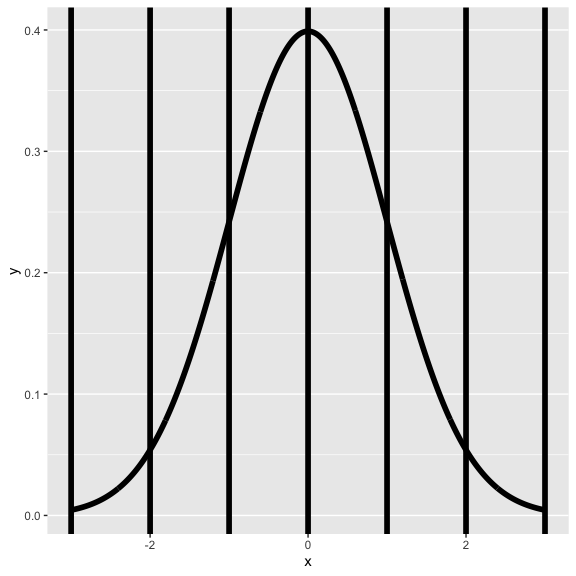

Some Common Distributions
================

## The Bernoulli distribution

-   The **Bernoulli distribution** arises as the result of a binary
    outcome
-   Bernoulli random variables take (only) the values 1 and 0 with
    probabilities of (say) *p* and 1 − *p* respectively
-   The PMF for a Bernoulli random variable *X* is
    *P*(*X* = *x*) = *p*<sup>*x*</sup>(1 − *p*)<sup>1 − *x*</sup>
-   The mean of a Bernoulli random variable is *p* and the variance is
    *p*(1 − *p*)
-   If we let *X* be a Bernoulli random variable, it is typical to call
    *X* = 1 as a “success” and *X* = 0 as a “failure”

## Binomial trials

-   The *binomial random variables* are obtained as the sum of iid
    Bernoulli trials
-   In specific, let *X*<sub>1</sub>, …, *X*<sub>*n*</sub> be iid
    Bernoulli(*p*); then $X = \\sum\_{i=1}^n X\_i$ is a binomial random
    variable
-   The binomial mass function is

$$
P(X = x) = 
\\left(
\\begin{array}{c}
  n \\\\ x
\\end{array}
\\right)
p^x(1 - p)^{n-x}
$$
for *x* = 0, …, *n*

## Choose

-   Recall that the notation
    $$\\left(
      \\begin{array}{c}
        n \\\\ x
      \\end{array}
    \\right) = \\frac{n!}{x!(n-x)!}
    $$
    (read “*n* choose *x*”) counts the number of ways of selecting *x*
    items out of *n* without replacement disregarding the order of the
    items

$$\\left(
    \\begin{array}{c}
      n \\\\ 0
    \\end{array}
  \\right) =
\\left(
    \\begin{array}{c}
      n \\\\ n
    \\end{array}
  \\right) =  1
  $$

## Example

-   Suppose a friend has 8 children (oh my!), 7 of which are girls and
    none are twins
-   If each gender has an independent 50% probability for each birth,
    what’s the probability of getting 7 or more girls out of 8 births?

$$ 
\\left(
\\begin{array}{c}
  8 \\\\ 7
\\end{array}
\\right) .5^{7}(1-.5)^{1}
+
\\left
\\begin{array}{c}
  8 \\\\ 8
\\end{array}
\\right) .5^{8}(1-.5)^{0} \\approx 0.04
$$

``` r
choose(8, 7) * .5 ^ 8 + choose(8, 8) * .5 ^ 8 
```

    ## [1] 0.03515625

``` r
pbinom(6, size = 8, prob = .5, lower.tail = FALSE)
```

    ## [1] 0.03515625

## The normal distribution

-   A random variable is said to follow a **normal** or **Gaussian**
    distribution with mean *μ* and variance *σ*<sup>2</sup> if the
    associated density is
    (2*π**σ*<sup>2</sup>)<sup> − 1/2</sup>*e*<sup> − (*x* − *μ*)<sup>2</sup>/2*σ*<sup>2</sup></sup>
    If *X* a RV with this density then *E*\[*X*\] = *μ* and
    *V**a**r*(*X*) = *σ*<sup>2</sup>
-   We write *X* ∼ N(*μ*, *σ*<sup>2</sup>)
-   When *μ* = 0 and *σ* = 1 the resulting distribution is called **the
    standard normal distribution**
-   Standard normal RVs are often labeled *Z*

## The standard normal distribution with reference lines

``` r
x <- seq(-3, 3, length = 1000)
library(ggplot2)
g <- ggplot(data.frame(x = x, y = dnorm(x)), 
            aes(x = x, y = y)) + geom_line(size = 2)
g <- g + geom_vline(xintercept = -3 : 3, size = 2)
g
```



## Facts about the normal density

If *X* ∼ N(*μ*, *σ*<sup>2</sup>) then
$$Z = \\frac{X -\\mu}{\\sigma} \\sim N(0, 1)$$

If *Z* is standard normal
*X* = *μ* + *σ**Z* ∼ N(*μ*, *σ*<sup>2</sup>)

## More facts about the normal density

1.  Approximately 68%, 95% and 99% of the normal density lies within 1,
    2 and 3 standard deviations from the mean, respectively
2.   − 1.28,  − 1.645,  − 1.96 and  − 2.33 are the 10<sup>*t**h*</sup>,
    5<sup>*t**h*</sup>, 2.5<sup>*t**h*</sup> and 1<sup>*s**t*</sup>
    percentiles of the standard normal distribution respectively
3.  By symmetry, 1.28, 1.645, 1.96 and 2.33 are the 90<sup>*t**h*</sup>,
    95<sup>*t**h*</sup>, 97.5<sup>*t**h*</sup> and 99<sup>*t**h*</sup>
    percentiles of the standard normal distribution respectively

## Question

-   What is the 95<sup>*t**h*</sup> percentile of a
    *N*(*μ*, *σ*<sup>2</sup>) distribution?
    -   Quick answer in R `qnorm(.95, mean = mu, sd = sd)`
-   Or, because you have the standard normal quantiles memorized and you
    know that 1.645 is the 95th percentile you know that the answer has
    to be
    *μ* + *σ*1.645
-   (In general *μ* + *σ**z*<sub>0</sub> where *z*<sub>0</sub> is the
    appropriate standard normal quantile)

## Question

-   What is the probability that a N(*μ*, *σ*<sup>2</sup>) RV is larger
    than *x*?

## Example

Assume that the number of daily ad clicks for a company is
(approximately) normally distributed with a mean of 1020 and a standard
deviation of 50.

**What’s the probability of getting more than 1,160 clicks in a day?**

It’s not very likely, 1,160 is

``` r
(1160 - 1020) / 50
```

    ## [1] 2.8

standard deviations from the mean

``` r
pnorm(1160, mean = 1020, sd = 50, lower.tail = FALSE)
```

    ## [1] 0.00255513

``` r
pnorm(2.8, lower.tail = FALSE)
```

    ## [1] 0.00255513

## Example

Assume that the number of daily ad clicks for a company is
(approximately) normally distributed with a mean of 1020 and a standard
deviation of 50.

**What number of daily ad clicks would represent the one where 75% of
days have fewer clicks (assuming days are independent and identically
distributed)?**

``` r
qnorm(0.75, mean = 1020, sd = 50)
```

    ## [1] 1053.724

## The Poisson distribution

-   Used to model counts
-   The Poisson mass function is
    $$
    P(X = x; \\lambda) = \\frac{\\lambda^x e^{-\\lambda}}{x!}
    $$
    for *x* = 0, 1, …
-   The mean of this distribution is *λ*
-   The variance of this distribution is *λ*
-   Notice that *x* ranges from 0 to ∞

## Some uses for the Poisson distribution

-   Modeling count data  
-   Modeling event-time or survival data
-   Modeling contingency tables
-   Approximating binomials when *n* is large and *p* is small

## Rates and Poisson random variables

-   Poisson random variables are used to model rates
-   *X* ∼ *P**o**i**s**s**o**n*(*λ**t*) where
    -   *λ* = *E*\[*X*/*t*\] is the expected count per unit of time
    -   *t* is the total monitoring time

## Example

The number of people that show up at a bus stop is Poisson with a mean
of 2.5 per hour.

**If watching the bus stop for 4 hours, what is the probability that 3
or fewer people show up for the whole time?**

``` r
ppois(3, lambda = 2.5 * 4)
```

    ## [1] 0.01033605

## Poisson approximation to the binomial

-   When *n* is large and *p* is small the Poisson distribution is an
    accurate approximation to the binomial distribution
-   Notation
    -   *X* ∼ Binomial(*n*, *p*)
    -   *λ* = *n**p*
    -   *n* gets large
    -   *p* gets small

## Example, Poisson approximation to the binomial

We flip a coin with success probablity 0.01 five hundred times.

**What’s the probability of 2 or fewer successes?**

``` r
pbinom(2, size = 500, prob = .01)
```

    ## [1] 0.1233858

``` r
ppois(2, lambda=500 * .01)
```

    ## [1] 0.124652
