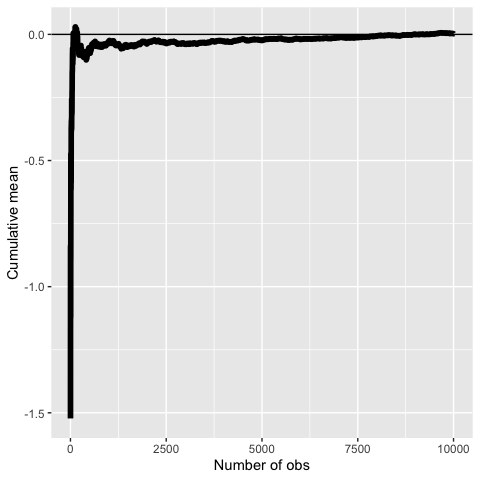
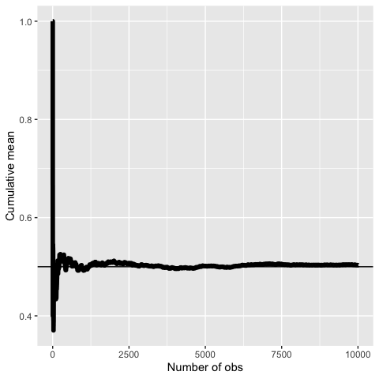
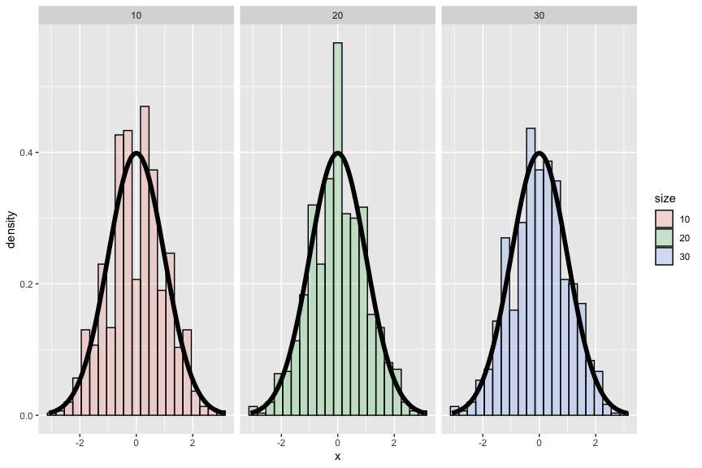
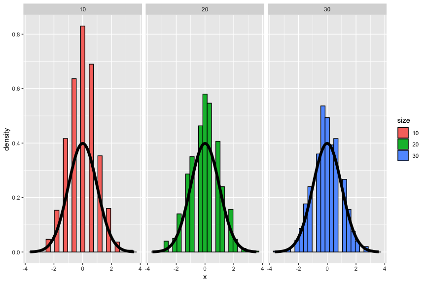
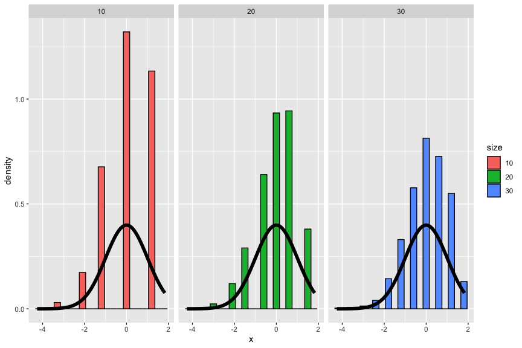
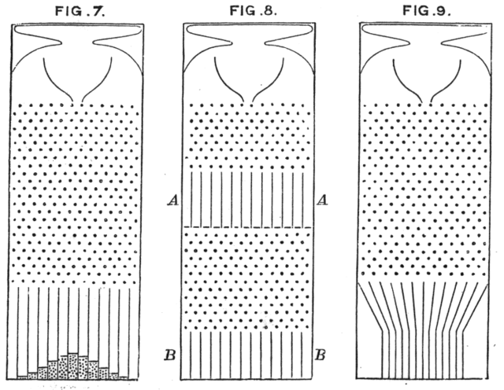
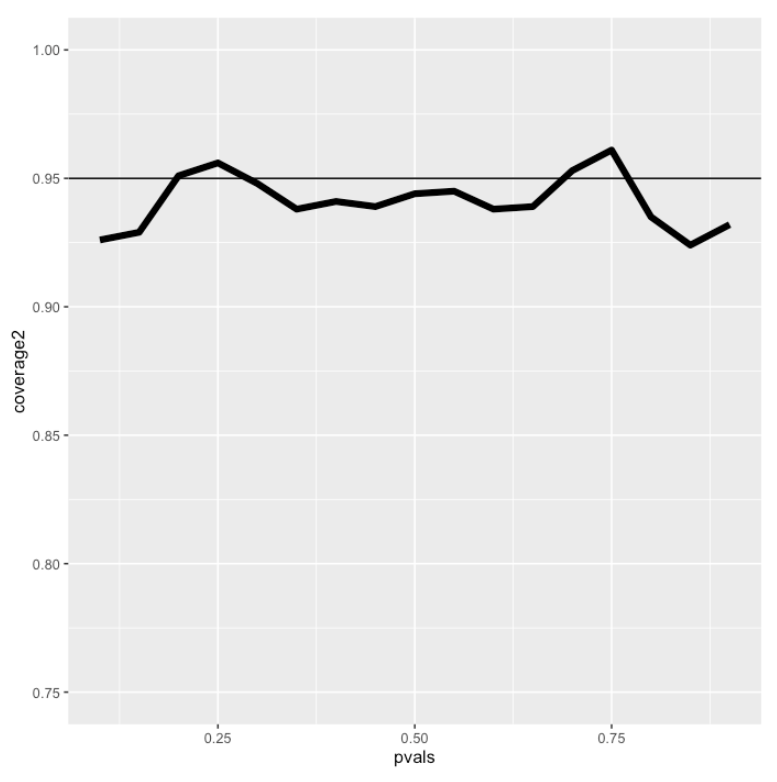
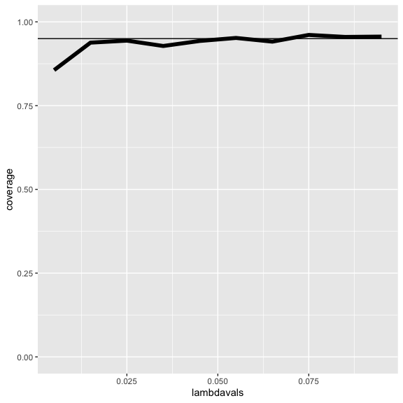

Asymptotics
================

## Asymptotics

-   Asymptotics is the term for the behavior of statistics as the sample
    size (or some other relevant quantity) limits to infinity (or some
    other relevant number)
-   (Asymptopia is my name for the land of asymptotics, where everything
    works out well and there’s no messes. The land of infinite data is
    nice that way.)
-   Asymptotics are incredibly useful for simple statistical inference
    and approximations
-   (Not covered in this class) Asymptotics often lead to nice
    understanding of procedures
-   Asymptotics generally give no assurances about finite sample
    performance
-   Asymptotics form the basis for frequency interpretation of
    probabilities (the long run proportion of times an event occurs)

## Limits of random variables

-   Fortunately, for the sample mean there’s a set of powerful results
-   These results allow us to talk about the large sample distribution
    of sample means of a collection of *i**i**d* observations
-   The first of these results we intuitively know
    -   It says that the average limits to what it’s estimating, the
        population mean
    -   It’s called the Law of Large Numbers
    -   Example *X̄*<sub>*n*</sub> could be the average of the result of
        *n* coin flips (i.e. the sample proportion of heads)
        -   As we flip a fair coin over and over, it eventually
            converges to the true probability of a head The LLN forms
            the basis of frequency style thinking

## Law of large numbers in action

``` r
n <- 10000; means <- cumsum(rnorm(n)) / (1  : n); library(ggplot2)
g <- ggplot(data.frame(x = 1 : n, y = means), aes(x = x, y = y)) 
g <- g + geom_hline(yintercept = 0) + geom_line(size = 2) 
g <- g + labs(x = "Number of obs", y = "Cumulative mean")
g
```

<!-- -->

## Law of large numbers in action, coin flip

``` r
means <- cumsum(sample(0 : 1, n , replace = TRUE)) / (1  : n)
g <- ggplot(data.frame(x = 1 : n, y = means), aes(x = x, y = y)) 
g <- g + geom_hline(yintercept = 0.5) + geom_line(size = 2) 
g <- g + labs(x = "Number of obs", y = "Cumulative mean")
g
```

<!-- -->

## Discussion

-   An estimator is **consistent** if it converges to what you want to
    estimate
    -   The LLN says that the sample mean of iid sample is consistent
        for the population mean
    -   Typically, good estimators are consistent; it’s not too much to
        ask that if we go to the trouble of collecting an infinite
        amount of data that we get the right answer
-   The sample variance and the sample standard deviation of iid random
    variables are consistent as well

## The Central Limit Theorem

-   The **Central Limit Theorem** (CLT) is one of the most important
    theorems in statistics
-   For our purposes, the CLT states that the distribution of averages
    of iid variables (properly normalized) becomes that of a standard
    normal as the sample size increases
-   The CLT applies in an endless variety of settings
-   The result is that
    $$\\frac{\\bar X\_n - \\mu}{\\sigma / \\sqrt{n}}=
    \\frac{\\sqrt n (\\bar X\_n - \\mu)}{\\sigma}
    = \\frac{\\mbox{Estimate} - \\mbox{Mean of estimate}}{\\mbox{Std. Err. of estimate}}$$
    has a distribution like that of a standard normal for large *n*.
-   (Replacing the standard error by its estimated value doesn’t change
    the CLT)
-   The useful way to think about the CLT is that *X̄*<sub>*n*</sub> is
    approximately *N*(*μ*, *σ*<sup>2</sup>/*n*)

## Example

-   Simulate a standard normal random variable by rolling *n* (six
    sided)
-   Let *X*<sub>*i*</sub> be the outcome for die *i*
-   Then note that *μ* = *E*\[*X*<sub>*i*</sub>\] = 3.5
-   *V**a**r*(*X*<sub>*i*</sub>) = 2.92
-   SE $\\sqrt{2.92 / n} = 1.71 / \\sqrt{n}$
-   Let’s roll *n* dice, take their mean, subtract off 3.5, and divide
    by $1.71 / \\sqrt{n}$ and repeat this over and over

## Result of our die rolling experiment

``` r
nosim <- 1000
cfunc <- function(x, n) sqrt(n) * (mean(x) - 3.5) / 1.71
dat <- data.frame(
  x = c(apply(matrix(sample(1 : 6, nosim * 10, replace = TRUE), 
                     nosim), 1, cfunc, 10),
        apply(matrix(sample(1 : 6, nosim * 20, replace = TRUE), 
                     nosim), 1, cfunc, 20),
        apply(matrix(sample(1 : 6, nosim * 30, replace = TRUE), 
                     nosim), 1, cfunc, 30)
        ),
  size = factor(rep(c(10, 20, 30), rep(nosim, 3))))
g <- ggplot(dat, aes(x = x, fill = size)) + geom_histogram(alpha = .20, binwidth=.3, colour = "black", aes(y = ..density..)) 
g <- g + stat_function(fun = dnorm, size = 2)
g + facet_grid(. ~ size)
```



## Coin CLT

-   Let *X*<sub>*i*</sub> be the 0 or 1 result of the
    *i*<sup>*t**h*</sup> flip of a possibly unfair coin
-   The sample proportion, say *p̂*, is the average of the coin flips
-   *E*\[*X*<sub>*i*</sub>\] = *p* and
    *V**a**r*(*X*<sub>*i*</sub>) = *p*(1 − *p*)
-   Standard error of the mean is $\\sqrt{p(1-p)/n}$
-   Then
    $$
      \\frac{\\hat p - p}{\\sqrt{p(1-p)/n}}
    $$
    will be approximately normally distributed
-   Let’s flip a coin *n* times, take the sample proportion of heads,
    subtract off .5 and multiply the result by $2 \\sqrt{n}$ (divide by
    $1/(2 \\sqrt{n})$)

## Simulation results

``` r
nosim <- 1000
cfunc <- function(x, n) 2 * sqrt(n) * (mean(x) - 0.5) 
dat <- data.frame(
  x = c(apply(matrix(sample(0:1, nosim * 10, replace = TRUE), 
                     nosim), 1, cfunc, 10),
        apply(matrix(sample(0:1, nosim * 20, replace = TRUE), 
                     nosim), 1, cfunc, 20),
        apply(matrix(sample(0:1, nosim * 30, replace = TRUE), 
                     nosim), 1, cfunc, 30)
        ),
  size = factor(rep(c(10, 20, 30), rep(nosim, 3))))
g <- ggplot(dat, aes(x = x, fill = size)) + geom_histogram(binwidth=.3, colour = "black", aes(y = ..density..)) 
g <- g + stat_function(fun = dnorm, size = 2)
g + facet_grid(. ~ size)
```



## Simulation results, *p* = 0.9

``` r
nosim <- 1000
cfunc <- function(x, n) sqrt(n) * (mean(x) - 0.9) / sqrt(.1 * .9)
dat <- data.frame(
  x = c(apply(matrix(sample(0:1, prob = c(.1,.9), nosim * 10, replace = TRUE), 
                     nosim), 1, cfunc, 10),
        apply(matrix(sample(0:1, prob = c(.1,.9), nosim * 20, replace = TRUE), 
                     nosim), 1, cfunc, 20),
        apply(matrix(sample(0:1, prob = c(.1,.9), nosim * 30, replace = TRUE), 
                     nosim), 1, cfunc, 30)
        ),
  size = factor(rep(c(10, 20, 30), rep(nosim, 3))))
g <- ggplot(dat, aes(x = x, fill = size)) + geom_histogram(binwidth=.3, colour = "black", aes(y = ..density..)) 
g <- g + stat_function(fun = dnorm, size = 2)
g + facet_grid(. ~ size)
```



## Galton’s quincunx

<http://en.wikipedia.org/wiki/Bean_machine#mediaviewer/File:Quincunx_(Galton_Box)_-_Galton_1889_diagram.png>



## Confidence intervals

-   According to the CLT, the sample mean, *X̄*, is approximately normal
    with mean *μ* and sd $\\sigma / \\sqrt{n}$
-   $\\mu + 2 \\sigma /\\sqrt{n}$ is pretty far out in the tail (only
    2.5% of a normal being larger than 2 sds in the tail)
-   Similarly, $\\mu - 2 \\sigma /\\sqrt{n}$ is pretty far in the left
    tail (only 2.5% chance of a normal being smaller than 2 sds in the
    tail)
-   So the probability *X̄* is bigger than $\\mu + 2 \\sigma / \\sqrt{n}$
    or smaller than $\\mu - 2 \\sigma / \\sqrt{n}$ is 5%
    -   Or equivalently, the probability of being between these limits
        is 95%
-   The quantity $\\bar X \\pm 2 \\sigma /\\sqrt{n}$ is called a 95%
    interval for *μ*
-   The 95% refers to the fact that if one were to repeatedly get
    samples of size *n*, about 95% of the intervals obtained would
    contain *μ*
-   The 97.5th quantile is 1.96 (so I rounded to 2 above)
-   90% interval you want (100 - 90) / 2 = 5% in each tail
    -   So you want the 95th percentile (1.645)

## Give a confidence interval for the average height of sons

in Galton’s data

``` r
library(UsingR);data(father.son); x <- father.son$sheight
```

    ## Loading required package: MASS

    ## Loading required package: HistData

    ## Loading required package: Hmisc

    ## Loading required package: lattice

    ## Loading required package: survival

    ## Loading required package: Formula

    ## 
    ## Attaching package: 'Hmisc'

    ## The following objects are masked from 'package:base':
    ## 
    ##     format.pval, units

    ## 
    ## Attaching package: 'UsingR'

    ## The following object is masked from 'package:survival':
    ## 
    ##     cancer

``` r
(mean(x) + c(-1, 1) * qnorm(.975) * sd(x) / sqrt(length(x))) / 12
```

    ## [1] 5.709670 5.737674

## Sample proportions

-   In the event that each *X*<sub>*i*</sub> is 0 or 1 with common
    success probability *p* then *σ*<sup>2</sup> = *p*(1 − *p*)
-   The interval takes the form
    $$
      \\hat p \\pm z\_{1 - \\alpha/2}  \\sqrt{\\frac{p(1 - p)}{n}}
    $$
-   Replacing *p* by *p̂* in the standard error results in what is called
    a Wald confidence interval for *p*
-   For 95% intervals
    $$\\hat p \\pm \\frac{1}{\\sqrt{n}}$$
    is a quick CI estimate for *p*

## Example

-   Your campaign advisor told you that in a random sample of 100 likely
    voters, 56 intent to vote for you.
    -   Can you relax? Do you have this race in the bag?
    -   Without access to a computer or calculator, how precise is this
        estimate?
-   `1/sqrt(100)=0.1` so a back of the envelope calculation gives an
    approximate 95% interval of `(0.46, 0.66)`
    -   Not enough for you to relax, better go do more campaigning!
-   Rough guidelines, 100 for 1 decimal place, 10,000 for 2, 1,000,000
    for 3.

``` r
round(1 / sqrt(10 ^ (1 : 6)), 3)
```

    ## [1] 0.316 0.100 0.032 0.010 0.003 0.001

## Binomial interval

``` r
.56 + c(-1, 1) * qnorm(.975) * sqrt(.56 * .44 / 100)
```

    ## [1] 0.4627099 0.6572901

``` r
binom.test(56, 100)$conf.int
```

    ## [1] 0.4571875 0.6591640
    ## attr(,"conf.level")
    ## [1] 0.95

## Simulation

``` r
n <- 20; pvals <- seq(.1, .9, by = .05); nosim <- 1000
coverage <- sapply(pvals, function(p){
  phats <- rbinom(nosim, prob = p, size = n) / n
  ll <- phats - qnorm(.975) * sqrt(phats * (1 - phats) / n)
  ul <- phats + qnorm(.975) * sqrt(phats * (1 - phats) / n)
  mean(ll < p & ul > p)
})
```

## Plot of the results (not so good)

``` r
n <- 100; pvals <- seq(.1, .9, by = .05); nosim <- 1000
coverage2 <- sapply(pvals, function(p){
  phats <- rbinom(nosim, prob = p, size = n) / n
  ll <- phats - qnorm(.975) * sqrt(phats * (1 - phats) / n)
  ul <- phats + qnorm(.975) * sqrt(phats * (1 - phats) / n)
  mean(ll < p & ul > p)
})
```

## Plot of coverage for *n* = 100



## Simulation

Now let’s look at *n* = 20 but adding 2 successes and failures

``` r
n <- 20; pvals <- seq(.1, .9, by = .05); nosim <- 1000
coverage <- sapply(pvals, function(p){
  phats <- (rbinom(nosim, prob = p, size = n) + 2) / (n + 4)
  ll <- phats - qnorm(.975) * sqrt(phats * (1 - phats) / n)
  ul <- phats + qnorm(.975) * sqrt(phats * (1 - phats) / n)
  mean(ll < p & ul > p)
})
```

## Adding 2 successes and 2 failures

(It’s a little conservative)

``` r
x <- 5; t <- 94.32; lambda <- x / t
round(lambda + c(-1, 1) * qnorm(.975) * sqrt(lambda / t), 3)
```

    ## [1] 0.007 0.099

``` r
poisson.test(x, T = 94.32)$conf
```

    ## [1] 0.01721254 0.12371005
    ## attr(,"conf.level")
    ## [1] 0.95

## Simulating the Poisson coverage rate

Let’s see how this interval performs for lambda values near what we’re
estimating

``` r
lambdavals <- seq(0.005, 0.10, by = .01); nosim <- 1000
t <- 100
coverage <- sapply(lambdavals, function(lambda){
  lhats <- rpois(nosim, lambda = lambda * t) / t
  ll <- lhats - qnorm(.975) * sqrt(lhats / t)
  ul <- lhats + qnorm(.975) * sqrt(lhats / t)
  mean(ll < lambda & ul > lambda)
})
```

## Covarage

(Gets really bad for small values of lambda)

``` r
lambdavals <- seq(0.005, 0.10, by = .01); nosim <- 1000
t <- 1000
coverage <- sapply(lambdavals, function(lambda){
  lhats <- rpois(nosim, lambda = lambda * t) / t
  ll <- lhats - qnorm(.975) * sqrt(lhats / t)
  ul <- lhats + qnorm(.975) * sqrt(lhats / t)
  mean(ll < lambda & ul > lambda)
})
ggplot(data.frame(lambdavals, coverage), aes(x = lambdavals, y = coverage)) + geom_line(size = 2) + geom_hline(yintercept = 0.95) + ylim(0, 1.0)
```



## Summary

-   The LLN states that averages of iid samples converge to the
    population means that they are estimating
-   The CLT states that averages are approximately normal, with
    distributions
    -   centered at the population mean
    -   with standard deviation equal to the standard error of the mean
    -   CLT gives no guarantee that *n* is large enough
-   Taking the mean and adding and subtracting the relevant normal
    quantile times the SE yields a confidence interval for the mean
    -   Adding and subtracting 2 SEs works for 95% intervals
-   Confidence intervals get wider as the coverage increases (why?)
-   Confidence intervals get narrower with less variability or larger
    sample sizes
-   The Poisson and binomial case have exact intervals that don’t
    require the CLT
    -   But a quick fix for small sample size binomial calculations is
        to add 2 successes and failures
