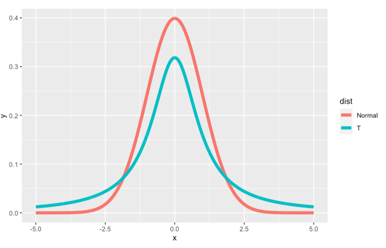
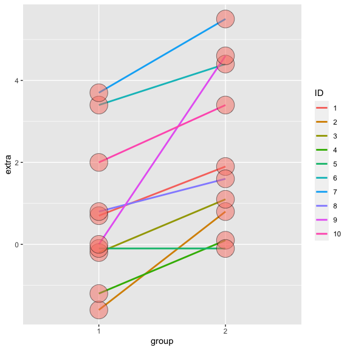
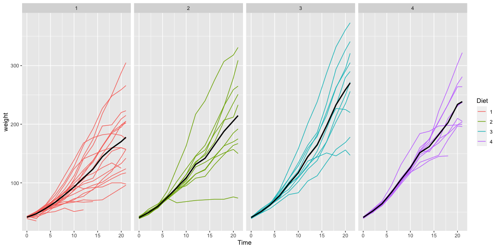
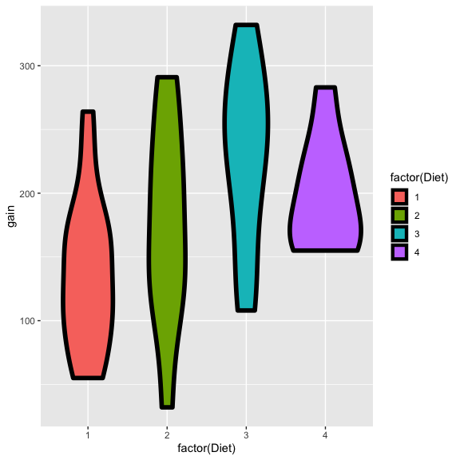

T Confidence Intervals
================

## T Confidence intervals

-   In the previous, we discussed creating a confidence interval using
    the CLT
    -   They took the form
        *E**s**t* ± *Z**Q* × *S**E*<sub>*E**s**t*</sub>
-   In this lecture, we discuss some methods for small samples, notably
    Gosset’s *t* distribution and *t* confidence intervals
    -   They are of the form
        *E**s**t* ± *T**Q* × *S**E*<sub>*E**s**t*</sub>
-   These are some of the handiest of intervals
-   If you want a rule between whether to use a *t* interval or normal
    interval, just always use the *t* interval
-   We’ll cover the one and two group versions

## Gosset’s *t* distribution

-   Invented by William Gosset (under the pseudonym “Student”) in 1908
-   Has thicker tails than the normal
-   Is indexed by a degrees of freedom; gets more like a standard normal
    as df gets larger
-   It assumes that the underlying data are iid Gaussian with the result
    that
    $$
    \\frac{\\bar X - \\mu}{S/\\sqrt{n}}
    $$
    follows Gosset’s *t* distribution with *n* − 1 degrees of freedom
-   (If we replaced *s* by *σ* the statistic would be exactly standard
    normal)
-   Interval is $\\bar X \\pm t\_{n-1} S/\\sqrt{n}$ where
    *t*<sub>*n* − 1</sub> is the relevant quantile

## Code for manipulate

``` r
library(ggplot2); library(manipulate)
k <- 1000
xvals <- seq(-5, 5, length = k)
myplot <- function(df){
  d <- data.frame(y = c(dnorm(xvals), dt(xvals, df)),
                  x = xvals,
                  dist = factor(rep(c("Normal", "T"), c(k,k))))
  g <- ggplot(d, aes(x = x, y = y)) 
  g <- g + geom_line(size = 2, aes(colour = dist))
  g
}
manipulate(myplot(mu), mu = slider(1, 20, step = 1))  
```



## Easier to see

``` r
pvals <- seq(.5, .99, by = .01)
myplot2 <- function(df){
  d <- data.frame(n= qnorm(pvals),t=qt(pvals, df),
                  p = pvals)
  g <- ggplot(d, aes(x= n, y = t))
  g <- g + geom_abline(size = 2, col = "lightblue")
  g <- g + geom_line(size = 2, col = "black")
  g <- g + geom_vline(xintercept = qnorm(0.975))
  g <- g + geom_hline(yintercept = qt(0.975, df))
  g
}
manipulate(myplot2(df), df = slider(1, 20, step = 1))
```


## Note’s about the *t* interval

-   The *t* interval technically assumes that the data are iid normal,
    though it is robust to this assumption
-   It works well whenever the distribution of the data is roughly
    symmetric and mound shaped
-   Paired observations are often analyzed using the *t* interval by
    taking differences
-   For large degrees of freedom, *t* quantiles become the same as
    standard normal quantiles; therefore this interval converges to the
    same interval as the CLT yielded
-   For skewed distributions, the spirit of the *t* interval assumptions
    are violated
    -   Also, for skewed distributions, it doesn’t make a lot of sense
        to center the interval at the mean
    -   In this case, consider taking logs or using a different summary
        like the median
-   For highly discrete data, like binary, other intervals are available

## Sleep data

In R typing `data(sleep)` brings up the sleep data originally analyzed
in Gosset’s Biometrika paper, which shows the increase in hours for 10
patients on two soporific drugs. R treats the data as two groups rather
than paired.

## The data

``` r
data(sleep)
head(sleep)
```

    ##   extra group ID
    ## 1   0.7     1  1
    ## 2  -1.6     1  2
    ## 3  -0.2     1  3
    ## 4  -1.2     1  4
    ## 5  -0.1     1  5
    ## 6   3.4     1  6

## Plotting the data

``` r
library(ggplot2)
g <- ggplot(sleep, aes(x = group, y = extra, group = factor(ID)))
g <- g + geom_line(size = 1, aes(colour = ID)) + geom_point(size =10, pch = 21, fill = "salmon", alpha = .5)
g
```



## Results

``` r
g1 <- sleep$extra[1 : 10]; g2 <- sleep$extra[11 : 20]
difference <- g2 - g1
mn <- mean(difference); s <- sd(difference); n <- 10
```

``` r
mn + c(-1, 1) * qt(.975, n-1) * s / sqrt(n)
```

    ## [1] 0.7001142 2.4598858

``` r
t.test(difference)
```

    ## 
    ##  One Sample t-test
    ## 
    ## data:  difference
    ## t = 4.0621, df = 9, p-value = 0.002833
    ## alternative hypothesis: true mean is not equal to 0
    ## 95 percent confidence interval:
    ##  0.7001142 2.4598858
    ## sample estimates:
    ## mean of x 
    ##      1.58

``` r
t.test(g2, g1, paired = TRUE)
```

    ## 
    ##  Paired t-test
    ## 
    ## data:  g2 and g1
    ## t = 4.0621, df = 9, p-value = 0.002833
    ## alternative hypothesis: true difference in means is not equal to 0
    ## 95 percent confidence interval:
    ##  0.7001142 2.4598858
    ## sample estimates:
    ## mean of the differences 
    ##                    1.58

``` r
t.test(extra ~ I(relevel(group, 2)), paired = TRUE, data = sleep)
```

    ## 
    ##  Paired t-test
    ## 
    ## data:  extra by I(relevel(group, 2))
    ## t = 4.0621, df = 9, p-value = 0.002833
    ## alternative hypothesis: true difference in means is not equal to 0
    ## 95 percent confidence interval:
    ##  0.7001142 2.4598858
    ## sample estimates:
    ## mean of the differences 
    ##                    1.58

## The results

(After a little formatting)

``` r
rbind(
mn + c(-1, 1) * qt(.975, n-1) * s / sqrt(n),
as.vector(t.test(difference)$conf.int),
as.vector(t.test(g2, g1, paired = TRUE)$conf.int),
as.vector(t.test(extra ~ I(relevel(group, 2)), paired = TRUE, data = sleep)$conf.int)
)
```

    ##           [,1]     [,2]
    ## [1,] 0.7001142 2.459886
    ## [2,] 0.7001142 2.459886
    ## [3,] 0.7001142 2.459886
    ## [4,] 0.7001142 2.459886

## Independent group *t* confidence intervals

-   Suppose that we want to compare the mean blood pressure between two
    groups in a randomized trial; those who received the treatment to
    those who received a placebo
-   We cannot use the paired t test because the groups are independent
    and may have different sample sizes
-   We now present methods for comparing independent groups

## Confidence interval

-   Therefore a (1 − *α*) × 100% confidence interval for
    *μ*<sub>*y*</sub> − *μ*<sub>*x*</sub> is
    $$
      \\bar Y - \\bar X \\pm t\_{n\_x + n\_y - 2, 1 - \\alpha/2}S\_p\\left(\\frac{1}{n\_x} + \\frac{1}{n\_y}\\right)^{1/2}
    $$
-   The pooled variance estimator is
    *S*<sub>*p*</sub><sup>2</sup> = {(*n*<sub>*x*</sub> − 1)*S*<sub>*x*</sub><sup>2</sup> + (*n*<sub>*y*</sub> − 1)*S*<sub>*y*</sub><sup>2</sup>}/(*n*<sub>*x*</sub> + *n*<sub>*y*</sub> − 2)
-   Remember this interval is assuming a constant variance across the
    two groups
-   If there is some doubt, assume a different variance per group, which
    we will discuss later

## Example

### Based on Rosner, Fundamentals of Biostatistics

(Really a very good reference book)

-   Comparing SBP for 8 oral contraceptive users versus 21 controls
-   *X̄*<sub>*O**C*</sub> = 132.86 mmHg with *s*<sub>*O**C*</sub> = 15.34
    mmHg
-   *X̄*<sub>*C*</sub> = 127.44 mmHg with *s*<sub>*C*</sub> = 18.23 mmHg
-   Pooled variance estimate

``` r
sp <- sqrt((7 * 15.34^2 + 20 * 18.23^2) / (8 + 21 - 2))
132.86 - 127.44 + c(-1, 1) * qt(.975, 27) * sp * (1 / 8 + 1 / 21)^.5
```

    ## [1] -9.521097 20.361097

## Mistakenly treating the sleep data as grouped

``` r
n1 <- length(g1); n2 <- length(g2)
sp <- sqrt( ((n1 - 1) * sd(x1)^2 + (n2-1) * sd(x2)^2) / (n1 + n2-2))
md <- mean(g2) - mean(g1)
semd <- sp * sqrt(1 / n1 + 1/n2)
rbind(
md + c(-1, 1) * qt(.975, n1 + n2 - 2) * semd,  
t.test(g2, g1, paired = FALSE, var.equal = TRUE)$conf,
t.test(g2, g1, paired = TRUE)$conf
)
```

## Grouped versus independent


## `ChickWeight` data in R

``` r
library(datasets); data(ChickWeight); library(reshape2)
##define weight gain or loss
wideCW <- dcast(ChickWeight, Diet + Chick ~ Time, value.var = "weight")
names(wideCW)[-(1 : 2)] <- paste("time", names(wideCW)[-(1 : 2)], sep = "")
library(dplyr)
```

    ## 
    ## Attaching package: 'dplyr'

    ## The following objects are masked from 'package:stats':
    ## 
    ##     filter, lag

    ## The following objects are masked from 'package:base':
    ## 
    ##     intersect, setdiff, setequal, union

``` r
wideCW <- mutate(wideCW,
  gain = time21 - time0
)
```

## Plotting the raw data

    ## Warning: `fun.y` is deprecated. Use `fun` instead.



## Weight gain by diet



## Let’s do a t interval

``` r
wideCW14 <- subset(wideCW, Diet %in% c(1, 4))
rbind(
t.test(gain ~ Diet, paired = FALSE, var.equal = TRUE, data = wideCW14)$conf,
t.test(gain ~ Diet, paired = FALSE, var.equal = FALSE, data = wideCW14)$conf
)
```

    ##           [,1]      [,2]
    ## [1,] -108.1468 -14.81154
    ## [2,] -104.6590 -18.29932

## Unequal variances

-   Under unequal variances
    $$
    \\bar Y - \\bar X \\pm t\_{df} \\times \\left(\\frac{s\_x^2}{n\_x} + \\frac{s\_y^2}{n\_y}\\right)^{1/2}
    $$
    where *t*<sub>*d**f*</sub> is calculated with degrees of freedom
    $$
    df=    \\frac{\\left(S\_x^2 / n\_x + S\_y^2/n\_y\\right)^2}
      {\\left(\\frac{S\_x^2}{n\_x}\\right)^2 / (n\_x - 1) +
        \\left(\\frac{S\_y^2}{n\_y}\\right)^2 / (n\_y - 1)}
    $$
    will be approximately a 95% interval
-   This works really well
    -   So when in doubt, just assume unequal variances

## Example

-   Comparing SBP for 8 oral contraceptive users versus 21 controls
-   *X̄*<sub>*O**C*</sub> = 132.86 mmHg with *s*<sub>*O**C*</sub> = 15.34
    mmHg
-   *X̄*<sub>*C*</sub> = 127.44 mmHg with *s*<sub>*C*</sub> = 18.23 mmHg
-   *d**f* = 15.04, *t*<sub>15.04, .975</sub> = 2.13
-   Interval
    $$
    132.86 - 127.44 \\pm 2.13 \\left(\\frac{15.34^2}{8} + \\frac{18.23^2}{21} \\right)^{1/2}
    = \[-8.91, 19.75\]
    $$
-   In R, `t.test(..., var.equal = FALSE)`

## Comparing other kinds of data

-   For binomial data, there’s lots of ways to compare two groups
    -   Relative risk, risk difference, odds ratio.
    -   Chi-squared tests, normal approximations, exact tests.
-   For count data, there’s also Chi-squared tests and exact tests.
-   We’ll leave the discussions for comparing groups of data for binary
    and count data until covering glms in the regression class.
-   In addition, Mathematical Biostatistics Boot Camp 2 covers many
    special cases relevant to biostatistics.
