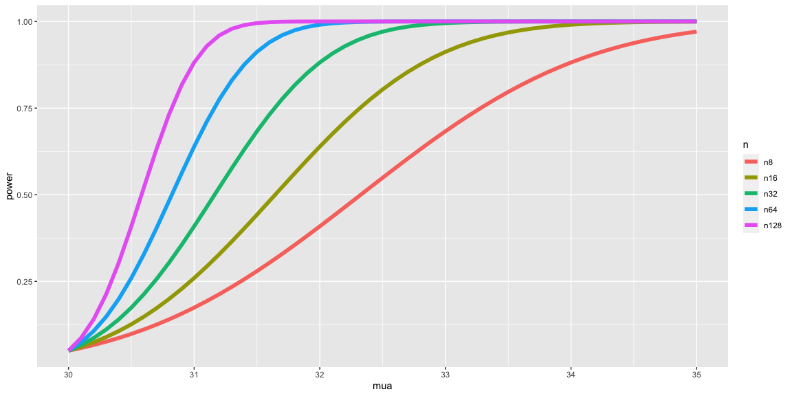

Power
================

## Power

-   Power is the probability of rejecting the null hypothesis when it is
    false
-   Ergo, power (as its name would suggest) is a good thing; you want
    more power
-   A type II error (a bad thing, as its name would suggest) is failing
    to reject the null hypothesis when it’s false; the probability of a
    type II error is usually called *β*
-   Note Power  = 1 − *β*

## Notes

-   Consider our previous example involving RDI
-   *H*<sub>0</sub> : *μ* = 30 versus *H*<sub>*a*</sub> : *μ* &gt; 30
-   Then power is
    $$P\\left(\\frac{\\bar X - 30}{s /\\sqrt{n}} &gt; t\_{1-\\alpha,n-1} \~;\~ \\mu = \\mu\_a \\right)$$
-   Note that this is a function that depends on the specific value of
    *μ*<sub>*a*</sub>!
-   Notice as *μ*<sub>*a*</sub> approaches 30 the power approaches *α*

## Calculating power for Gaussian data

-   We reject if
    $\\frac{\\bar X - 30}{\\sigma /\\sqrt{n}} &gt; z\_{1-\\alpha}$
    -   Equivalently if
        $\\bar X &gt; 30 + Z\_{1-\\alpha} \\frac{\\sigma}{\\sqrt{n}}$
-   Under
    *H*<sub>0</sub> : *X̄* ∼ *N*(*μ*<sub>0</sub>, *σ*<sup>2</sup>/*n*)
-   Under
    *H*<sub>*a*</sub> : *X̄* ∼ *N*(*μ*<sub>*a*</sub>, *σ*<sup>2</sup>/*n*)
-   So we want

``` r
mu0 <- 30
sigma <- 4
n <- 16
alpha = 0.05
mua <- 32
z = qnorm(1 - alpha)
pnorm(mu0 + z * sigma / sqrt(n), mean = mua, sd = sigma / sqrt(n), 
      lower.tail = FALSE)
```

    ## [1] 0.63876

## Example continued

-   *μ*<sub>*a*</sub> = 32, *μ*<sub>0</sub> = 30, *n* = 16, *σ* = 4

``` r
alpha <- 0.05
mu0 = 30; mua = 32; sigma = 4; n = 16
z = qnorm(1 - alpha)
pnorm(mu0 + z * sigma / sqrt(n), mean = mu0, sd = sigma / sqrt(n), 
      lower.tail = FALSE)
```

    ## [1] 0.05

``` r
pnorm(mu0 + z * sigma / sqrt(n), mean = mua, sd = sigma / sqrt(n), 
      lower.tail = FALSE)
```

    ## [1] 0.63876

## Plotting the power curve

``` r
library(ggplot2)
nseq = c(8, 16, 32, 64, 128)
mua = seq(30, 35, by = 0.1)
z = qnorm(.95)
power = sapply(nseq, function(n)
pnorm(mu0 + z * sigma / sqrt(n), mean = mua, sd = sigma / sqrt(n), 
          lower.tail = FALSE)
    )
colnames(power) <- paste("n", nseq, sep = "")
d <- data.frame(mua, power)
library(reshape2)
d2 <- melt(d, id.vars = "mua")
names(d2) <- c("mua", "n", "power")    
g <- ggplot(d2, 
            aes(x = mua, y = power, col = n)) + geom_line(size = 2)
g            
```



## Graphical Depiction of Power

``` r
library(manipulate)
mu0 = 30
myplot <- function(sigma, mua, n, alpha){
    g = ggplot(data.frame(mu = c(27, 36)), aes(x = mu))
    g = g + stat_function(fun=dnorm, geom = "line", 
                          args = list(mean = mu0, sd = sigma / sqrt(n)), 
                          size = 2, col = "red")
    g = g + stat_function(fun=dnorm, geom = "line", 
                          args = list(mean = mua, sd = sigma / sqrt(n)), 
                          size = 2, col = "blue")
    xitc = mu0 + qnorm(1 - alpha) * sigma / sqrt(n)
    g = g + geom_vline(xintercept=xitc, size = 3)
    g
}
manipulate(
    myplot(sigma, mua, n, alpha),
    sigma = slider(1, 10, step = 1, initial = 4),
    mua = slider(30, 35, step = 1, initial = 32),
    n = slider(1, 50, step = 1, initial = 16),
    alpha = slider(0.01, 0.1, step = 0.01, initial = 0.05)
    )
```

## Question

-   When testing *H*<sub>*a*</sub> : *μ* &gt; *μ*<sub>0</sub>, notice if
    power is 1 − *β*, then
    $$1 - \\beta = P\\left(\\bar X &gt; \\mu\_0 + z\_{1-\\alpha} \\frac{\\sigma}{\\sqrt{n}} ; \\mu = \\mu\_a \\right)$$
-   where *X̄* ∼ *N*(*μ*<sub>*a*</sub>, *σ*<sup>2</sup>/*n*)
-   Unknowns: *μ*<sub>*a*</sub>, *σ*, *n*, *β*
-   Knowns: *μ*<sub>0</sub>, *α*
-   Specify any 3 of the unknowns and you can solve for the remainder

## Notes

-   The calculation for *H*<sub>*a*</sub> : *μ* &lt; *μ*<sub>0</sub> is
    similar
-   For *H*<sub>*a*</sub> : *μ* ≠ *μ*<sub>0</sub> calculate the one
    sided power using *α*/2 (this is only approximately right, it
    excludes the probability of getting a large TS in the opposite
    direction of the truth)
-   Power goes up as *α* gets larger
-   Power of a one sided test is greater than the power of the
    associated two sided test
-   Power goes up as *μ*<sub>1</sub> gets further away from
    *μ*<sub>0</sub>
-   Power goes up as *n* goes up
-   Power doesn’t need *μ*<sub>*a*</sub>, *σ* and *n*, instead only
    $\\frac{\\sqrt{n}(\\mu\_a - \\mu\_0)}{\\sigma}$
    -   The quantity $\\frac{\\mu\_a - \\mu\_0}{\\sigma}$ is called the
        effect size, the difference in the means in standard deviation
        units.
    -   Being unit free, it has some hope of interpretability across
        settings

## T-test power

-   Consider calculating power for a Gossett’s *T* test for our example
-   The power is
    $$
      P\\left(\\frac{\\bar X - \\mu\_0}{S /\\sqrt{n}} &gt; t\_{1-\\alpha, n-1} \~;\~ \\mu = \\mu\_a \\right)
      $$
-   Calcuting this requires the non-central t distribution.
-   `power.t.test` does this very well
    -   Omit one of the arguments and it solves for it

## Example

``` r
power.t.test(n = 16, delta = 2 / 4, sd=1, type = "one.sample",  alt = "one.sided")$power
```

    ## [1] 0.6040329

``` r
power.t.test(n = 16, delta = 2, sd=4, type = "one.sample",  alt = "one.sided")$power
```

    ## [1] 0.6040329

``` r
power.t.test(n = 16, delta = 100, sd=200, type = "one.sample", alt = "one.sided")$power
```

    ## [1] 0.6040329

## Example

``` r
power.t.test(power = .8, delta = 2 / 4, sd=1, type = "one.sample",  alt = "one.sided")$n
```

    ## [1] 26.13751

``` r
power.t.test(power = .8, delta = 2, sd=4, type = "one.sample",  alt = "one.sided")$n
```

    ## [1] 26.13751

``` r
power.t.test(power = .8, delta = 100, sd=200, type = "one.sample", alt = "one.sided")$n
```

    ## [1] 26.13751
